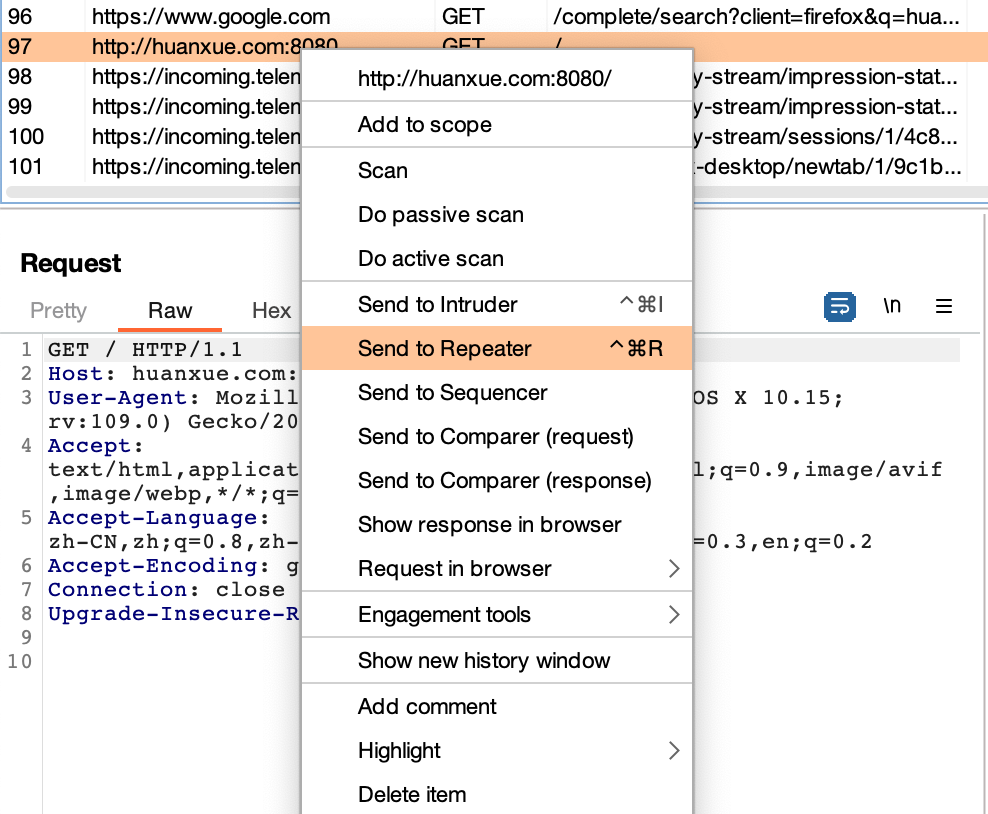

# 一、安装 Java 环境并激活 Burp。


> 说明：之前安装过，直接启动截图。

# 二、练习 Tomcat PUT 方法任意写文件漏洞（CVE-2017-12615），提供命令执行截图。

## 1. 靶场搭建
### 1.1 搜索镜像

```shell
docker search CVE-2017-12615
```


### 1.2 下载镜像

```shell
docker pull cved/cve-2017-12615
```


### 1.3 启动镜像

```shell
docker run -d -p 8080:8080 cved/cve-2017-12615
```


### 1.4 访问页面


> 说明：为了后面使用 BurpSuite 抓本地包，配置了本地host，huanxue.com 指向 127.0.0.1

## 2. 漏洞实践

### 2.1 远程命令POC实践练习

#### 2.1.1 启动 BurpSuite


#### 2.1.2 启用系统代理


#### 2.1.3 抓取请求,并发送至 repeater



#### 2.1.4 修改请求，发送构造好的 poc 至服务器


#### 2.1.5 访问上传的jsp文件,并执行命令


### 2.2 中国蚁剑实践练习

#### 2.2.1 上传蚁剑POC文件


#### 2.2.3 在中国蚁剑配置连接


#### 2.2.3 使用中国蚁剑连接


# 三、练习 S2-048 远程代码执行漏洞（CVE-2017-9791），提供命令执行截图。

## 1. 靶场搭建

### 1.1 搜索镜像

```shell
docker search S2-048
```


### 1.2 下载镜像，并启动
#### 下载
```shell
docker pull piesecurity/apache-struts2-cve-2017-5638
```
#### 启动
```shell
docker run -d -p 8081:8080 piesecurity/apache-struts2-cve-2017-5638
```


## 2. 漏洞实践

### 2.1 访问页面


### 2.2 选择 “Integration - struts 1 Integration”


### 2.3 验证漏洞点


> 发现在 Gangster Name 中填入 OGNL 表达式，提交后，表达式中的内容被系统执行，由此可见本页面存在可执行漏洞。

### 2.4 构造远程执行POC,并执行


# 四、练习 JBoss 5.x/6.x 反序列化漏洞（CVE-2017-12149），提供命令执行截图。

## 1. 靶场搭建

### 1.1 搜索镜像

```shell
docker search CVE-2017-12149
```

### 1.2 下载镜像并运行

#### 下载镜像

```shell
docker pull hackingpub/cve-2017-12149
```
#### 运行

```shell
docker run -d -p 8083:8080 hackingpub/cve-2017-12149
```


## 2. 漏洞实践

### 2.1 访问页面


### 2.2 运行JBoss，命令执行漏洞工具

```shell
java -jar jboss_CVE-2017-12149.jar
```


#### 遇到的问题：使用JDK高版本的时候，会报错


#### 解决办法

> 通过idea找到jdk8所在的位置


> 进入低版本jdk后，使用低版本启动当前工具


# 五、安装并使用 Nmap 扫描一个地址（本机、VPS、虚拟机环境都可以），提供扫描结果截图。

## 1. Nmap的安装


> 之前已经安装过，这里不再进行安装。

## 2. Nmap 进行扫描

```shell
nmap -A -T4 -sS -O -sV 47.97.*.***
```
> 指令说明：防止敏感信息泄露，这里的ip脱敏处理。

> 参数说明：

> -A: 进行系统及其版本扫描。

> -T: T0-T1 用于躲避 IDS。 T2 降低了扫描速度可以使用更少的带宽和目标主机资源。T3 默认模式。 T4 针对TCP端口禁止动态扫描延迟超过10ms， -T5对应的值就是5ms。

> -sS: TCP SYN 扫描。

> -O: 启用操作系统检测。

> -sV: 打开版本探测，也可以用-A同时打开系统探测和版本探测。

## 3. 扫描结果


> 说明：

> 从结果中关注状态为 open 的端口，分别为：22、80、8080、8888、9999。

> 操作系统及版本：Linux 3.X|4.X|5.X (89%), Asus embedded (85%)

> 系统内核版本：cpe:/o:linux:linux_kernel:3 cpe:/o:linux:linux_kernel:4 cpe:/o:linux:linux_kernel:5.1 cpe:/o:linux:linux_kernel cpe:/h:asus:rt-ac66u

> 进一步的操作系统猜测： Linux 3.10 - 4.11 (89%), Linux 5.1 (87%), Linux 3.2 - 4.9 (86%), Linux 3.13 or 4.2 (85%), Linux 4.1 (85%), Linux 4.10 (85%), Linux 4.2 (85%), Linux 4.4 (85%), Asus RT-AC66U WAP (85%), Linux 3.11 - 3.12 (85%)

# 六、以任一企业为关键词进行信息收集练习并汇总形成报告，禁止进行违规操作。