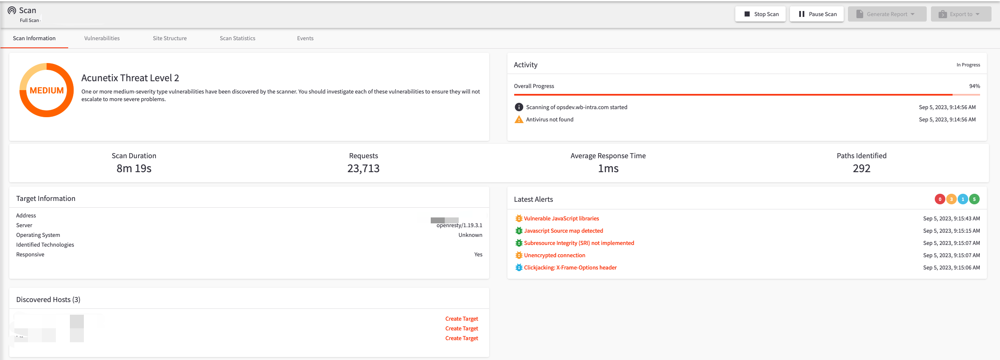
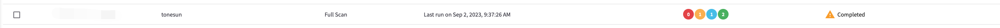

# 一、分别使用 AWVS 和 Xray（被动扫描模式）去扫描任一 SRC 允许测试的目标，对比扫描结果的不同；

## 1. AWVS

### 1.1 AWVS 的安装与启动

#### 搜索

```shell
docker search awvs
```

#### 获取镜像

```shell
docker pull dockermi3aka/awvs
```

#### 启动

```shell
docker run -dit -p 3443:3443 dockermi3aka/awvs
```

#### 访问

```url
https://huanxue.com:3443/#/dashboard
```


### 1.2 AWVS 扫描（应用类主动扫描）

#### 1.2.1 添加目标站点，位置：“Targets--Add Targets”，输入后点击 “save” 进行保存。


#### 1.2.2 选择 “scan”


##### 点击新建扫描任务按钮 “New Scan”


##### 勾选目标站点，点击 “scan”


##### 等待扫描结束



##### 扫描完成




## 2. Xray

### 2.1 Xray 的安装

#### 2.1.1 访问 Xray 官网

```url
https://docs.xray.cool
```
#### 2.1.2 查看文档页中的快速开始

```url
https://docs.xray.cool/#/tutorial/prepare
```

#### 2.1.3 下载

##### 下载地址

```url
https://stack.chaitin.com/tool/detail/1
```

##### 下载 mac 版本的


#### 2.1.4 压缩包解压到指定目录


#### 2.1.5 启动前，修改配置


#### 2.1.6 启用xray被动模式代理

```shell
./xray_darwin_amd64 webscan --listen 127.0.0.1:7777 --html-output tonesun.html
```


#### 2.1.7 启用浏览器代理


#### 2.1.8 访问测试站点页面，进行简单的功能测试


#### 2.1.9 查看生成的报告


## 3. 扫描结果对比

|对比项|项目|描述|
|---|---|---|
1.2+|扫描方式|AWVS|主动扫描|
|xray|被动扫描|


# 二、使用 Nessus 扫描任一主机，要求使用全端口扫描，提供主机扫描报告；
# 三、安装 Burp，分别在本机上实现全局代理和局部代理，提供设置过程的说明文档；
# 四、利用 Burp 实现对 HTTPS 站点的抓包。
