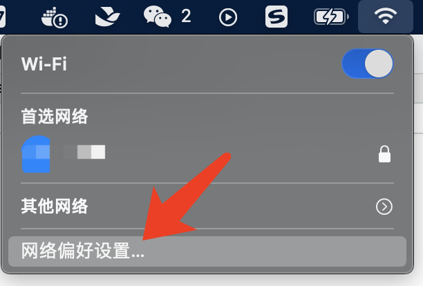

# 一、分别使用 AWVS 和 Xray（被动扫描模式）去扫描任一 SRC 允许测试的目标，对比扫描结果的不同；

## 1. AWVS

### 1.1 AWVS 的安装与启动

#### 搜索

```shell
docker search awvs
```

#### 获取镜像

```shell
docker pull dockermi3aka/awvs
```

#### 启动

```shell
docker run -dit -p 3443:3443 dockermi3aka/awvs
```

#### 访问

```url
https://huanxue.com:3443/#/dashboard
```


### 1.2 AWVS 扫描（应用类主动扫描）

#### 1.2.1 添加目标站点，位置：“Targets--Add Targets”，输入后点击 “save” 进行保存。


#### 1.2.2 选择 “scan”


##### 点击新建扫描任务按钮 “New Scan”


##### 勾选目标站点，点击 “scan”


##### 扫描结果


## 2. Xray

### 2.1 Xray 的安装

#### 2.1.1 访问 Xray 官网

```url
https://docs.xray.cool
```
#### 2.1.2 查看文档页中的快速开始

```url
https://docs.xray.cool/#/tutorial/prepare
```

#### 2.1.3 下载

##### 下载地址

```url
https://stack.chaitin.com/tool/detail/1
```

##### 下载 mac 版本的


#### 2.1.4 压缩包解压到指定目录


#### 2.1.5 启动前，修改配置


#### 2.1.6 启用xray被动模式代理

```shell
./xray_darwin_amd64 webscan --listen 127.0.0.1:7777 --html-output test.html
```


#### 2.1.7 启用浏览器代理


#### 2.1.8 访问测试站点页面，进行简单的功能测试


#### 2.1.9 查看生成的报告


## 3. 扫描结果对比

|对比项|项目|描述|
|---|---|---|
|扫描方式|AWVS|主动扫描|
| |Xray|被动扫描|
|查看方式|AWVS|直接通过可视化系统，访问 Scans 页面，点击对应的条目，就可查看扫描结果|
| |Xray|通过命令行中的 --html-output 选项来指定结果的输出类型，名称与位置|
|站点安全现状描述|AWVS|扫描结果中可以看到目标站点当前的整体风险等级评价|
| |Xray|无|
|系统信息|AWVS|扫描结果中有目标站点的系统信息描述|
| |Xray|无|
|漏洞描述|AWVS|漏洞信息描述详细，有具体的漏洞等级，发现漏洞时的请求和响应，修复建议以及漏洞编号信息|
| |Xray|漏洞信息描述简明，仅有有发现漏洞的插件，以及漏洞类型，发现漏洞时的请求和响应|

**个人总结：** AWVS 的扫描结果比较详细，内容丰富，但其因主动扫描的方式，很可能会被安全防护设备拦截，所以通常会用于内网项目的扫描，操作时最好和运维团队打招呼。Xray 的代理模式（被动扫描），其扫描结果言简意赅，没有漏洞等级以及漏洞编号等描述，适合有一定安全从业经验和了解常见漏洞及其原理的安全工作者使用。

# 二、使用 Nessus 扫描任一主机，要求使用全端口扫描，提供主机扫描报告；
## 1. Nessus 的下载与安装
### 1.1 获取官方激活码
```url
https://zh-cn.tenable.com/products/nessus/activation-code?tns_redirect=true
```
### 1.2 点击立即注册


### 1.3 填写注册信息后，点击“开始”，将会有激活码发送至邮箱


### 1.4 从邮箱中获取激活码和下载地址


### 1.5 跳转下载地址，进行下载


### 1.6 校验软件完整性
```shell
md5 Nessus-10.6.0.dmg
```


### 1.7 双击下载好的包，进行安装

> 已经安装过了，这里略过，以及后面的插件安装，都是自动的，等待就行了。

### 1.8 启动与停止

#### 点击苹果右上角图标，选择“隐私偏好设置”


#### 点击 “Nessus”后，点击🔐，输入密码解锁后，点击“Start Nessus”启动，“Stop Nessus”停止。


### 1.9 访问
```url
https://localhost:8834/#/
```


## 2. 扫描
### 2.1 新建扫描任务
#### 2.1.1 “My Scans” 点击 “New Scan”


#### 2.1.2 选择高级扫描


#### 2.1.3 扫描设置
##### 基础配置

##### 端口设置

##### 保存扫描任务


### 2.2 开始扫描


### 2.3 等待扫描结果


### 2.4 扫描结果


### 2.5 导出扫描结果


> 选择带漏洞详情的形式进行导出

### 2.6 查看报告


# 三、安装 Burp，分别在本机上实现全局代理和局部代理，提供设置过程的说明文档；
##  1. 概念
### 1.1 局部代理

局部代理IP，顾名思义，改变局部的IP，可以只让某个浏览器或应用使用此代理，不影响其他程序软件运行的使用IP，也不会影响其他软件使用本地网络。

### 1.2 全局代理

所谓全局代理IP，就是改变整个客户端的上网IP，不管是什么程序，它对支持代理协议的软件和大多数浏览器生效，都将使用代理IP上网。

## 2. 设置方法
### 2.1 局部代理
#### 2.1.1 启动 Burp, 设置代理ip和端口


#### 2.1.2 打开火狐浏览器，配置代理ip和端口


#### 2.1.3 使用火狐浏览器访问任意网址，然后观察 Burp 抓包情况


#### 2.1.4 使用其他浏览器，访问任意网址，然后观察 Burp 抓包情况


> 并没有流量进入 Burp

#### 2.1.5 查看系统代理情况，点击“网络偏好与设置”


#### 2.1.6 点击“高级”


#### 2.1.7 点击“代理”，查看系统代理情况


> 由此可以看出，通过火狐浏览器设置的代理，仅仅作用于火狐浏览器本身应用的代理，并不是系统级别的代理。

### 2.2 全局代理
#### 2.2.1 关闭火狐浏览器的代理ip和端口

#### 2.2.2 打开谷歌浏览器，配置代理ip和端口


#### 2.2.3 谷歌浏览器访问任意网址


#### 观察 Burp 中的流量


#### 查看系统代理情况


# 四、利用 Burp 实现对 HTTPS 站点的抓包。
