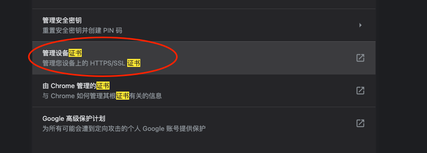

# 一、分别使用 AWVS 和 Xray（被动扫描模式）去扫描任一 SRC 允许测试的目标，对比扫描结果的不同；

## 1. AWVS

### 1.1 AWVS 的安装与启动

#### 搜索

```shell
docker search awvs
```

#### 获取镜像

```shell
docker pull dockermi3aka/awvs
```

#### 启动

```shell
docker run -dit -p 3443:3443 dockermi3aka/awvs
```

#### 访问

```url
https://huanxue.com:3443/#/dashboard
```


### 1.2 AWVS 扫描（应用类主动扫描）

#### 1.2.1 添加目标站点，位置：“Targets--Add Targets”，输入后点击 “save” 进行保存。


#### 1.2.2 选择 “scan”


##### 点击新建扫描任务按钮 “New Scan”


##### 勾选目标站点，点击 “scan”


##### 扫描结果


## 2. Xray

### 2.1 Xray 的安装

#### 2.1.1 访问 Xray 官网

```url
https://docs.xray.cool
```
#### 2.1.2 查看文档页中的快速开始

```url
https://docs.xray.cool/#/tutorial/prepare
```

#### 2.1.3 下载

##### 下载地址

```url
https://stack.chaitin.com/tool/detail/1
```

##### 下载 mac 版本的


#### 2.1.4 压缩包解压到指定目录


#### 2.1.5 启动前，修改配置


#### 2.1.6 启用xray被动模式代理

```shell
./xray_darwin_amd64 webscan --listen 127.0.0.1:7777 --html-output test.html
```


#### 2.1.7 启用浏览器代理


#### 2.1.8 访问测试站点页面，进行简单的功能测试


#### 2.1.9 查看生成的报告


## 3. 扫描结果对比

|对比项|项目|描述|
|---|---|---|
|扫描方式|AWVS|主动扫描|
| |Xray|被动扫描|
|查看方式|AWVS|系统中，访问 Scans 页面，点击对应的条目，就可查看扫描结果|
| |Xray|通过命令行中的 --html-output 选项来指定结果的输出类型，名称与位置，结束后打开对应文件进行查看|
|站点安全现状描述|AWVS|扫描结果中可以看到目标站点当前的整体风险等级评价|
| |Xray|无|
|系统信息|AWVS|扫描结果中有目标站点的系统信息描述|
| |Xray|无|
|漏洞描述|AWVS|漏洞信息描述详细，有具体的漏洞等级，发现漏洞时的请求和响应，修复建议以及漏洞编号信息|
| |Xray|漏洞信息描述简明，仅有有发现漏洞的插件，以及漏洞类型，发现漏洞时的请求和响应|

**个人总结：** AWVS 的扫描结果比较详细，内容丰富，但其因主动扫描的方式，很可能会被安全防护设备拦截，所以通常会用于内网项目的扫描，操作时最好和运维团队打招呼。Xray 的代理模式（被动扫描），其扫描结果言简意赅，没有漏洞等级以及漏洞编号等描述，适合有一定安全从业经验和了解常见漏洞及其原理的安全工作者使用。

# 二、使用 Nessus 扫描任一主机，要求使用全端口扫描，提供主机扫描报告；
## 1. Nessus 的下载与安装
### 1.1 获取官方激活码
```url
https://zh-cn.tenable.com/products/nessus/activation-code?tns_redirect=true
```
### 1.2 点击立即注册


### 1.3 填写注册信息后，点击“开始”，将会有激活码发送至邮箱


### 1.4 从邮箱中获取激活码和下载地址


### 1.5 跳转下载地址，进行下载


### 1.6 校验软件完整性
```shell
md5 Nessus-10.6.0.dmg
```


### 1.7 双击下载好的包，进行安装

> 已经安装过了，这里略过，以及后面的插件安装，都是自动的，等待就行了。

### 1.8 启动与停止

#### 点击苹果右上角图标，选择“隐私偏好设置”


#### 点击 “Nessus”后，点击🔐，输入密码解锁后，点击“Start Nessus”启动，“Stop Nessus”停止。


### 1.9 访问
```url
https://localhost:8834/#/
```


## 2. 扫描
### 2.1 新建扫描任务
#### 2.1.1 “My Scans” 点击 “New Scan”


#### 2.1.2 选择高级扫描


#### 2.1.3 扫描设置
##### 基础配置

##### 端口设置

##### 保存扫描任务


### 2.2 开始扫描


### 2.3 等待扫描结果


### 2.4 扫描结果


### 2.5 导出扫描结果


> 选择带漏洞详情的形式进行导出

### 2.6 查看报告


# 三、安装 Burp，分别在本机上实现全局代理和局部代理，提供设置过程的说明文档；
##  1. 概念
### 1.1 局部代理

局部代理IP，顾名思义，改变局部的IP，可以只让某个浏览器或应用使用此代理，不影响其他程序软件运行的使用IP，也不会影响其他软件使用本地网络。

### 1.2 全局代理

所谓全局代理IP，就是改变整个客户端的上网IP，不管是什么程序，它对支持代理协议的软件和大多数浏览器生效，都将使用代理IP上网。

## 2. 设置方法
### 2.1 局部代理
#### 2.1.1 启动 Burp, 设置代理ip和端口


#### 2.1.2 打开火狐浏览器，配置代理ip和端口


#### 2.1.3 使用火狐浏览器访问任意网址，然后观察 Burp 抓包情况


#### 2.1.4 使用其他浏览器，访问任意网址，然后观察 Burp 抓包情况


> 并没有流量进入 Burp

#### 2.1.5 查看系统代理情况，点击“网络偏好与设置”


#### 2.1.6 点击“高级”


#### 2.1.7 点击“代理”，查看系统代理情况


> 由此可以看出，通过火狐浏览器设置的代理，仅仅作用于火狐浏览器本身应用的代理，并不是系统级别的代理。

### 2.2 全局代理
#### 2.2.1 关闭火狐浏览器的代理ip和端口

#### 2.2.2 打开谷歌浏览器，配置代理ip和端口


#### 2.2.3 谷歌浏览器访问任意网址


#### 2.2.4 观察 Burp 中的流量


#### 2.2.5 火狐浏览器访问任意网站


#### 2.2.6 观察 Burp 中的流量


#### 2.2.7 查看系统代理情况


> **总结：** 其实从不同浏览中设置代理就可以看出，但我们使用火狐设置的时候，直接就在浏览器内部设置就可以了，但是如果使用谷歌浏览器设置，他打开的是计算机网络设置，这里设置的是计算机的代理，所以火狐中设置的是局部代理，仅火狐浏览器应用中的流量会走 Burp 代理，其他应用并不受影响。但是如果从谷歌中跳转设置的是计算机的代理，那么这台计算机上所有应用的网络请求都会走 Burp 代理，这就是全局代理了。

# 四、利用 Burp 实现对 HTTPS 站点的抓包。

## 1. 概念
### 1.1 HTTPS 的实现原理
HTTPS 整体过程分为证书验证阶段和数据传输阶段：

1. 证书验证阶段

（1）浏览器发起 HTTPS 请求。

（2）服务器返回 HTTPS 证书。

（3）客户端验证证书是否合法，如果不合法则告警。

2. 数据传输阶段

（1）当证书合法后，在本地生成一个随机数。

（2）通过公钥对随机数进行加密，然后将随机数发送给服务端。

（3）服务端通过私钥对随机数进行解密。

（4）服务端通过随机数对返回的数据进行对称加密，将加密后的内容返回给客户端。

### 1.2 证书

HTTP 协议被认为不安全是因为传输过程容易被监听者监听、伪造服务器，而 HTTPS 协议主要解决的便是网络传输的安全性问题。

首先我们假设不存在认证机构，任何人都可以制作证书，这带来的安全风险便是经典的 “中间人攻击” 问题。

#### 1.2.1 证书中都包含哪些信息？

* 颁发机构信息
* 公钥
* 公司信息
* 域名
* 有效期
* 指纹
* 等等

#### 1.2.2 证书的合法性

首先，权威机构是要有认证的，不是随便一个机构都有资格颁发证书，不然也不叫做权威机构。

另外，证书的可信性基于信任制，权威机构需要对其颁发的证书进行信用背书，只要是权威机构生成的证书，我们就认为是合法的。

所以权威机构会对申请者的信息进行审核，不同等级的权威机构对审核的要求也不一样，于是证书也分为免费的、便宜的和贵的。

#### 1.2.3 浏览器如何校验证书的合法性？

浏览器发起 HTTPS 请求时，服务器会返回网站的 SSL 证书，浏览器需要对证书做以下验证：

（1）验证域名、有效期等信息是否正确。证书上都有包含这些信息，比较容易完成验证；

（2）判断证书来源是否合法。每份签发证书都可以根据验证链查找到对应的根证书，操作系统、浏览器会在本地存储权威机构的根证书，利用本地根证书可以对对应机构签发证书完成来源验证；

（3）判断证书是否被篡改。需要与 CA 服务器进行校验；

（4）判断证书是否已吊销。通过CRL（Certificate Revocation List 证书注销列表）和 OCSP（Online Certificate Status Protocol 在线证书状态协议）实现，其中 OCSP 可用于第3步中以减少与 CA 服务器的交互，提高验证效率。

### 1.3 使用代理对 HTTPS 进行抓包

HTTPS 的数据是加密的，常规下抓包工具代理请求后抓到的包内容是加密状态，无法直接查看。

但是，浏览器只会提示安全风险，如果用户授权仍然可以继续访问网站，完成请求。因此，只要客户端是我们自己的终端，我们授权的情况下，便可以组建中间人网络，而抓包工具便是作为中间人的代理。

通常 HTTPS 抓包工具的使用方法是会生成一个证书，用户需要手动把证书安装到客户端中，然后终端发起的所有请求通过该证书完成与抓包工具的交互，然后抓包工具再转发请求到服务器，最后把服务器返回的结果在控制台输出后再返回给终端，从而完成整个请求的闭环。

## 2. Burp 证书安装

### 2.1 启动 Burp


### 2.2 设置浏览器代理


### 2.3 访问下面地址
```url
http://burp/
```


### 2.4 点击 ”CA Certificate“，会下载一个证书


### 2.5 将生成的证书导入浏览器中
#### 2.5.1 打开浏览器设置，搜索证书


#### 2.5.2 点击“管理设备证书”


#### 2.5.3 将下载的证书导入


#### 2.5.4 搜索刚导入的证书，设置为“始终信任”


### 2.6 访问 HTTPS 站点，查看 Burp 流量抓取情况。

