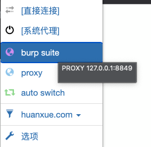
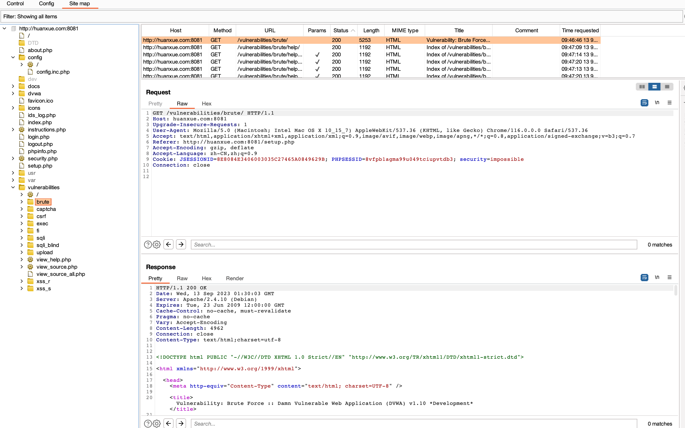
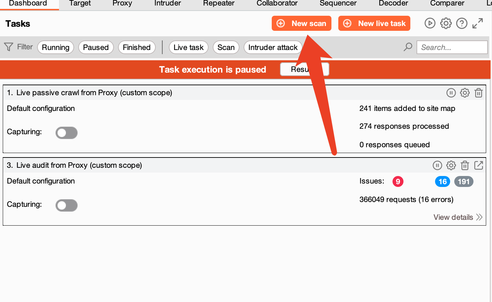

# 一、使用 Burp 的 Discover Content 功能爬取任意站点的目录，给出爬取过程的说明文档、站点树截图；

## 1. 启动 Burp。


## 2. 设置浏览器代理。


## 3. 访问目标站点。


## 4. 观察 Burp target 下的 Site Map（站点地图）信息。


## 5. 使用 Discover Content 功能爬取目标站点的目录。
### 5.1 在 Site Map 中，右键点击目标站点，选择 “Engagement tools--Discover Content”


### 5.2 Discover Content 说明

* Control：控制模块，由“发现会话状态”和“排列任务”两部分组成。
* Config：配置，可以配置目标站点（target），文件名（Filenames），文件扩展名（File extensions），发现引擎（Discovery engine）。
* Site map：站点地图

### 5.3 开启爬取
#### 点击 “Session is not running”

#### 当前url不在 “target scope” 中，这里点击确定，确认执行。

#### 等待爬取结束


### 5.4 站点树（Site Map）


# 二、分别使用 Burp Scan 的主动扫描和被动扫描功能对 DVWA 站点进行扫描，输出扫描报告；
## 1. 被动扫描
### 1.1 被动扫描任务
在启动 Burp Suite 的时候，默认开启，如下图：

> 说明：   
> Live passive crawl from Proxy (all traffic): 来自于代理的实时被动爬取功能。   
> Live audit from Proxy (all traffic): 来自于代理的实时被动审计功能。
### 1.2 被发现的漏洞列表

* Issue activity：发现的漏洞列表。
* Advisory: 漏洞的详细描述。
* Request: 发现漏洞的请求信息。
* Response: 发现漏洞的请求响应信息。
### 1.3 设置被动扫描的范围

分别对 “Live passive crawl from Proxy (all traffic)” 和 “Live audit from Proxy (all traffic)” 中的 URL scope 进行设置。

### 1.4 查看扫描结果
点击 “Live audit from Proxy (all traffic)” 任务的 “View details” 可以查看被动扫描详情。


### 1.5 导出扫描报告
在 Dash Board 中的 Issue activity 中选择发现的漏洞，然后右键点击，选择“report selected issues”（导出扫描报告）选项。  

以html格式导出。    

漏洞描述与修复建议描述，漏洞引用等信息，根据需要进行勾选定制。   

漏洞发现时的请求信息设置。   

勾选需要导出的漏洞类型。   

设置导出的目录，以及漏洞的分组形式，可以按照类型分，按照服务器分，按照 URL 分。以及漏洞的级别的过滤设置。   

查看导出的扫描报告文件。


## 2. 主动扫描
### 2.1 新建
点击 “New scan” 来创建一个主动扫描任务

设置扫描任务参数
 
> Scan type：扫描类型，“Crawl and audit” 爬取并审计；“Crawl” 爬取。   
> URLs to scan：设置主动扫描的 URL。   
> Protocol settings：协议设置，“Scan using HTTP & HTTPS” 使用 HTTP 和 HTTPS 协议；“Scan using specified protocols” 使用自定义协议。   
> 其他设置：“Included URL prefixes” 基于地址开头匹配。“Excluded URL prefixes” 地址开头匹配后排除。

设置扫描模式

> Lightweight: 轻度扫描
> Fast: 快速扫描
> Balanced: 均衡扫描
> Deep：深度扫描

登录设置

> 不需要，保持默认。   

资源池设置
   

> Concurrent requests: 并发请求数量。
> Request delay: 延迟请求。
> Random delay: 随机延迟。
> Delay increment: 累加延迟

点击“OK”，保存扫描任务


等待扫描结束


### 2. 扫描报告
与上面被动扫描的报告导出步骤一样，导出过程省略。


# 三、Burp Intruder 爆破题目

> 靶场地址： *****   
> 靶场开放时间：2023.9.9 ~ 2023.9.17   
> 管理员账号 / 密码：******   
> 注意事项：爆破成功的同学请勿修改任何账号的密码，以免影响其他同学正常作业。   

## 1. 老李今年 52 岁了，他最近也在学习网络安全，为了方便练习，他在 DVWA 靶场中增设了一个自己的账号，密码就是他的生日，请你想办法破解出他的账号密码。
## 2. Cookie 老师在 DVWA 靶场中设置了一个账号 Geektime（注意首字母大写），且在靶场中的某处存放了一个文件名为 geekbang.txt 的密码字典，请你想办法找到该字典并尝试爆破，最终获取到账号 Geektime 的正确密码。

# 五、在不依赖于 DVWA 后端数据库的情况，如何通过前端验证的方法判断 DVWA 中的注入点是数字型注入还是字符型注入？（提示：用假设法进行逻辑判断）

## 1. 定义
* 字符型注入：当输入的参数为字符串时，若存在注入漏洞，称为字符型注入。
* 数字型注入：当输入的参数为整形时，若存在注入漏洞，称为数字型注入。

## 2. 推导过程
### 2.1 查看正常功能
当我们输入id后，会查询出来id对应的数据。先输入 1：

再输入 2：

### 2.2 使用 HackBar 工具，“Load URL”。


### 2.3 使用 `1'` 进行验证。
```text
http://huanxue.com:8081/vulnerabilities/sqli/?id=1'&Submit=Submit#
```

明显的sql拼写错误的报错，说明此处`id`可能存在 SQL 注入的点。
#### 2.3.1 假设此处 id 为数字型。
那么此处正常在系统中运行的sql，可能如下：
```Mysql
select * from table where id = 1;
```
当我们重新构造了请求之后，它会变为如下：
```Mysql
select * from table where id = 1';
```
那么此处会报SQL的拼写错误。

#### 2.3.2 假设此处 id 为字符型。
那么此处正常在系统中运行的sql，可能如下：
```Mysql
select * from table where id = '1';
```
当我们重新构造了请求之后，它会变为如下：
```Mysql
select * from table where id = '1'';
```
那么此处会报SQL的拼写错误。

#### 结论
无论是字符型还是数字型，此处的 `1'` 也无法论证出来它具体的类型，只能证明可能存在 SQL 注入。
### 2.4 假设为数字型
#### 2.4.1 尝试构造 `1 and 1 = 1` 来看系统响应结果,预期可以正常查询出 `id = 1` 的用户信息。

通过构造 `1 and 1 = 1`，可以正常查出 `id` 为 1 的 `admin` 用户的信息，那么此处的sql可能为：
```Mysql
select * from table where id = 1 and 1 = 1;
```
#### 2.4.2 基于上面的情况，继续尝试构造 `1 and 1 = 2` 来查看系统的响应结果，预期查询不出来数据，因为 `1 = 2` 恒不成立。

执行结果预期之外，按照数值型的sql，运行可能如下：
```Mysql
select * from table where id = 1 and 1 = 2;
```
#### 结论
至此，无法证明此处的SQL注入漏洞为数字型。
### 2.5 假设为字符型
#### 2.5.1 尝试构造 `1' #`,通过 `#` 来注释掉字符型结尾的 `'` ,使得 sql 能够正常执行，预期可以正常查询出数据。
那么此处的sql就可能会变为如下：
```Mysql
select * from table where id = '1'#';
```
> `#` 号后面为注释掉的内容。   

可以正常查询出来内容，符合预期：


#### 2.5.2 基于上面的情况，继续尝试构造 `1' and 1 = 2#`,来查看系统的响应结果，预期查询不出来数据，因为 `1 = 2` 恒不成立。
此处查询结果符合预期：

那么此处执行的 sql 可能为：
```Mysql
select * from table where id = '1' and 1 = 2#';
```
#### 2.5.3 至此可以证明此处通过构造 `'` 以及 `#` 的注释后续的闭合，能够让 SQL 语句正常执行，以及额外添加的条件正常执行，此处的注入漏洞确实存在，但是要证明此处的注入类型，还缺少字符型证明，下面构造 `1abc' #`,预期无法查询出来 admin 用户的数据。
查询结果超出预期，结果如下：

此处构造的SQL，可能如下：
```Mysql
select * from table where id = '1abc'#';
```
#### 结论
通过此处的推导，发现此处功能确实存在`'`闭合的情况，因为`1' #`可以正常执行，但是`1'` 却不可以，但是此处又不是字符型，因为在字符 `1abc` 的情况下，依然可以查询出 `id` 为 1 的用户信息。

### 2.6 综合分析
基于上面的推导结果，进行进一步分析,当我们构造`1 and 1 = 1`时，执行的sql可能如下：
```Mysql
select * from table where id = 1 and 1 = 2;
```
依然可以正常执行，查询出 id 为 1 的用户信息，结合上述字符型推导，可以证明存在 `'` 闭合的情况，所以这里会被构造成如下的情况：
```Mysql
select * from table where id = '1 and 1 = 2';
```
那么这里构造 `1 and 1 = 2` 最终以 `'1 and 1 = 2'` 执行和我们构造出的 `1abc' #` 最终以 `'1abc'`执行的情况其实一样，都是预期传入了一个不存在的`id`字符，却能查出 `id` 为 1 的 admin 用户信息，那么这里可以证明无论是 `'1 and 1 = 2'` 还是 `'1abc'` 最终都被转化为 1 进行查询了，字符型的注入并不存在这种情况，只有数值型的才会存在这种隐式替换的情况，所以这里应该是数字型注入类型。

### 结论
此处的SQL注入漏洞，属于数字型注入。