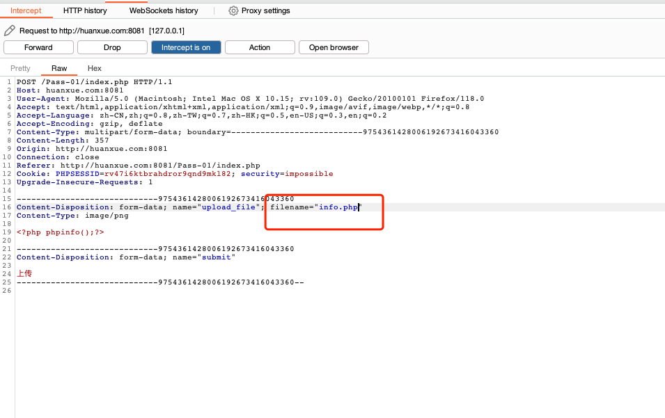

# 一、文件上传
## 前置准备
### 靶场
```shell
docker pull cuer/upload-labs
# 启动
docker run -d -p 8081:80 cuer/upload-labs
```

### 文件上传利用的三个条件
* 能不能上传：是指有没有文件上传的点，例如上传头像，上传附件，发布图片等等。
* 保存在哪：是指上传上去文件的访问位置，我们是否可以访问。
* 能不能运行：是指上传上去的文件是否可以被服务器所执行。
## 1. 客户端绕过练习。
当前端做了一些安全防护校验的情况下，可以使用下面的方式进行客户端绕过。
### 1.1 禁用js（pass01）
#### 1.1.1 页面正常功能介绍
   
页面通过点击`浏览`按钮进行本地文件选择，点击`上传`之后将选中的文件上传至服务器。   

#### 1.1.2 尝试上传一句话木马的`php`文件
```php
 <?php phpinfo();?>
```
   
网站提示只允许上传.jpg|.png|.gif格式图片，接下来判断此限制来源于前端还是服务端。
#### 1.1.3 打开浏览器控制台，查看是否有网络请求
   
点击`上传`。
   
我们发现并没有发送网络请求，由此可以判断为前端校验，那么接下来尝试使用`JS绕过`的方式，查看是否可以正常上传。
#### 1.1.4 禁用js后，点击`上传`。
##### 火狐浏览器设置方法

##### 谷歌浏览器设置方法

   
禁用`js`设置好之后，点击上传`info.php`。
  
成功上传。
#### 1.1.5 访问该文件

### 1.2 burp 拦截，修改后缀名
前面使用`js绕过`后，将`info.php`修改为`info.png`进行上传，然后尝试使用burp抓包，修改请求中文件的后缀名，其目的是使用`info.png`绕过前端校验，拦截修改为`.php`，是为了保存至服务器为`.php`文件，服务器可以执行。
#### 1.2.1 修改文件名
```shell
mv info.php info.png
```
#### 1.2.2 开启burp,拦截上传请求

#### 1.2.3 修改文件名为`info.php`

#### 1.2.4 上传成功，尝试访问


### 1.3 修改前端文件
查看前端源码，通过修改前端代码的方式，来跳过安全校验的执行。
#### 1.3.1 查看前端源码
   
看到在`form`提交的时候会触发一个`onsubmit`事件,里面执行了`checkFile()`函数，进一步查看下`checkFile()`函数中的处理逻辑。
   
可以看到，`checkFile()` 函数就是为了校验文件的类型，那么我们删除`onsubmit`事件后尝试直接提交`info.php`文件。
#### 1.3.2 修改前端代码
   
删除标记部分。   

#### 1.3.3 成功上传 `info.php`
    
尝试访问该文件。   

## 2. 服务端黑名单绕过：.htaccess 文件绕过。(pass04)
当服务器使用了黑名单拦截的方式，我们可以通过先上传黑名单外的`.htaccess`文件，在`.htaccess`文件中指定后续我们将要上传的`info.png`以php的方式来运行，达到绕过和执行的目的。
```text
 .htaccess 文件是 Apache 服务器中的一个配置文件，他负责相关目录下的网页配置。通过htaccess文件，可以帮我们实现： 网页301重定向、自定义404错误页面、改变文件扩展名、允许/阻止特定的用户或者目录的访问、禁止目录列 表、配置默认文档等功能。上传.htaccess文件，来绕过黑名单。
```
前提条件：   
* mod_rewrite模块开启。
* AllowOverride All。
### 2.1 
## 3. 服务端白名单绕过：%00 截断绕过，要求虚拟机中搭建实验环境，分别实现 GET、POST 方法的绕过。
## 4. 二次渲染绕过。
# 二、文件包含
## 1. DVWA 环境下包含其他目录的任意 3 个文件，要求使用相对路径。
## 2. 远程文件包含。
## 3. 中间件日志包含绕过，要求使用蚁剑连接成功。