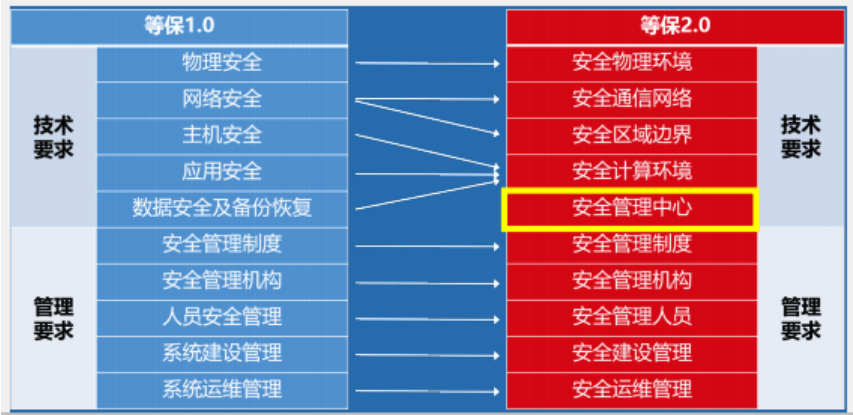

# 一、等级保护 & 风险评估：了解基本测评流程，知道各角色岗位在测评工作中的职责，学习国标文件。
## 1. 基本测评流程
首先测评内容主要分为两大类：技术要求、管理要求。   
   
等级保护对象整体测评应从安全控制点、安全控制点间和区域间等方面进行测评和综合安全分析，从而给出等级测评结论。整体测评包括安全控制点测评、安全控制点间测评和区域间测评，测评方法包括访谈、文档审查、实地察看、配置核查、工具测试等。   
（1）首先进行安全控制点的测评，对单个控制点中所有要求项的符合程度进行分析和判定。如果该安全控制点下的所有要求项为符合，则该安全控制点符合，否则为不符合、部分符合或者不适用。
（2）然后进行安全控制点间测评，对同一区域同一类内的两个或者两个以上不同安全控制点间的关联进行测评分析，其目的是确定这些关联对等级保护对象整体安全保护能力的影响。   
（3）最后进行区域间安全测评，对互连互通的不同区域之间的关联进行测评分析，其目的是确定这些关联对等级保护对象整体安全保护能力的影响。   
因等级保护对象的不同（不同形态和不同级别），等级保护的测评要求分为：安全通用要求和安全扩展要求。   
（a）安全通用要求：针对共性化保护需求提出，等级保护对象无论以何种形式出现，应根据安全保护等级实现相应级别的安全通用要求，包括10个部分：安全物理环境、安全通信网络、安全区域边界、安全计算环境、安全管理中心；安全管理制度、安全管理机构、安全管理人员、安全建设管理、安全运维管理。   
（b）安全扩展要求：针对个性化保护需求提出，需要根据安全保护等级和使用的特定技术或特定的应用场景选择性实现安全扩展要求，包括云计算扩展要求、物联网扩展要求、移动互联网扩展要求、工业控制系统扩展要求。
## 2. 各角色岗位在测评工作中的职责
|部门|职责|
|----|----|
|等级保护管理部门|等级保护管理部门依照等级保护相关法律、行政法规的规定，在各自职责范围内负责网络安全保护和监督管理工作|
|主管部门|负责依照国家网络安全等级保护的管理规范和技术标准，督促、检查和指导本行业、本部门或者本地区等级保护对象运营、使用单位的网络安全等级保护工作|
|运营、使用单位|负责依照国家网络安全等级保护的管理规范和技术标准，确定其等级保护对象的安全保护等级，有主管部门的，应报其主管部门审核批准；根据已经确定的安全保护等级，到公安机关办理备案手续；按照国
家网络安全等级保护管理规范和技术标准，进行等级保护对象安全保护的规划设计；使用符合国家有关规定，满足等级保护对象安全保护等级需求的信息技术产品和网络安全产品，开展安全建设或者改建工作；制定、落实各项安全管理制度，定期对等级保护对象的安全状况、安全保护制度及措施的落实情况进行自查，选择符合国家相关规定的等级测评机构，定期进行等级测评；制定不同等级网络安全事件的响应、处置预案，对网络安全事件分等级进行应急处置|
|网络安全服务机构|负责根据运营、使用单位的委托，依照国家网络安全等级保护的管理规范和技术标准，协助运营、使用单位完成等级保护的相关工作，包括确定其等级保护对象的安全保护等级、进行安全需求分析、安全总体规划、实施安全建设和安全改造、提供服务支撑平台等|
|网络安全等级测评机构|负责根据运营、使用单位的委托或根据等级保护管理部门的授权，协助运营、使用单位或等级保护管理部门，按照国家网络安全等级保护的管理规范和技术标准，对已经完成等级保护建设的等级保护对象进行等级测评；对网络安全产品供应商提供的网络安全产品进行安全测评|
|网络安全产品供应商|负责按照国家网络安全等级保护的管理规范和技术标准，开发符合等级保护相关要求的网络安全产品，接受安全测评；按照等级保护相关要求销售网络安全产品并提供相关服务|
## 3. 相关的国标文件   
|编号|文件名|
|----|----|
|~|关于开展全国重要信息系统安全等级保护定级工作的通知（公信安[2007]861号）|
|GB/T 28448-2019| 信息安全技术 网络安全等级保护测评要求|
|GB/T 22240-2020| 信息安全技术 网络安全等级保护定级指南|
|GB/T 22239-2019| 信息安全技术 网络安全等级保护基本要求|
|GB/T 31509-2015| 信息安全技术 信息安全风险评估实施指南|
|GB17859-1999| 计算机信息系统 安全保护等级划分准则|
|GB/T25058-2019| 信息安全技术 网络安全等级保护实施指南|
|GB/T25070-2019| 信息安全技术 网络安全等级保护安全设计技术要求|
# 二、思考：等级保护和风险评估有哪些区别（相似点和不同点）？
## 1. 什么是等级保护？
网络安全等级保护是指导我国信息安全保障体系建设的一项基础管理制度，对国家重要信息、法人和其他组织及公民的专有信息以及公开信息和存储、传输、处理这些信息系统中使用的信息安全产品实行按等级管理，对信息系统中发生的信息安全事件分等级响应、处置。等级保护是我国关于信息安全的基本政策，国家法律法规、相关政策制度要求单位开展等级保护工作。如《信息安全等级保护管理办法》和《中华人民共和国网络安全法》。
## 2. 什么是等级保护测评？
网络安全等级保护测评指的是用户单位委托第三方有测评资质的测评机构对单位已定级备案的信息系统开展安全测试的过程，测试结束后出具相应的符合网警检查的信息系统测评报告。
## 3. 什么是信息安全风险评估？
信息安全风险评估是参照风险评估标准和管理规范，对信息系统的资产价值、潜在威胁、薄弱环节、已采取的防护措施等进行分析，判断安全事件发生的概率以及可能造成的损失，提出风险管理措施的过程。
## 4. 等级测评与风险评估的区别？
等级测评、风险评估这两个是对等的，二者都是安全测评的方法。等级测评评估的是系统的安全防护能力，风险评估检测的是系统面临的风险。具体来说，就是风险评估评估的是系统面临的威胁、系统自身的脆弱性，等级测评评估的是系统的脆弱性和安全措施，二者可以结合使用。
## 5. 等级测评与风险评估的关系？
基本判断：风险评估是等级保护（不同等级不同安全需求）的出发点。风险评估中的风险等级和等级保护中的系统定级均充分考虑到信息资产CIA特性的高低，但风险评估中的风险等级加入了对现有安全控制措施的确认因素，也就是说，等级保护中高级别的信息系统不一定就有高级别的安全风险。   
风险评估是安全建设的出发点，它的重要意义就在于改变传统的以技术驱动为导向的安全体系结构设计及详细安全方案制定，以成本－效益平衡的原则，通过对用户关心的重要资产（如信息、硬件、软件、文档、代码、服务、设备、企业形象等）的分级、安全威胁（如人为威胁、自然威胁等）发生的可能性及严重性分析、对系统物理环境、硬件设备、网络平台、基础系统平台、业务应用系统、安全管理、运行措施等方面的安全脆弱性（或称薄弱环节）分析，并通过对已有安全控制措施的确认，借助定量、定性分析的方法，推断出用户关心的重要资产当前的安全风险，并根据风险的严重级别制定风险处理计划，确定下一步的安全需求方向。   
等级保护的前提是对系统定级，根据FIPS199，系统定级根据系统信息的机密性、完整性、可用性（简称CIA特性）等三性损失的最大值来确定，即“明确各种信息类型----确定每种信息类型的安全类别----确定系统的安全类别”三个步骤进行系统最终的定级。将信息系统安全类别（简称SC）表示为一个与CIA特性的潜在影响相关的三重函数，一般模式是：SC= ｛（保密性，影响），（完整性，影响），（可用性，影响）｝。   
等级保护中的系统分类分级的思想和风险评估中对信息资产的重要性分级基本一致，不同的是：等级保护的级别是从系统的业务需求或CIA特性出发，定义系统应具备的安全保障业务等级，而风险评估中最终风险的等级则是综合考虑了信息的重要性、系统现有安全控制措施的有效性及运行现状后的综合评估结果，也就是说，在风险评估中，CIA价值高的信息资产不一定风险等级就高。在确定系统安全等级级别后，风险评估的结果可作为实施等级保护、等级安全建设的出发点和参考。   
## 6. 内在联系和区别
等级保护是指导我国信息安全保障体系建设的一项基础管理制度，风险评估、系统测评都是在等级保护制度下，对信息及信息系统安全性评价方面两种特定的、有所区分但又有所联系的的不同研究、分析方法。   
等级保护是指导我国信息安全保障体系总体建设的基础管理原则，是围绕信息安全保障全过程的一项基础性管理制度，其核心内容是对信息安全分等级、按标准进行建设、管理和监督。风险评估、系统测评则只是针对信息安全评价方面两种有所区分但又有所联系的的不同研究、分析方法。从这个意义上讲，等级保护要高于风险评估和系统测评。当系统定级原则确定并根据该原则将系统分类分级后，那风险评估、系统测评都可以理解为在等级保护制度下的风险评估和等级保护制度下的系统测评，操作时只需在原有风险评估、系统测评方法、操作程序的基础上，加入特定等级的特殊要求就是了。打个比方：如果说等级保护是指导信息安全建设的宪法，则风险评估、安全测评则是针对系统安全性评估或合格判定方面的专项法律。
