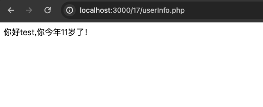

# 一、通过前端表单提交请求到后端 PHP 代码处理，请求内容为年龄 + 姓名，使用 GET 和 POST 请求，前端展示做 xss 漏洞防御。
## 1. [制作一个前端的表单提交](./user.html)

## 2. [写一个用于接收请求的php](./userInfo.php)

## 3. 启动服务

## 4. 提交数据

## 5. XSS攻击
   
   
## 6. 防御XSS
使用 `htmlspecialchars` 函数，改造之前的php源码。   

## 7. 再次提交
   
   
没有执行。
# 二、写一个三层循环嵌套，分别使用 continue、break 跳出 / 跳转最外层循环。
## 1. continue
   
```text
 continue 代表继续执行，当continue 3 的时候，代表从当前循环向外数第三层，然后继续执行。
```

## 2. break
   
```text
 break 代表跳出循环，如果和上面一样使用 break 3，那么整个代码循环只会执行一次，因为到最外层（第三层）也被跳出了，
 如果要实现当面的执行效果，这里可以使用 break 2。
```

# 三、通过 foreach 和 for 循环分别遍历一个数组。
[遍历数组](./array_test.php)   
