# 一、安装 ThinkPHP 框架。
## 1. Composer安装
### 1.1 简介
Composer 是 PHP ⽤来管理依赖（dependency）关系的⼯具。可以在⾃⼰的项⽬中声明所依赖的外部⼯具库（libraries），Composer 会帮你安装这些依赖的库⽂件。
### 1.2 安装
linux安装：   
```bash
 curl -sS https://getcomposer.org/installer | php
 mv composer.phar /usr/local/bin/composer
```   
windows安装：   
```url
 #下载地址 
  https://getcomposer.org/Composer-Setup.exe
```   
下载后双击安装。   
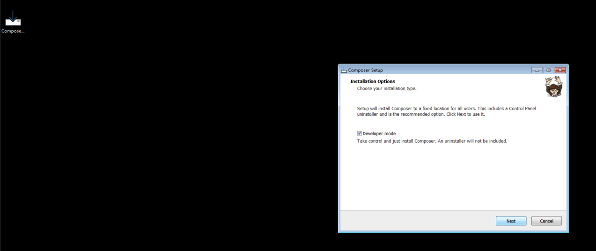   
## 2. 通过composer 创建一个 `Think PHP` 项目
```bash
 composer create-project topthink/think tp
```
进入 tp 目录，启动项目：   
```shell
 cd tp
 php think run
```   
访问地址：   
```url
 http://localhost:8000
```
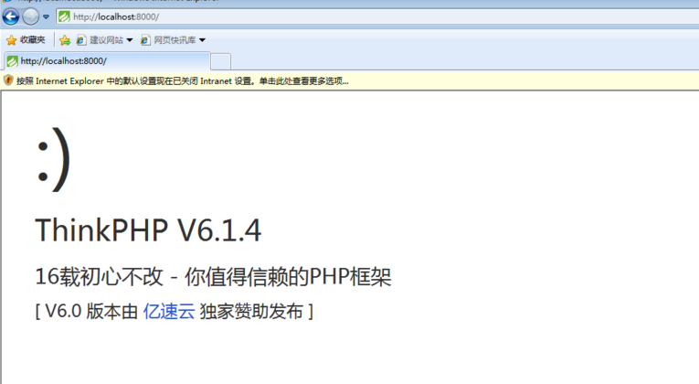   
# 二、在 ThinkPHP 框架中定义’/jike/:name’的路由，输出自己的名字。   
文件位置： `tp/route/app.php`   
访问原有路由 `hello/:name`    
```url
 http://localhost:8000/hello/zhangsan
```
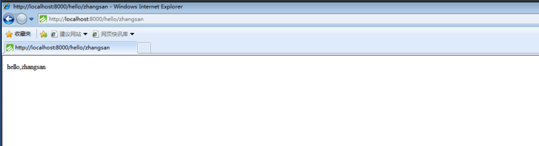   
新增路由： 
```php
 Route::get('jike/:name', 'index/hello');
```
访问新增路由：   
```url
 http://localhost:8000/jike/zhangsan
```
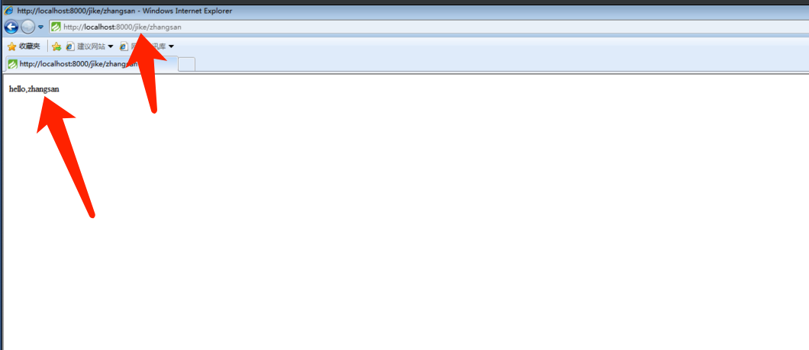   
# 三、梳理总结所有通用漏洞危险函数，梳理总结所有 PHP 获取用户的函数。
## 1.通用的危险函数
### 1.1 命令执行函数   
|函数/语法|描述|例子|
|---|---|---|
|system|执行命令并输出结果|system("id");|
|exec|执行命令 只可获取最后一行结果|exec('id',$a); print_r($a);|
|passthru|同system|passthru('id');|
|shell_exec (反引号) | 执⾏命令并返回结果 | $a=shell_exec('id');print_r($a);$a= id`;print_r($a);|
|popen|执⾏命令并建⽴管道 返回⼀个指针 使⽤fread等函数操作指针进⾏读写|$a=popen("id", "r"); echo fread($a, 2096);|
|proc_open|同 popen (进程控制功能更强⼤)|[手册地址](https://www.php.net/manual/zh/function.proc-open)|
|pcntl_exec|执行命令只返回是否发生错误|pcntl_exec('id');|   
### 1.2 mail函数
```php
 $to = 'Alice@example.com';
 $subject = 'Hello Alice!';
 $message=‘<?php phhpinfo(); ?>’；
 $headers = "CC: somebodyelse@example.com";
 $options = '-OQueueDirectory=/tmp -X/var/www/html/rce.php';
 mail($to, $subject, $message, $headers, $options);
```
### 1.3 代码注入/文件包含函数
|函数/语法|描述|例子|
|---|---|---|
|eval|将传入的参数内容作为PHP代码执行 eval 不是函数，是一种语法结构，不能当做函数动态调用|eval('phpinfo();');|
|assert|将传⼊的参数内容作为PHP代码执⾏ 版本在PHP7以下是函数PHP7及以上为语法结构|assert('phpinfo();');|
|preg_replace|当preg_replace使⽤/e修饰符且原字符串可控时，有可能执⾏php代码|echo preg_replace("/e","{${PHPINFO()}}","123");|
|call_user_func|把第一个参数作为回调函数调用，需要两个参数都完全可控才可利用，只能传入一个参数调用|call_user_func('assert','phpinfo();');|
|call_user_func_array|同call_user_func 可传⼊⼀个数组带⼊多个参数调⽤函数|call_user_func_array('file_put_contents',['1.txt','6666']);|
|create_function|根据传递的参数创建匿名函数，并为其返回唯⼀名称 利⽤需要第⼆个参数可控 且创建的函数被执⾏|$f = create_function('','system($_GET[123]);');$f();|
|include|包含并运⾏指定⽂件 执⾏出错会抛出错误|include 'vars.php'; (括号可有可⽆)|
|require|同include 执⾏出错会抛出警告|require('somefile.php'); (括号可有可⽆)|
|require_once|同require 但会检查之前是否已经包含该⽂件 确保不重复包含||
|include_once|同include 但会检查之前是否已经包含该⽂件 确保不重复包含||
### 1.4 文件读取/SSRF函数
|函数|描述|例子|
|---|---|---|
|file_get_contents|读⼊⽂件返回字符串|echo file_get_contents("flag.txt"); echo file_get_contents("https://ww w.bilibili.com/");|
|curl_setopt curl_exec|Curl访问url获取信息|function curl($url){$ch = curl_init(); curl_setopt($ch, CURLOPT_URL, $url);curl_exec($ch); curl_close($ch); } $url =$_GET['url'];curl($url);https://www.php.net/manual/zh/function.curl-exec.php|
|fsockopen|打开⼀个套接字连接(远程tcp/udpraw)|https://www.php.net/manual/zh/function.fsockopen.php|
|readfile|读取⼀个⽂件，并写⼊到输出缓冲|同file_get_contents|
|fopen/fread/fgets/fgetss/fgetc/fgetcsv/fpassthru/fscanf|打开⽂件或者 URL 读取⽂件流|$file = fopen("test.txt","r"); echo fread($file,"1234"); fclose($file);|
|file|把整个⽂件读⼊⼀个数组中|echo implode('', file('https://www.bilibili.com/ '));|
|highlight_file/show_source|语法⾼亮⼀个⽂件|highlight_file("1.php");|
|parse_ini_file|读取并解析⼀个ini配置⽂件|print_r(parse_ini_file('1.ini'));|
|simplexml_load_file|读取⽂件作为XML⽂档解析||
### 1.5 文件上传/写入/其他函数
|函数|描述|例子|
|---|---|---|
|file_put_contents|将一个字符串写入文件|file_put_contents("test.txt","magedu");|
|move_uploaded_file|将上传的临时文件移动到新的位置|move_uploaded_file($_FILES[ "pictures"]
["tmp_name"],"magedu.php")|
|rename|重命名⽂件/⽬录|rename($oldname,$newname);|
|rmdir|删除目录||
|mkdir|创建目录||
|unlink|删除文件||
|copy|复制文件|copy($file, $newfile);|
|fopen/fputs/fwrite|打开文件或URL|https://www.php.net/manual/zh/function.fwrite.php|
|link|创建文件硬链接|link($target, $link);|
|symlink|创建符号链接(软链接)|symlink($target, $link);|
|tmpfile|创建⼀个临时⽂件 (在临时⽬录存放 随机⽂件名 返回句柄)|$temp = tmpfile(); fwrite($temp, "123456");fclose($temp);|
|request()->file()->move()
request()->file()->file()| Thinkphp ⽂件上传 | $file = request()->file($name); $file->move($filepath);|
|extractTo|解压ZIP到目录||
|DOMDocument loadXML simplexml_import_dom|加载解析XML 有可能存在XXEE漏洞 file_get_contents获取客户端输⼊内容new DOMDocument()初始化XML 解析器 loadXML($xmlfile)加载客户端输⼊的XML内容simplexml_import_dom($dom)获取XML⽂档节点如果成功则返回SimpleXMLElement对象，如果失败则返回FALSE。|<?php $xmlfile = file_get_contents('php://input');$dom = new DOMDocument();$dom->loadXML($xmlfile);$xml = simplexml_import_dom($dom);$xxe = $xml->xxe;$str = "$xxe \n";echo $str;|
|simplexml_load_string|加载解析XML字符串 有可能存在XXE 漏洞|$xml=simplexml_load_string($_REQUEST['xml']);print_r($xml);|
|simplexml_load_file|读取⽂件作为XML⽂档解析 有可能存在XXE 漏洞||
|unserialize|反序列化||
### 1.6 mysql
|函数/方法|备注|
|---|---|
|mysql_query||
|odbc_exec||
|mysqli_query||
|mysql_db_query||
|mysql_unbuffered_query||
|mysqli::query⽤法$mysqli = new mysqli("localhost", "my_user", "my_password","world");$mysqli->query();||
|pg_query||
|pg_query_params||
|pg_send_query||
|pg_send_query_params||
|sqlsrv_query||
|pdo::query$pdo=new PDO("mysql:host=localhost;dbname=phpdem o","root","1234"); $pdo->query($sql);|PDO|
|SQLite3::query SQLite3::exec$db = new SQLite3('mysqlitedb.db'); $db->query('SELECT bar FROM foo'); $db->exec('CREATE TABLE bar (bar STRING)');||
## 2. 获取用户输入的函数
### 2.1 原生获取用户输入函数
|变量/常量/函数/等|描述|
|---|---|
|$_SERVER|包含服务器信息、环境变量、用户传入的http头和uri路径等信息|
|$_GET/$HTTP_POST_VARS|包含用户传入的URL参数|
|$_POST/$HTTP_POST_VARS|包含用户传入的POST BODY 的参数（当HTTP头中 Content-Type 值为application/x-www-form-urlencoded 或 multipart/form-data时才会被传入）|
|$_FILES/$HTTP_POST_FILES|包含用户上传文件信息、文件内容、原文件名、临时文件名、大小等信息|
|$_COOKIE/$HTTP_COOKIE_VARS|包含用户传入的HTTP头中的Cookies kv值|
|$_REQUEST|同时包含$GET $POST $_COOKIE|
|php://input$HTTP_RAW_POST_DATA|包含用户POST请求中的BODY的完整数据，常见用法file_get_contents('php://input');|
|apache_request_headers()/getallheaders()|包含用户传入的http头（Apache ONLY）|
### 2.2 THINKPHP框架输入变量
|方法|描述|
|---|---|
|param|获取当前请求的变量|
|get|获取 $_GET 变量|
|post|获取 $_POST 变量|
|put|获取 PUT 变量|
|delete|获取 DELETE 变量|
|session|获取 $_SESSION 变量|
|cookie|获取 $_COOKIE 变量|
|request|获取 $_REQUEST 变量|
|server|获取 $_SERVER 变量|
|env|获取 $_ENV 变量|
|route|获取 路由（包括PATHINFO） 变量|
|file| 获取 $_FILES 变量|
# 四、搭建 RIPS 工具，使用 RIPS 工具扫描 DVWA 代码。
## 1. RIPS 安装
官网地址：   
```url
 http://rips-scanner.sourceforge.net/
```  
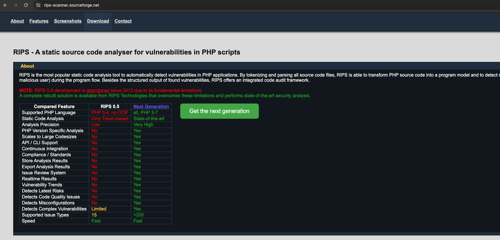   
下载地址：   
```url
 https://sourceforge.net/projects/rips-scanner/files/
```   
   
解压：   
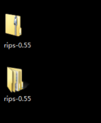   
将解压的文件放到网站根目录：   
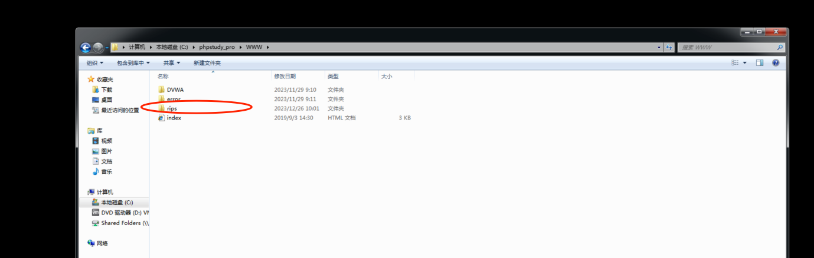   
启动服务，访问`RIPS`。   
```url
 http://127.0.0.1/rips/
```
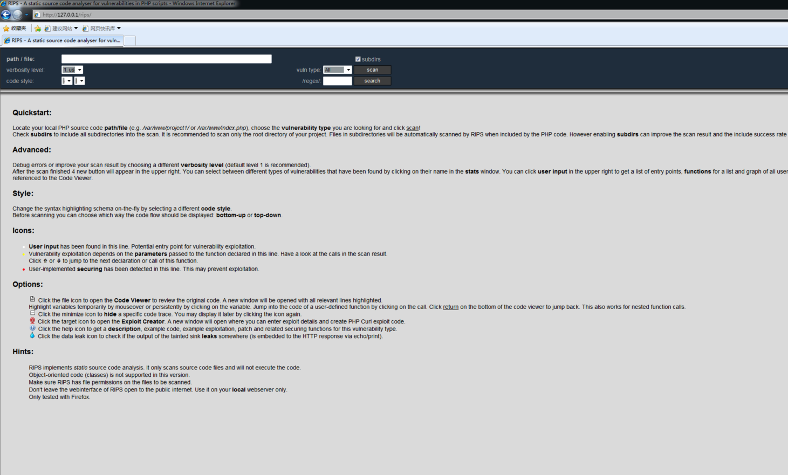   
## 2. 扫描 `DVWA` 代码   
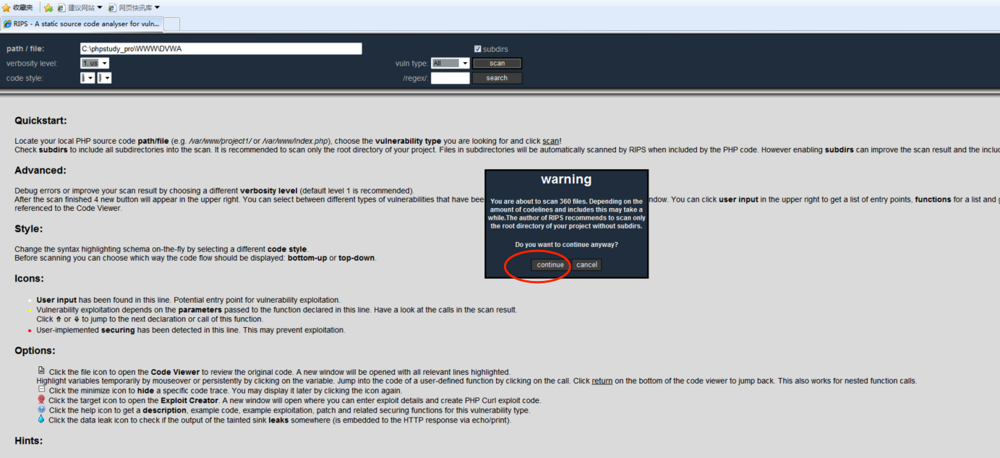   
Rips 主界面
```text
 subdirs：如果勾选上这个选项，会扫描所有子目录，否则只扫描一级目录，缺省为勾选。
 verbosity level：选择扫描结果的详细程度，缺省为1(建议就使用1)。
 vuln type：选择需要扫描的漏洞类型。支持命令注入、代码执行、SQL注入等十余种漏洞类型，缺省为全部扫描。
 code style：选择扫描结果的显示风格（支持9种语法高亮）。
 /regex/：使用正则表达式过滤结果。
 path/file： 要扫描的目录。
 scan： 开始扫描。
```
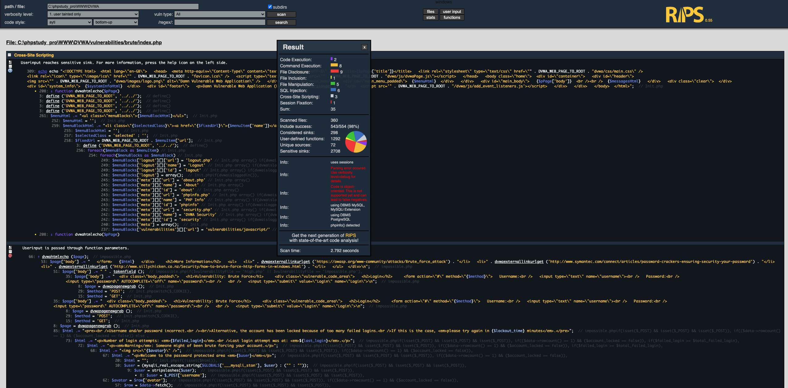   
```text
 结果说明：
 Code Execution: 代码执行
 Command Execution: 命令执行
 File Disclosure: 敏感文件泄露
 File Inclusion: 文件包含
 File Manipulation: 文件路径篡改
 SQL Injection: SQL 注入
 Cross-Site Scripting: XSS
 Session Fixation: 会话固定
```
漏洞链路信息：   
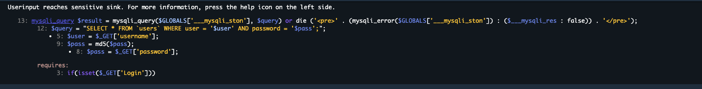   
具体的页面信息：   
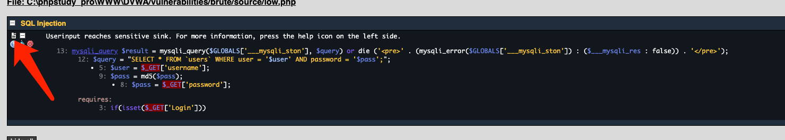   
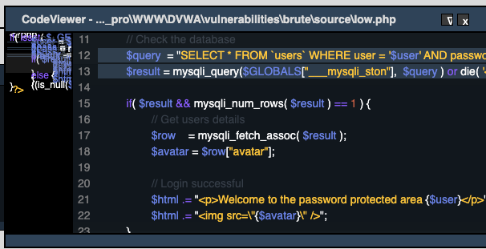   
注：此工具只能做老`PHP`项目的代码扫描，首先它只能单页面进行扫描，其次他不支持PHP框架的语法扫描。

