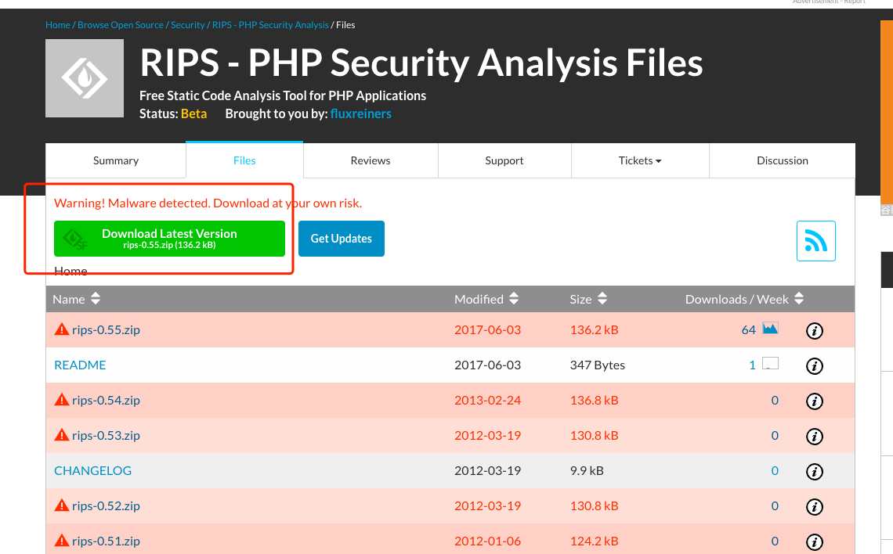

# 一、安装 ThinkPHP 框架。
## 1. Composer安装
### 1.1 简介
Composer 是 PHP ⽤来管理依赖（dependency）关系的⼯具。可以在⾃⼰的项⽬中声明所依赖的外部⼯具库（libraries），Composer 会帮你安装这些依赖的库⽂件。
### 1.2 安装
linux安装：   
```bash
 curl -sS https://getcomposer.org/installer | php
 mv composer.phar /usr/local/bin/composer
```   
windows安装：   
```url
 #下载地址 
  https://getcomposer.org/Composer-Setup.exe
```   
下载后双击安装。   
   
## 2. 通过composer 创建一个 `Think PHP` 项目
```bash
 composer create-project topthink/think tp
```
进入 tp 目录，启动项目：   
```shell
 cd tp
 php think run
```   
访问地址：   
```url
 http://localhost:8000
```
   
# 二、在 ThinkPHP 框架中定义’/jike/:name’的路由，输出自己的名字。   
文件位置： `tp/route/app.php`   
访问原有路由 `hello/:name`    
```url
 http://localhost:8000/hello/zhangsan
```
   
新增路由： 
```php
 Route::get('jike/:name', 'index/hello');
```
访问新增路由：   
```url
 http://localhost:8000/jike/zhangsan
```
   
# 三、梳理总结所有通用漏洞危险函数，梳理总结所有 PHP 获取用户的函数。
# 四、搭建 RIPS 工具，使用 RIPS 工具扫描 DVWA 代码。
## 1. RIPS 安装
官网地址：   
```url
 http://rips-scanner.sourceforge.net/
```  
   
下载地址：   
```url
 https://sourceforge.net/projects/rips-scanner/files/
```   
   
解压：   
   
将解压的文件放到网站根目录：   
   
启动服务，访问`RIPS`。   
```url
 http://127.0.0.1/rips/
```
   
扫描 `DVWA` 代码。   
   
Rips 主界面
```text
 subdirs：如果勾选上这个选项，会扫描所有子目录，否则只扫描一级目录，缺省为勾选。
 verbosity level：选择扫描结果的详细程度，缺省为1(建议就使用1)。
 vuln type：选择需要扫描的漏洞类型。支持命令注入、代码执行、SQL注入等十余种漏洞类型，缺省为全部扫描。
 code style：选择扫描结果的显示风格（支持9种语法高亮）。
 /regex/：使用正则表达式过滤结果。
 path/file： 要扫描的目录。
 scan： 开始扫描。
```
   
```text
 结果说明：
 Code Execution: 代码执行
 Command Execution: 命令执行
 File Disclosure: 敏感文件泄露
 File Inclusion: 文件包含
 File Manipulation: 文件路径篡改
 SQL Injection: SQL 注入
 Cross-Site Scripting: XSS
 Session Fixation: 会话固定
```
漏洞链路信息：   
   
具体的页面信息：   
   
   
注：此工具只能做老`PHP`项目的代码扫描，首先它只能单页面进行扫描，其次他不支持PHP框架的语法扫描。

