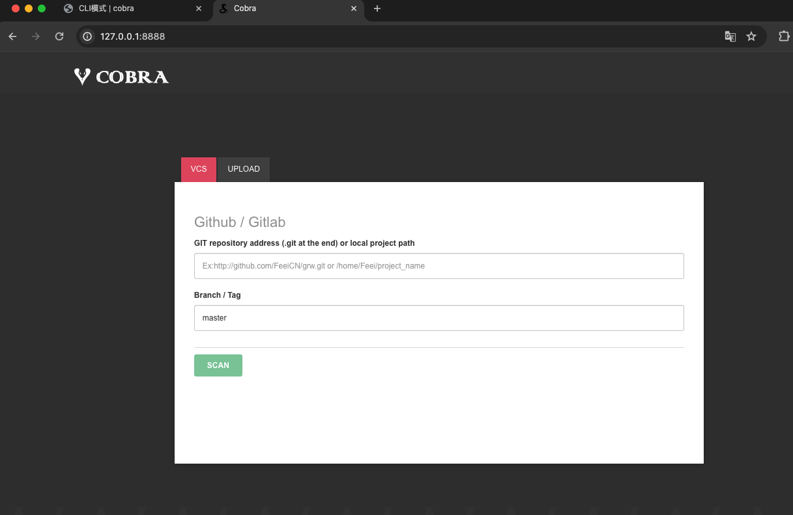
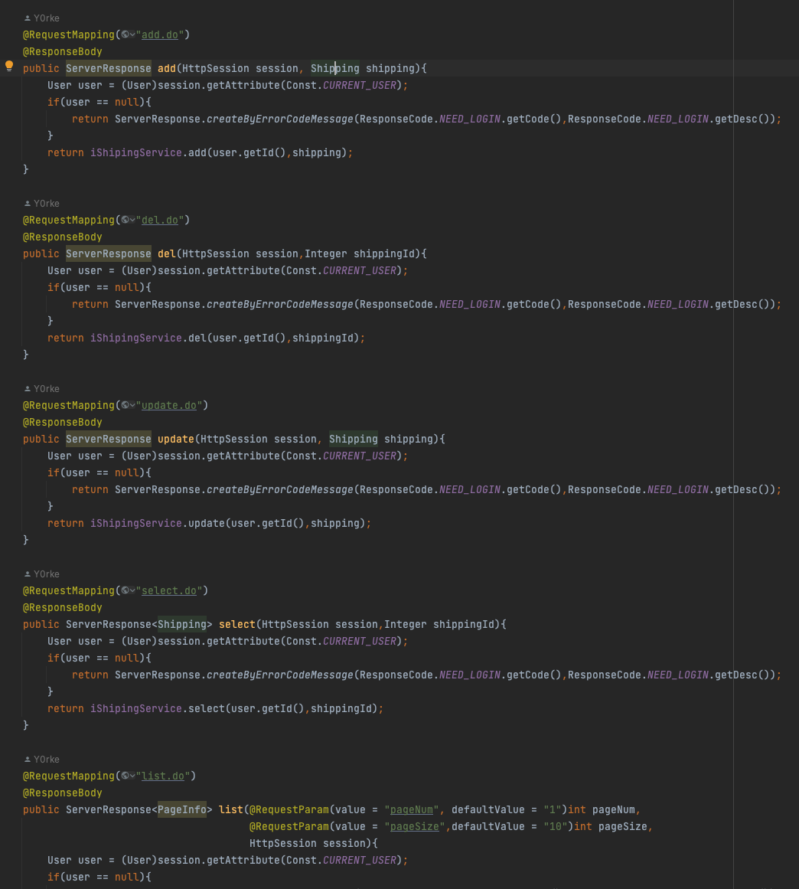

# 一、搭建 cobra，并扫描 mmall 系统代码。
## 1. `cobra`简介（摘自 [cobra](https://cobra.feei.cn/) ）
### 1.1 什么是”源代码安全审计（白盒扫描）”？
由于开发人员的技术水平和安全意识各不相同，导致可能开发出一些存在安全漏洞的代码。 攻击者可以通过渗透测试来找到这些漏洞，从而导致应用被攻击、服务器被入侵、数据被下载、业务受到影响等等问题。 “源代码安全审计”是指通过审计发现源代码中的安全隐患和漏洞，而Cobra可将这个流程自动化。
### 1.2 Cobra为什么能从源代码中扫描到漏洞？
对于一些特征较为明显的可以使用正则规则来直接进行匹配出，比如硬编码密码、错误的配置等。 对于OWASP Top 10的漏洞，Cobra通过预先梳理能造成危害的函数，并定位代码中所有出现该危害函数的地方，继而基于Lex(Lexical Analyzer Generator, 词法分析生成器)和Yacc(Yet Another Compiler-Compiler, 编译器代码生成器)将对应源代码解析为AST(Abstract Syntax Tree, 抽象语法树)，分析危害函数的入参是否可控来判断是否存在漏洞（目前仅接入了PHP-AST，其它语言AST接入中）。
### 1.3 Cobra和其它源代码审计系统有什么区别或优势？
> 开发源代码（基于开放的MIT License，可更改源码）   
> 支持开发语言多（支持十多种开发语言和文件类型）   
> 支持漏洞类型多（支持数十种漏洞类型）   
> 支持各种场景集成（提供API也可以命令行使用）   
> 专业支持，持续维护（目前已停止更新）   
#### 1.4 Cobra支持哪些开发语言？
目前Cobra主要支持PHP、Java等主要开发语言及其它数十种文件类型，并持续更新规则和引擎以支持更多开发语言，具体见支持的[开发语言和文件类型](https://cobra.feei.cn/languages)。   
[查看更多相关介绍](https://cobra.feei.cn/)   
## 2. 安装
   
[查看明细](https://cobra.feei.cn/installation)   
运行   

## 3. 扫描代码
```bash
 # 扫描一个文件夹的代码
$ python cobra.py -t tests/vulnerabilities

# 扫描一个Git项目代码
$ python cobra.py -t https://github.com/FeeiCN/grw.git

# 扫描一个文件夹，并将扫描结果导出为JSON文件
$ python cobra.py -t tests/vulnerabilities -f json -o /tmp/report.json

# 扫描一个Git项目，并将扫描结果JSON文件推送到API上
$ python cobra.py -f json -o http://push.to.com/api -t https://github.com/FeeiCN/vc.git

# 扫描一个Git项目，并将扫描结果JSON文件发送到邮箱中
$ python cobra.py -f json -o feei@feei.cn -t https://github.com/FeeiCN/grw.git

# 扫描一个文件夹代码的某两种漏洞
$ python cobra.py -t tests/vulnerabilities -r cvi-190001,cvi-190002

# 开启一个Cobra HTTP Server，然后可以使用API接口来添加扫描任务
$ python cobra.py -H 127.0.0.1 -P 8888

# 查看版本
$ python cobra.py --version

# 查看帮助
$ python cobra.py --help

# 扫描一个Git项目，扫描完毕自动删除缓存
$ python cobra.py -t http://github.com/xx/xx.git -dels

# 扫描gitlab全部项目，配置好config中private_token，gitlab_url，cobra_ip
$ python git_projects.py

# 自动生成Cobra扫描周报发送至指定邮箱，需要配置好config中的SMTP服务器信息
$ python cobra.py -rp
```   
扫描 mmall代码。   
```bash
 python cobra.py -t ~/learn/mmall2 -f json -o /temp/report.json
```   
   
查看报告文件。   
   
前端交互页面扫描。   
   

启动服务   
```bash
 python cobra.py -H 127.0.0.1 -P 8888
```   
   
可以指定git地址，也可以上传项目进行扫描。   
   
# 二、自定义 1-2 条规则，扫描 mmall 系统代码，使用多条正则匹配。
## 1. 规则配置
   
   
   
## 2. 扫描场景   
**场景一：** 扫描 `mapper` 文件中的 `$` 拼接。   
复制一个规则，修改编号，然后配置具体规则：
```xml
 <?xml version="1.0" encoding="UTF-8"?>
<cobra document="https://github.com/WhaleShark-Team/cobra">
    <name value="SQL注入"/>
    <language value="*"/>
    <match mode="regex-only-match"><![CDATA[\$\{([^}]*)\}]]></match>
    <match2 block="in-file-up"><![CDATA[^<\?xml]]></match2>
    <level value="1"/>
    <test>
        <case assert="true"><![CDATA[and name like ${productName}]]></case>
        <case assert="false"><![CDATA[and name like #{productName}]]></case>
    </test>
    <solution>
        ## 安全风险
        sql注入。

        ## 修复方案
        使用#{}

        示例修复：
        ```
        and name like #{productName}
        ```
    </solution>
    <status value="on"/>
    <author name="huanxue" email="*****@gmail.com"/>
 </cobra>
```
结果：   
   
**场景二：** 使用了"YYYY"方式进行日期格式化，可能存在跨年的问题，扫描这类型的使用。   
复制一个规则，修改编号，然后配置具体规则：
```xml
 <?xml version="1.0" encoding="UTF-8"?>
 <cobra document="https://github.com/WhaleShark-Team/cobra">
    <name value="使用不推荐的YYYY作为年份格式化"/>
    <language value="java"/>
    <match mode="regex-only-match"><![CDATA[/\bYYYY\b/]]></match>
    <match2 block="in-file-up"><![CDATA[/\SimpleDateFormat\b/]]></match2>
    <level value="2"/>
    <test>
        <case assert="true"><![CDATA[SimpleDateFormat sdf1 = new SimpleDateFormat("YYYY-MM-dd");]]></case>
        <case assert="false"><![CDATA[SimpleDateFormat sdf2 = new SimpleDateFormat("yyyy-MM-dd");]]></case>
        <case assert="true"><![CDATA[SimpleDateFormat sdf3 = new SimpleDateFormat("dd/MM/YYYY");]]></case>
    </test>
    <solution>
        ## 安全风险
        使用不推荐的"YYYY"作为年份格式化可能导致跨年风险。在Java中，应该使用"yyyy"来表示四位数的年份。

        ## 修复方案
        将使用"YYYY"的日期格式化代码改为使用"yyyy"来表示年份。

        示例修复：
        ```
        SimpleDateFormat sdf1 = new SimpleDateFormat("yyyy-MM-dd");
        ```
    </solution>
    <status value="on"/>
    <author name="huanxue" email="*****@gmail.com"/>
 </cobra>
```
**说明：** 扫描代码中出现的 `YYYY` 单词，并且在当前行的上方文件中查 `SimpleDateFormat` 单词，匹配上了则说明存在问题。   
执行：   
```bash
 # 指定规则进行扫描 
 python cobra.py -t ~/learn/CVE-2022-25845 -r cvi-400001
```   
结果：   
   
# 三、复现 fastjson 漏洞。
## 1. fastjson 漏洞原理介绍
fastjson为了读取并判断传入的值是什么类型，增加了autotype机制导致了漏洞产生。
由于要获取json数据详细类型，每次都需要读取@type，而@type可以指定反序列化任意类调用其set，get，is方法，并且由于反序列化的特性，我们可以通过目标类的set方法自由的设置类的属性值。
那么攻击者只要准备rmi服务和web服务，将rmi绝对路径注入到lookup方法中，受害者JNDI接口会指向攻击者控制rmi服务器，JNDI接口从攻击者控制的web服务器远程加载恶意代码并执行，形成RCE。
## 2. 复现
添加依赖。
```xml
 <dependencies>
    <dependency>
        <groupId>com.alibaba</groupId>
        <artifactId>fastjson</artifactId>
        <version>1.2.24</version>
    </dependency>
 </dependencies>
```
编写恶意代码，在setAge方法中注入恶意代码。
```java
 public class User {
    private String name;
    private int age;

    public void setAge(int age){
        this.age = age;
        try {
            Runtime.getRuntime().exec(new String[]{"open", "/System/Applications/Calculator.app"});
        } catch (IOException e) {
            throw new RuntimeException(e);
        }
    }

    public void setName(String name){
        this.name = name;
    }

    public String getName(){
        return this.name;
    }
    public int getAge(){
        return this.age;
    }

 }
```
运行。
```java
 public class Test {
    public static void main(String[] args) {
        String poc = "{\"name\":\"123\",\"age\":12}";
        JSON.parseObject(poc, User.class);
    }
 }
```  
成功弹出计算器。   
   
# 四、人工审计完成 mmall 系统所有接口逻辑。
## 1. `mmall` 项目结构分析
   
```text
 common 公共包
 controller 控制层，程序的入口
 dao 数据操作层
 pojo 数据实体
 service 业务层
 util 工具
 vo 展示实体
```
## 2. 从控制层开始看
控制层分为两个包，一个是 `backend` 后台和一个 `portal` 前端，先从前端开始审计。  
### 2.1 portal
寻找用户可控参数，`session`为用户不可控可以忽略，一般重点关注 `String` 类型入参。   
   
未发现直接问题，查看业务处理中的核心方法，添加购物车 `add` 方法，发现并没有对添加的数量进行严格的校验，可能会存在传入负数或者整数溢出的风险。   
   
此处如果为负数，再去查看提交订单处。   
   
订单处也没有做负数相关的校验，这里可能得出的总金额为负数。支付金额的计算逻辑也没有做负数的校验，最终可能得到一个负数的付款金额。      
   
继续查看扣减库存逻辑。   
   
由于上面没做负数限制，这里的扣减库存会变成负负得正的情况。   
   
订单中其余方法的查询，重点关注是否存在越权查看的问题，发现uid都是从session中获取，不存在越权查看订单敏感信息的风险。   
商品控制类中，无写等相关操作，全部都是直接走数据库查询，需要结合实际业务场景，考虑高流量可能带来的拒绝服务风险。   
购物控制类，主要维护收货信息的增删改查。   
   
所有uid都是从session中获取，   
   
mapper中无 `$` 拼接的情况。   
   
用户控制类中，登录开始审计，首先登录，只有用户和密码，没有次数限制，存在爆破风险。   
   
登录失败后，提示信息存在问题，攻击者可以进行账号枚举。   
   
其余注册，重置密码等地方未发现风险。   
### 2.2 backend
首先是添加分类控制器，其中 `categoryName` 为字符串用户可控参数，重点关注,在mapper中搜索 `$` ，未发现异常，整体操作有角色的权限控制，用户是从session中获取的，所以这里没有问题。  
    
然后是订单后台控制器，无用户可控参数，也都进行了权限的校验，用户信息从session中获取。   
商品控制器中，有图片上传的功能，这里没有校验文件的类型，上传完成之后将完整的url返回给了前端。   
用户管理控制器中，有个登录方法和前端登录调用的同一个实现方法，存在同样的问题。