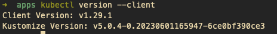

# 一、使用 Docker Desktop 搭建 Kubernetes 环境，并创建 K8s dashboard。
## 1. K8s简介
Kubernetes是容器集群管理系统，是⼀个开源的平台，可以实现容器集群的⾃动化部署、⾃动扩缩容、维护等功能。   
通过Kubernetes你可以：   
* 快速部署应⽤   
* 快速扩展应⽤   
* ⽆缝对接新的应⽤功能   
* 节省资源，优化硬件资源的使⽤   
我们的⽬标是促进完善组件和⼯具的⽣态系统，以减轻应⽤程序在公有云或私有云中运⾏的负担。
## 2. Kubernetes 特点
* 可移植: ⽀持公有云，私有云，混合云，多重云（multi-cloud）   
* 可扩展: 模块化, 插件化, 可挂载, 可组合   
* ⾃动化: ⾃动部署，⾃动重启，⾃动复制，⾃动伸缩/扩展   
## 3. 搭建 Kubernetes
### 3.1 docker 安装
之前安装过了，这里就不安装了。   
   
### 3.2 安装 kubectl   
[详细教程](https://kubernetes.io/zh-cn/docs/tasks/tools/install-kubectl-macos/)   
下载最新的发行版   
```bash
 curl -LO "https://dl.k8s.io/release/$(curl -L -s https://dl.k8s.io/release/stable.txt)/bin/darwin/amd64/kubectl"
```
   
设置为可执行文件   
```bash
 chmod +x ./kubectl
```
将可执行文件 kubectl 移动到系统可寻址路径 PATH 内的一个位置：   
```bash
 sudo mv ./kubectl /usr/local/bin/kubectl
 sudo chown root: /usr/local/bin/kubectl
```   
验证安装是否成功   
```bash
 kubectl version --client
```
   
基础命令   
```bash
 # 基于yaml⽂件创建namespace
 kubectl create -f test.yaml
 # 命令⾏创建namespace
 kubectl create nampspace custom-namespace
 # 列出所有命名空间
 kubectl get ns
 kubectl get namespace
 # 列出命名空间下的资源,不指定命名空间的情况下默认为default命名空间
 kubectl get pods -n kube-system
```
### 3.3 docker 中设置开启 Kubernetes
   
启动成功之后，图标会变成绿色。   
   
查看状态   
```bash
 kubectl cluster-info
```
   
### 3.4 创建 kubernetes-dashboard 
预先从阿里云镜像服务下载 Kubernetes 所需镜像
```bash
 git clone  https://github.com/AliyunContainerService/k8s-for-docker-desktop
```
执行 `load_images.sh`   
```bash
 cd k8s-for-docker-desktop
 ./load_images.sh
```
   
创建 kubernetes-dashboard   
```bash
 kubectl create -f kubernetes-dashboard.yaml
```
授权 `kube-system` 账号
```bash
 kubectl apply -f kube-system-default.yaml
```   
   
开启代理   
```bash
 kubectl proxy
```
访问下面链接   
```url
 http://127.0.0.1:8001/api/v1/namespaces/kubernetes-dashboard/services/https:kubernetes-dashboard:/proxy/#/login
```   
   
选择token登录，输入下面命令获取token   
```bash
 kubectl describe secret default -n kube-system
```
   
将token复制到登录框中   
   

# 二、安装 Python 基础环境和 PyCharm。
## 1. python 安装
mac自带2.x版本.   
   
自行安装3.x版本。   
[下载地址](https://www.python.org/downloads/macos/)   
   
   
下载后安装完成之后，配置环境变量。  
```bash
 vi ~/.bash_profile
``` 
添加   
```bash
 export PATH="/Library/Frameworks/Python.framework/Versions/3.12/bin/:$PATH"
```   
source
```bash
 source ~/.bash_profile
```
   
## 2. 安装pyCharm
[下载地址](https://www.jetbrains.com/zh-cn/pycharm/download/?section=mac)   
下载社区版即可   
   
# 三、使用 Python 输出 2000 以内的斐波那契数列，对输出的数列进行翻转再去除首尾两个元素后取出次大数和最大数进行求和。   
```python
 def gen_fibonacci_sequence(max_num):
    """
    生成一个斐波那契数列
    :param max_num: 自定义数列的最大值
    :return: 返回生成的数列
    """
    sequence = [0, 1]
    first_idx = 0
    second_idx = 1
    if sequence[first_idx] + sequence[second_idx] > max_num:
        print("请输入大于等于1的数字")
    else:
        while sequence[first_idx] + sequence[second_idx] <= max_num:
            sequence.append(sequence[first_idx] + sequence[second_idx])
            first_idx = second_idx
            second_idx = second_idx + 1
    return sequence


def sum_max_and_second_num(sequence):
    """
    获取一个队列中最大数和次大数的和
    :param sequence: 队列
    :return: sum num
    """
    if len(sequence) < 2:
        print("请传入长度大于等于2的队列")
    else:
        max_num = sequence[0]
        second_num = 0
        for i in range(1, len(sequence) - 1):  # 从下标为1开始遍历，不断替换最大和最小值，最后返回两个数的和
            current_num = sequence[i]
            if current_num > max_num:
                second_num = max_num
                max_num = current_num
            elif (current_num < max_num) & (current_num > second_num):
                second_num = current_num
        return max_num + second_num


if __name__ == '__main__':
    fibonacci_sequence = gen_fibonacci_sequence(2000)  # 生成一个2000以内的斐波那契数列
    print(fibonacci_sequence)
    fibonacci_sequence = fibonacci_sequence[::-1]  # 进行数列翻转
    print(fibonacci_sequence)
    fibonacci_sequence = fibonacci_sequence[1:len(fibonacci_sequence) - 1]  # 去除首尾两个元素
    print(fibonacci_sequence)
    sum_num = sum_max_and_second_num(fibonacci_sequence)  # 获取最大数和次大数的和
    print(sum_num)
```   
输出：   
