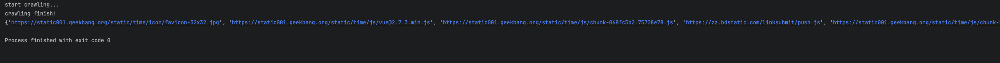
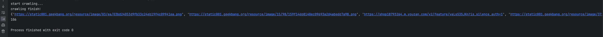
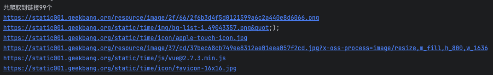

# 一、爬取极客时间网站时，对所有爬取到的主⻚的链接进行去重 ;
## 1. 功能介绍
爬取地址为：
```plain
 https://time.geekbang.org
```   
使用到的组件为：
```plain
 1. selenium  # 爬虫组件
 2. asyncio  # 异步请求，提高抓取效率
 3. re  # 正则匹配需要的地址信息
```
## 2. 核心代码介绍
```python
 async def crawling(d, craw_url):
    """
    抓取主函数，获取到页面数据之后开启三个任务解析不同位置的url信息
    :param d: driver 配置好的驱动器
    :param craw_url:  请求地址
    :return:
    """
    d.get(craw_url)  # 查看页面源码，可以找到拥有url信息的标签有link，script的src和js代码中
    await asyncio.create_task(get_url_from_link(d))  # 从link中获取地址
    await asyncio.create_task(get_url_from_a(d))  # 从a标签中获取地址
    await asyncio.create_task(get_url_from_img(d))  # 从img标签中获取地址
    await asyncio.create_task(get_url_from_script(d))  # 从script标签中获取地址
    await asyncio.create_task(get_url_from_page_source(d))  # 从源码内容中获取地址
```
除了正则匹配地址外，有些标签中存在当前本地地址的情况，所以需要单独解析。
## 3. 执行结果

# 二、当主⻚中链接为 HTML⻚面时进行进一步爬取（获得 HTML⻚面中的所有极客时间域名的链接）；
## 1. 分析
需要进一步抓取需要满足的条件：
```plain
 1. html页面
 2. 极客时间的域名
```  
## 2. 代码改造
在上述代码的基础上进行改造，抓取之后进行url解析，满足条件的进行进一步的抓取。   
```python
 async def next_send(d, url):
    global urls
    global domain
    url_spilt = url.split('/')
    if len(url_spilt) > 2:
        temp_domain = url_spilt[2]
        if temp_domain.endswith(domain) and url.endswith('html'):
            await asyncio.create_task(crawling(d, url))
```
新封装一个方法，用于解析到url后，判断是否满足进一步抓取的条件，满足条件之后，进一步开启新的一个抓取任务.
## 2. 执行结果

# 三、输出去重后的所有链接并统计数量 ;

# 四、爬取代理 IP 列表，当网站访问被拦截时自动替换代理 IP（进阶，选做）。
## 1. 代理
```url
 https://free.kuaidaili.com/
```
## 2. 代码中设置代理
```python
 proxy_pool = [
    "134.35.254.250:8080",
    "177.93.36.81:999",
    "134.35.25.155:8080"
 ]
 async def crawling(craw_url, retry_times=3):
    """
    抓取主函数，获取到页面数据之后开启三个任务解析不同位置的url信息
    :param retry_times:  重试次数
    :param craw_url:  请求地址
    :return:
    """
    profile = webdriver.FirefoxOptions()  # 驱动设置
    profile.set_preference("general.useragent.override", "geektime.com")
    proxy = random.choice(proxy_pool)
    profile.add_argument('--proxy-server=%s' % proxy)
    driver = webdriver.Firefox(options=profile)
    if register_task(craw_url):
        with driver:
            driver.get(craw_url)  # 查看页面源码，可以找到拥有url信息的标签有link，script的src和js代码中
            if not is_intercept(driver):  # 查看是否被拦截了，如果被拦截了，则尝试随机代理，重新请求
                await asyncio.create_task(parse(driver))
            else:
                retry_times -= 1
                if retry_times > 0:
                    await crawling(craw_url, retry_times)
```
抓取时传入一个尝试次数，抓取之后，判断是否被拦截了，如果拦截了，从代理池中随机获取一个代理，重新发起请求