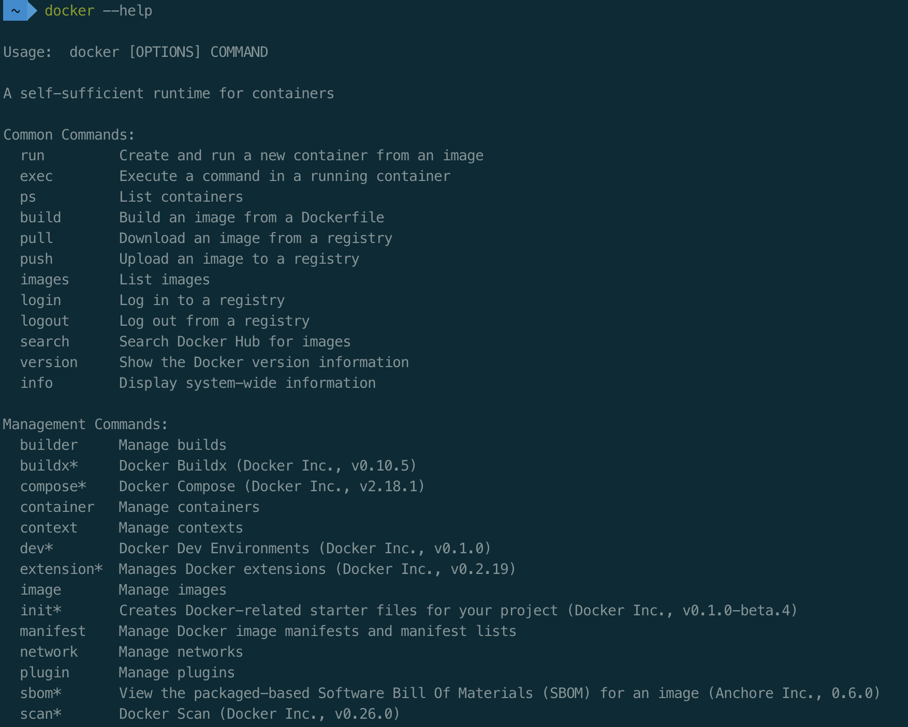
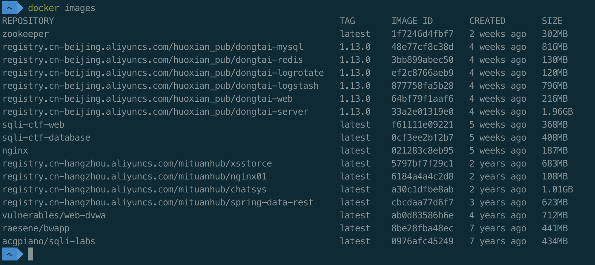
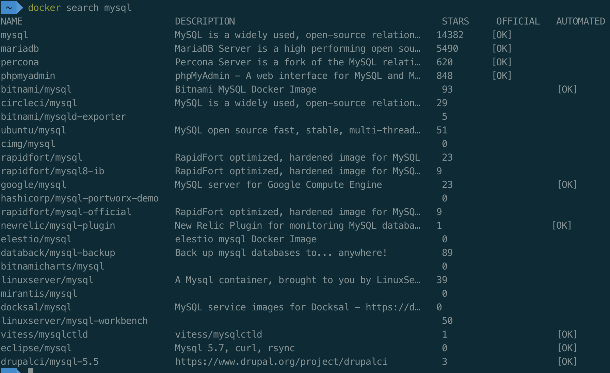
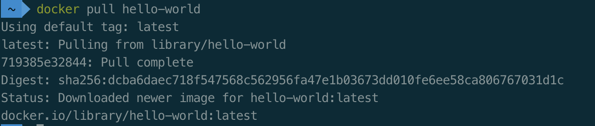
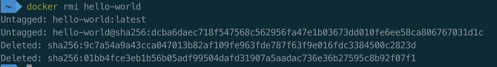

# 一、判断题

1. Java 是编译型语言。
| 错：java既不是编译型语言，也不是解释型语言
2. Javascript 中，不区分大小写字母，也就是说 A 和 a 是同一个变量。
| 错：区分
3. Javascript 中的常量包括 String、Number、Boolean、Null、Undefined。
| 错：js中三种常量数字，字符串，布尔。
4. String 字符串的语法中既可以使用单引号，也可以使用双引号。
| 对
5. typeof 是用来判断变量类型，不可以当作运算符使用。
| 错：typeof是运算符，总是返回字符串。
6. 任何值和 undefined 运算，undefined 可看做 0 运算。
| 错：undefined是未定义，和任何数据运算都是NaN。

# 二、请分别描述下列代码中“+”的作用。
1. console.log(“年龄:” + 20);
| 字符串拼接。
2. console.log(11+22+33);
| 数值相加。
3. console.log(“网络 + 安全”);
| “+”属于字符串。
4. var a = 1;
var b = 2;
console.log(“a” + b);
| 字符串拼接。
5. var a = 1;
var b = 2;
console.log(“a + b”);
| “+”属于字符串。

# 三、计算下述代码的打印值
var a = 10;
var b = 10;
console.log(a++);
| 10
console.log(++a);
| 12
console.log(--b);
| 9
console.log(b--);
| 9

# 四、分别使用行内式、内嵌式、引入外部文件的方法造成网页弹窗，要求触发弹窗的 JavaScript 命令不止一种（alert、print、prompt）。
## 1. 行内式
```javascript

```
## 2. 内嵌式
```javascript
<script>
    prompt('123');
</script>
```
## 3. 引入外部文件
```javascript
<script src='./homework.js'></script>
```

五、安装 Docker 并练习以下基础命令、帮助命令、镜像命令和容器命令:

帮助命令
docker 命令 --help

镜像命令
docker images 列出所有镜像

docker search 搜索镜像

docker pull 下载镜像

docker rmi 删除镜像

请各位同学课后及时练习回顾上述 Docker 命令，下次课程将在此基础之上讲解靶场的搭建。