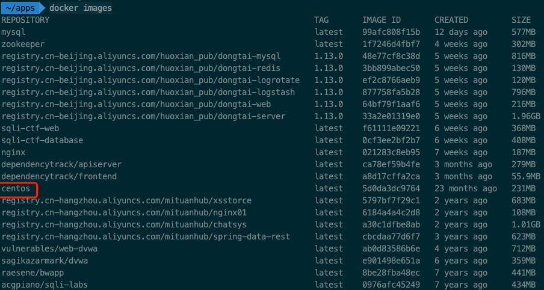
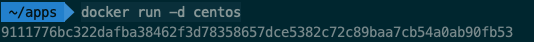
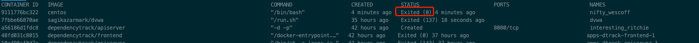
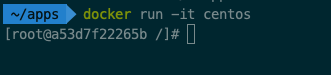
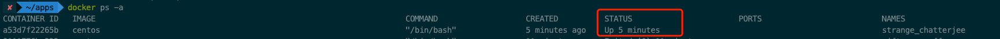
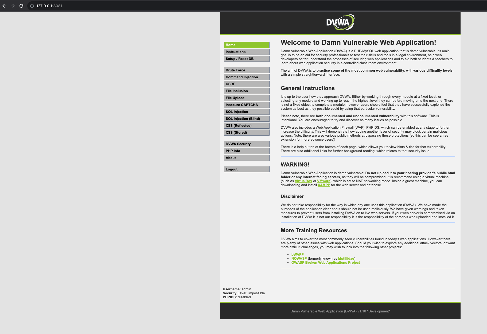
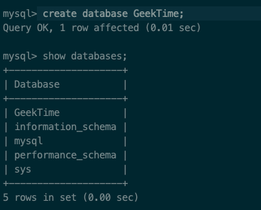
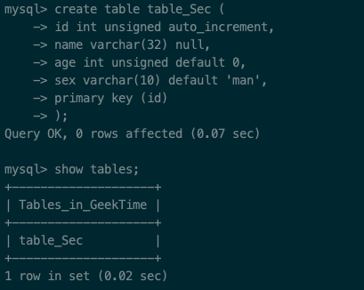
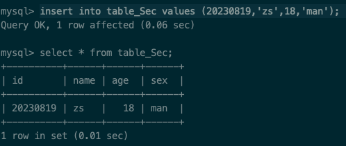
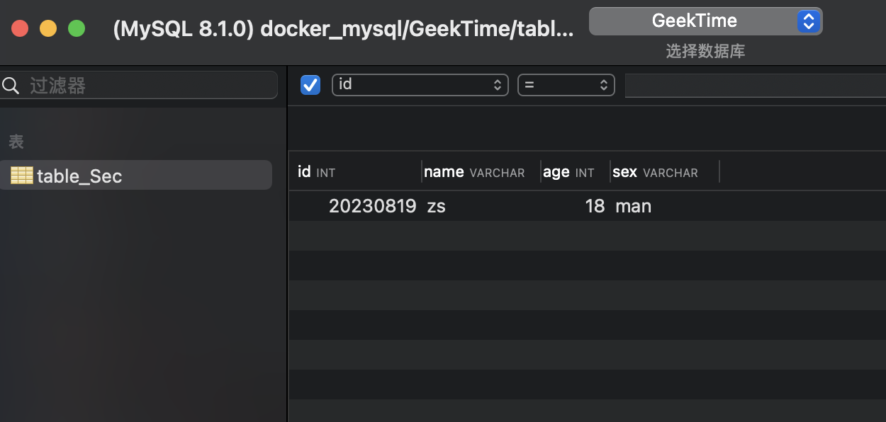

# 一、 在 Docker 中分别以后台方式和交互方式启动 CentOS，对比启动后的容器状态，实现退出容器也能保持其运行状态。

## 1. 查看 CentOS 镜像信息；
```shell
docker images
```

## 2. 启动 CentOS；

### 2.1 以后台方式启动 CentOS

```shell
docker run -d centos
```



#### 查看启动后的容器状态

```shell
docker ps -a
```


### 2.2 以交互方式启动 CentOS

```shell
docker run -it centos
```


#### 保持退出
```shell
ctrl + Q + P
```
#### 查看容器状态


# 二、 在 Docker 中部署 DVWA，要求：DVWA Web 端口映射到 8081，提供访问截图。


# 三、 MySQL 练习

* 创建一个名为 GeekTime 的数据库；

```shell
 create database GeekTime;
```


* 在 GeekTime 数据库中创建一张名为 table_Sec 的表，要求有序号、姓名、年龄、性别字段；
```mysql

create table table_Sec (
    id int unsigned auto_increment,
    name varchar(32) null,
    age int unsigned default 0,
    sex varchar(10) default 'man',
    primary key (id)
);
```


* 在 table_Sec 表中插入数据，序号是 20230819，姓名是拼音缩写，年龄、性别无要求 ;

```mysql
insert into table_Sec values (20230819,'zs',18,'man');
```


* 使用 Navicat 连接你所创建的数据库，查看个人信息并提供截图。



# 四、 回顾课件中关于 HTTP 协议的相关知识点，包括格式、请求方法、状态码等，练习使用 HackBar 工具。

## 1. HTTP

### 1.1 格式

#### 请求

```shell
POST /.well-known/attribution-reporting/debug/verbose HTTP/1.1  //请求行 POST表示请求方法 /.well-known/attribution-reporting/debug/verbose 表示请求资源的路径 HTTP/1.1 表示所用的协议以及版本
Host: www.googleadservices.com //请求头
Content-Length: 201 //请求体的大小
Pragma: no-cache
Cache-Control: no-cache
Content-Type: application/json // 请求体的格式
Origin: https://www.googleadservices.com //来源
Sec-Fetch-Site: same-origin
Sec-Fetch-Mode: same-origin
Sec-Fetch-Dest: empty
User-Agent: Mozilla/5.0 (Macintosh; Intel Mac OS X 10_15_7) AppleWebKit/537.36 (KHTML, like Gecko) Chrome/115.0.0.0 Safari/537.36 // UA记录着系统和浏览器信息
Accept-Encoding: gzip, deflate //支持的编码方式
Accept-Language: zh-CN,zh;q=0.9 // 支持的语言
//空行表示请求头结束，两个CLRF(\r\n)，流量攻击中可以去掉一个（\r\n）标识头部未结束，客户端在发送任意头部保持连接，耗尽服务器资源
[{"body":{"attribution_destination":"https://godaddy.com","source_debug_key":"4654826503229838853","source_event_id":"11957062176077987889","source_site":"https://runoob.com"},"type":"source-success"}]//请求正文
```

#### 响应
```shell
HTTP/1.1 200 OK //响应行 HTTP/1.1表示使用的协议以及版本 200为响应的状态码
Server: ADAS/1.0.201 //服务器信息
Date: Thu, 24 Aug 2023 02:06:24 GMT //日期
Content-Type: application/json; charset=utf-8 //响应体格式
Connection: close //连接状态
Vary: Accept-Encoding
X-XSS-Protection: 1; mode=block
X-Content-Type-Options: nosniff
X-UA-Compatible: chrome=1
Expires: Sun, 1 Jan 2000 01:00:00 GMT //过期时间
Pragma: must-revalidate, no-cache, private
Cache-Control: no-cache
Set-Cookie: oschina_new_user=false; path=/; expires=Mon, 24 Aug 2043 02:06:23 -0000
Set-Cookie: gitee-session-n=TkRkNFRJNys5bHUrd3JzSXk; domain=.gitee.com; path=/; HttpOnly //保持登录状态，同时设置了 HttpOnly 表示只能通过http请求中获取，不能通过js等访问，一个安全属性的设置，可以避免XSS攻击时通过js获取凭证。
X-Request-Id: 668d16ccd86b89d84224d072680dd436
X-Runtime: 0.035238
Vary: Origin
X-Frame-Options: SAMEORIGIN
Content-Security-Policy: frame-ancestors 'self' https://*.gitee.com
Content-Length: 39 // 响应内容大小
//空行表示响应头结束
{"status":200,"data":[],"message":null} //响应体
```

### 1.2 请求方法

* HTTP1.0定义了三种请求方法：GET、POST和HEAD方法。
* HTTP1.1新增了六种请求方法：OPTIONS、PUT、DELETE、PATCH、TRACE和CONNECT方法。

|请求方法|说明|
|---|---|
|GET|请求指定的资源路径，获取资源|
|HEAD|类似于GET，只不过没有具体的响应体内容，只有响应行和响应头|