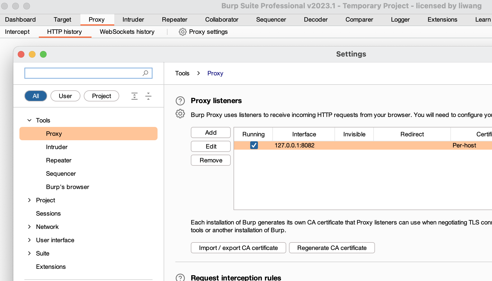

# 安装 Java 环境并激活 Burp。


> 说明：之前安装过，直接启动截图。

# 练习 Tomcat PUT 方法任意写文件漏洞（CVE-2017-12615），提供命令执行截图。

## 1. 环境的搭建
### 1.1 搜索镜像

```shell
docker search CVE-2017-12615
```


### 1.2 下载镜像

```shell
docker pull cved/cve-2017-12615
```


### 1.3 启动镜像

```shell
docker run -d -p 8080:8080 cved/cve-2017-12615
```


### 1.4 访问页面


> 说明：为了后面使用 BurpSuite 抓本地包，配置了本地host，huanxue.com 指向 127.0.0.1

## 2. 漏洞实践

### 2.1 远程命令POC实践练习

#### 2.1.1 启动 BurpSuite



#### 2.1.2 启用系统代理


#### 2.1.3 抓取请求,并发送至 repeater


#### 2.1.4 修改请求，发送构造好的 poc 至服务器


#### 2.1.5 访问上传的jsp文件,并执行命令


### 2.2 中国蚁剑实践练习

#### 2.2.1 上传蚁剑POC文件


#### 2.2.3 在中国蚁剑配置连接


#### 2.2.3 使用中国蚁剑连接


# 练习 S2-048 远程代码执行漏洞（CVE-2017-9791），提供命令执行截图。
# 练习 JBoss 5.x/6.x 反序列化漏洞（CVE-2017-12149），提供命令执行截图。
# 安装并使用 Nmap 扫描一个地址（本机、VPS、虚拟机环境都可以），提供扫描结果截图。
# 以任一企业为关键词进行信息收集练习并汇总形成报告，禁止进行违规操作。